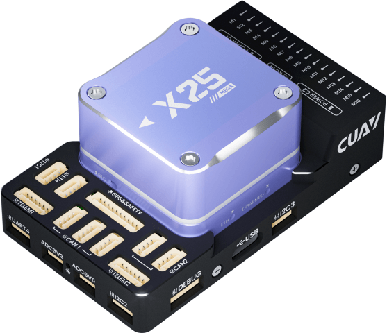
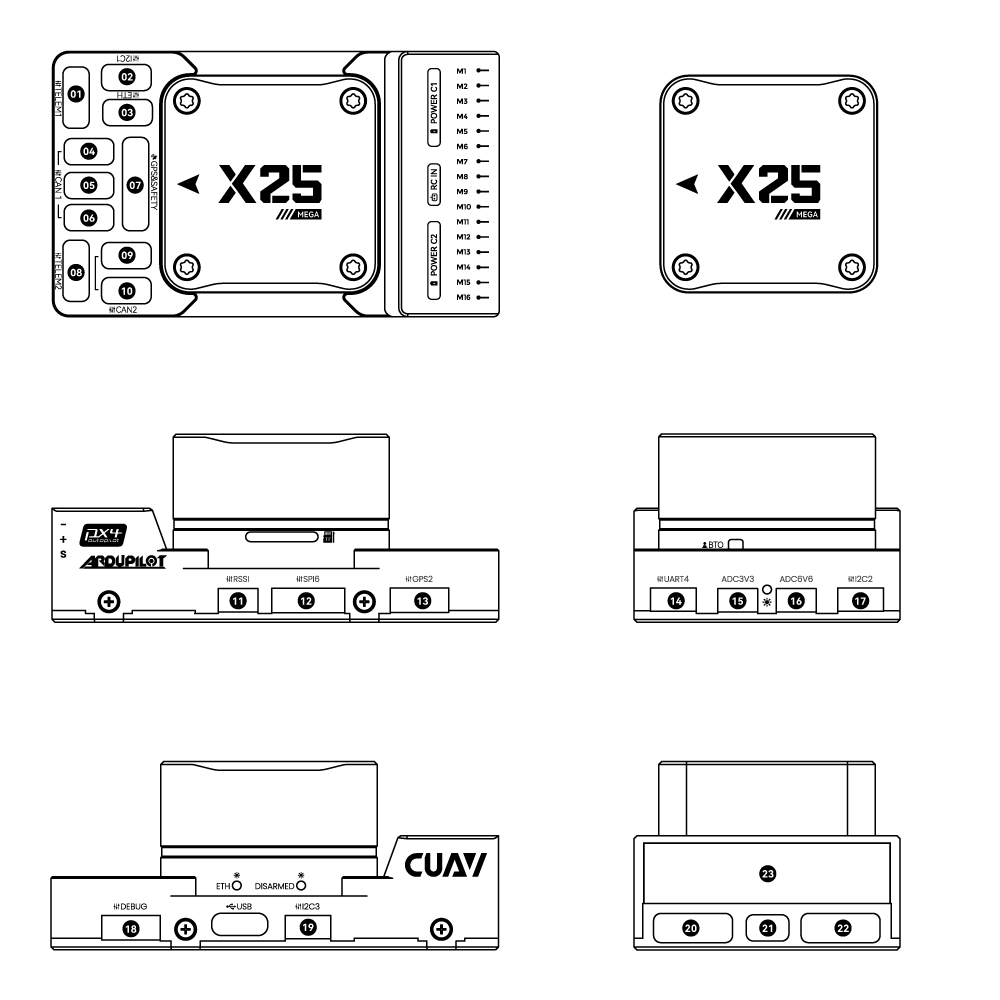
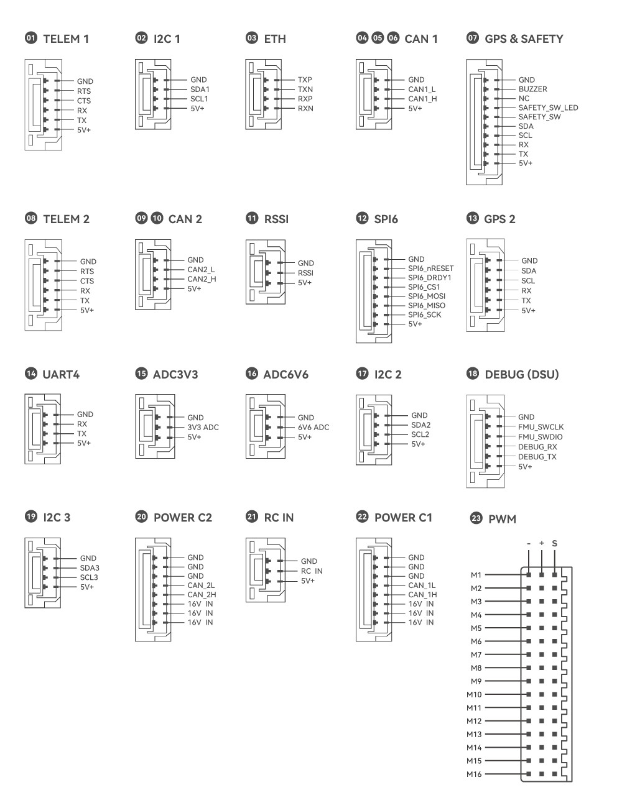

# CUAV-X25-MEGA Flight Controller



The CUAV-X25-MEGA flight controller produced by [CUAV](https://www.cuav.net).

## Features

- STM32H743 microcontroller
- 3 IMUs: one ADIS16607 with sync clock, one IIM42652 with an external crystal oscillator and one IIM42653
- builtin RM3100 magnetometer
- 2 barometers: BMP581 and ICP20100
- microSD card slot
- USB-TypeC port
- 1 ETH network interface
- 6 UARTs plus USB
- 16 PWM outputs
- 5 I2C ports (three I2C buses with five ports)
- 1 SPI port
- 5 CAN ports (three of which share a CAN bus and two for another CAN bus)
- 2 IMU heater
- internal vibration isolation for IMUs
- builtin RGB LED
- builtin DISARMED indication LED
- Analog RSSI input
- voltage monitoring for servo rail and Vcc
- 3.3V/5V configurable PWM output voltage

## Pinout




## UART Mapping

| Port | UART | Protocol | TX DMA | RX DMA |
| ---- | ---- | -------- | :----: | :----: |
| SERIAL0 | OTG1 (USB) | MAVLink2 | ✘ | ✘ |
| SERIAL1 | UART7 (TELEM1) | MAVLink2 | ✔ | ✔ |
| SERIAL2 | UART5 (TELEM2) | MAVLink2 | ✔ | ✔ |
| SERIAL3 | USART1 (GPS1&SAFETY) | GPS | ✔ | ✔ |
| SERIAL4 | USART2 (GPS2) | GPS | ✔ | ✔ |
| SERIAL5 | UART4 | None | ✔ | ✔ |
| SERIAL6 | USART3 (DEBUG) | None | ✔ | ✔ |
| SERIAL7 | OTG2 | MAVLink2 | ✘ | ✘ |

The TELEM1 and TELEM2 ports have RTS/CTS pins, the other UARTs do not. All UARTs have full DMA capability.

The USART3 connector is labelled "DEBUG", but is available as a general purpose UART with ArduPilot. The DEBUG connector also carries the SWD pins (FMU_SWCLK/FMU_SWDIO).

## RC Input

All ArduPilot supported unidirectional RC protocols can be input on the port marked RC IN, including PPM. For bi-directional or half-duplex protocols such as CRSF/ELRS, a full UART must be used, set `SERIALx_PROTOCOL` to "23 (RCIN)". And make the following settings according to the protocol:

- CRSF/ELRS would require `SERIALx_OPTIONS` be set to "0".
- FPort would require `SERIALx_OPTIONS` be set to "15".
- SRXL2 would require `SERIALx_OPTIONS` be set to "4 (Half-Duplex)" and connects only the TX pin.

See [RC systems](https://ardupilot.org/copter/docs/common-rc-systems.html) for more details.

## PWM Output

The CUAV-X25-MEGA flight controller supports up to 16 PWM outputs.

The 16 PWM outputs are in 5 groups:

- PWM 1-4 in group1 (TIM5)
- PWM 5-8 in group2 (TIM4)
- PWM 9-11 in group3 (TIM1)
- PWM 12-14 in group4 (TIM8)
- PWM 15-16 in group5 (TIM12)

Channels within the same group need to use the same output rate. If any channel in a group uses DShot then all channels in the group need to use DShot. Outputs 1-8 support BDShot. Channel 15 and 16 only support PWM.

ALL PWM outputs of CUAV-X25-MEGA flight controller support switching between 3.3V voltage and 5V voltage output. It can be switched to 5V by setting GPIO 80 high by setting up a Voltage-Level Translator to control it (set the [BRD_PWM_VOLT_SEL](https://ardupilot.org/copter/docs/parameters.html#brd-pwm-volt-sel-set-pwm-out-voltage) parameter in ArduPilot).

## Battery Monitoring

The board has two dedicated power monitor ports on 8 pin connectors.

Digital DroneCAN/UAVCAN battery monitoring is enabled by default.

## RSSI

CUAV-X25-MEGA has an analog RSSI voltage monitoring input. Set parameter [RSSI_TYPE](https://ardupilot.org/copter/docs/parameters.html#rssi-type-rssi-type) to 1 and [RSSI_ANA_PIN](https://ardupilot.org/copter/docs/parameters.html#rssi-ana-pin-receiver-rssi-sensing-pin) to 10 to  use this. RC protocols which embed RSSI would use [RSSI_TYPE](https://ardupilot.org/copter/docs/parameters.html#rssi-type-rssi-type) = 3.

## Compass

The CUAV-X25-MEGA has an RM3100 builtin compass. If interference is experienced from nearby power circuitry, you can also attach an external compass using the I2C port and disable this internal compass.

## IMU

The CUAV-X25-MEGA has 3 IMUs: one ADIS16607 with a sync clock, one IIM42652 with an external crystal oscillator, and one IIM42653. All these IMUs have heater hardware (IMU1 and IMU2 share one heater; IMU3 has a separate heater), but the heater for IMU3 is currently not enabled and awaits software adaptation.

## Analog Inputs

The CUAV-X25-MEGA has 3 analog inputs.

- ADC Pin13 -> ADC 3.3V sense
- ADC Pin12 -> ADC 6.6V sense
- ADC Pin10 -> RSSI voltage monitoring

## I2C Buses

- the internal I2C port is bus 0 in ArduPilot (I2C4 in hardware)
- the ports labelled I2C1 and 'GPS&SAFETY' is bus 1 in ArduPilot (I2C1 in hardware)
- the ports labelled I2C2 and GPS2 is bus 2 in ArduPilot (I2C2 in hardware)
- the port labelled I2C3 is bus 3 in ArduPilot (I2C3 in hardware)

## SPI

The CUAV-X25-MEGA has an external SPI interface marked as SPI6. To use this interface, you need to add the SPI driver configuration(name, bus ID, chip select ID, mode, rates) in the `hwdef.dat` file. For example, when connecting to the HMC5983 sensor, you need to add the following configuration:

```text
SPIDEV hmc5983 SPI6 DEVID1 EXT1_CS MODE3 2*MHZ 8*MHZ

COMPASS HMC5843 SPI:hmc5983 false ROTATION_NONE # Specified compass drive
```

Then compile the firmware. See [building the code](https://ardupilot.org/dev/docs/building-the-code.html#building-the-code) for more details. Regarding the wiring of SPI, please refer to [this](https://ardupilot.org/dev/docs/code-overview-sensor-drivers.html#spi).

## CAN

The CUAV-X25-MEGA has two independent CAN buses. CAN1 has three ports and CAN2 has two ports.

## Loading ODID-type Firmware

To use the ODID-type firmware, compile the firmware with the following command:

```bash
./waf configure --board=CUAV-X25-MEGA-ODID
./waf
```

By default, this configuration enables the ArduPilot CAN OpenDroneID module. Due to a board ID mismatch between the ODID-type firmware and the standard firmware, you need to use a debugger (e.g., ST-LINK) to flash either the bootloader or the full firmware (whose filename contains `with_bl` in the `build/CUAV‑X25‑MEGA‑ODID/bin` folder) onto the device via the DEBUG connector.

After flashing the ODID-type bootloader, \*.apj firmware files can be loaded via any ArduPilot compatible ground station.

For more details, please refer to the [ArduPilot OpenDroneID documentation](https://ardupilot.org/dev/docs/opendroneid.html).

## Where to Buy

[CUAV](https://www.cuav.net)
