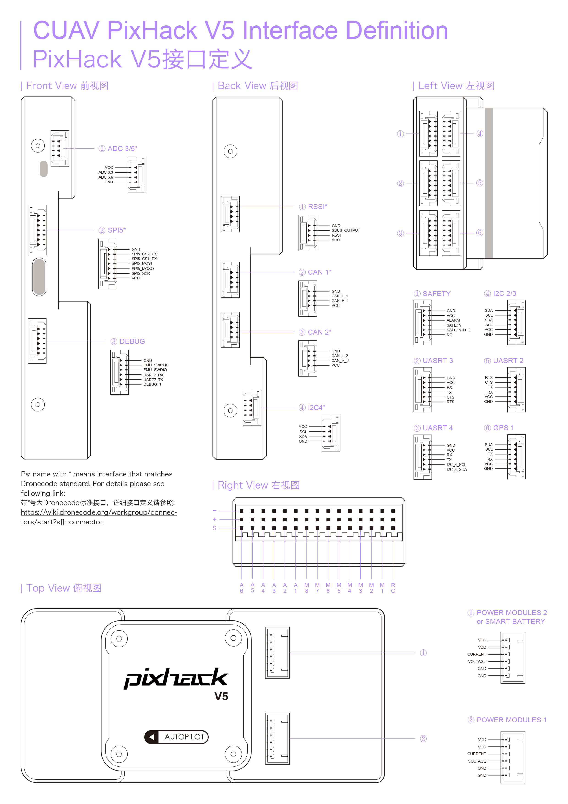

# CUAVv5 Flight Controller

The CUAVv5 flight controller is sold by [CUAV](http://store.cuav.net/)

The full schematics of the board are available here:

  https://github.com/ArduPilot/Schematics/tree/master/CUAV/CUAVv5

## Features

 - STM32F765 microcontroller
 - Three IMUs: ICM20689, MPU6000 and BMI055
 - internal vibration isolation for IMUs
 - MS5611 SPI barometer
 - builtin I2C IST8310 magnetometer
 - microSD card slot
 - 6 UARTs plus USB
 - 14 PWM outputs
 - Four I2C and two CAN ports
 - External Buzzer
 - builtin RGB LED
 - external safety Switch
 - voltage monitoring for servo rail and Vcc
 - two dedicated power input ports for external power bricks

## Pinout

## UART Mapping

 - SERIAL0 -> USB
 - SERIAL1 -> UART2 (Telem1)
 - SERIAL2 -> UART3 (Telem2)
 - SERIAL3 -> UART1 (GPS)
 - SERIAL4 -> UART4 (GPS2)
 - SERIAL5 -> UART6 (spare)
 - SERIAL6 -> UART7 (spare, debug)

The Telem1 and Telem2 ports have RTS/CTS pins, the other UARTs do not
have RTS/CTS.

The UART7 connector is labelled debug, but is available as a general
purpose UART with ArduPilot.

## RC Input
 
RC input is configured on the RCIN pin, at one end of the servo rail,
marked RC in the above diagram. This pin supports all RC protocols.

## PWM Output

The CUAVv5 supports up to 14 PWM outputs. First first 8 outputs (labelled
"MAIN") are controlled by a dedicated STM32F100 IO controller. These 8
outputs support all PWM output formats, but not DShot.

The remaining 6 outputs (labelled AUX1 to AUX6) are the "auxiliary"
outputs. These are directly attached to the STM32F765 and support all
PWM protocols as well as DShot.

All 14 PWM outputs have GND on the top row, 5V on the middle row and
signal on the bottom row.

The 8 main PWM outputs are in 3 groups:

 - PWM 1 and 2 in group1
 - PWM 3 and 4 in group2
 - PWM 5, 6, 7 and 8 in group3

The 6 auxiliary PWM outputs are in 2 groups:

 - PWM 1, 2, 3 and 4 in group1
 - PWM 5 and 6 in group2

Channels within the same group need to use the same output rate. If
any channel in a group uses DShot then all channels in the group need
to use DShot.

## Battery Monitoring

The board has two dedicated power monitor ports on 6 pin
connectors. The correct battery setting parameters are dependent on
the type of power brick which is connected.

## Compass

The CUAVv5 has a builtin IST8310 compass. Due to potential
interference the board is usually used with an external I2C compass as
part of a GPS/Compass combination.

## GPIOs

The 6 PWM ports can be used as GPIOs (relays, buttons, RPM etc). To
use them you need to limit the number of these pins that is used for
PWM by setting the BRD_PWM_COUNT to a number less than 6. For example
if you set BRD_PWM_COUNT to 4 then PWM5 and PWM6 will be available for
use as GPIOs.

The numbering of the GPIOs for PIN variables in ArduPilot is:

 - AUX1 50
 - AUX2 51
 - AUX3 52
 - AUX4 53
 - AUX5 54
 - AUX6 55

## Analog inputs

The CUAVv5 has 7 analog inputs

 - ADC Pin0 -> Battery Voltage
 - ADC Pin1 -> Battery Current Sensor
 - ADC Pin2 -> Battery Voltage 2
 - ADC Pin3 -> Battery Current Sensor 2
 - ADC Pin4 -> ADC port pin 2
 - ADC Pin14 -> ADC port pin 3
 - ADC Pin10 -> ADC 5V Sense
 - ADC Pin11 -> ADC 3.3V Sense
 - ADC Pin103 -> RSSI voltage monitoring

## Loading Firmware

The board comes pre-installed with an ArduPilot compatible bootloader,
allowing the loading of *.apj firmware files with any ArduPilot
compatible ground station.

## Acknowledgements

Thanks to [CUAV](http://cuav.net) for images
