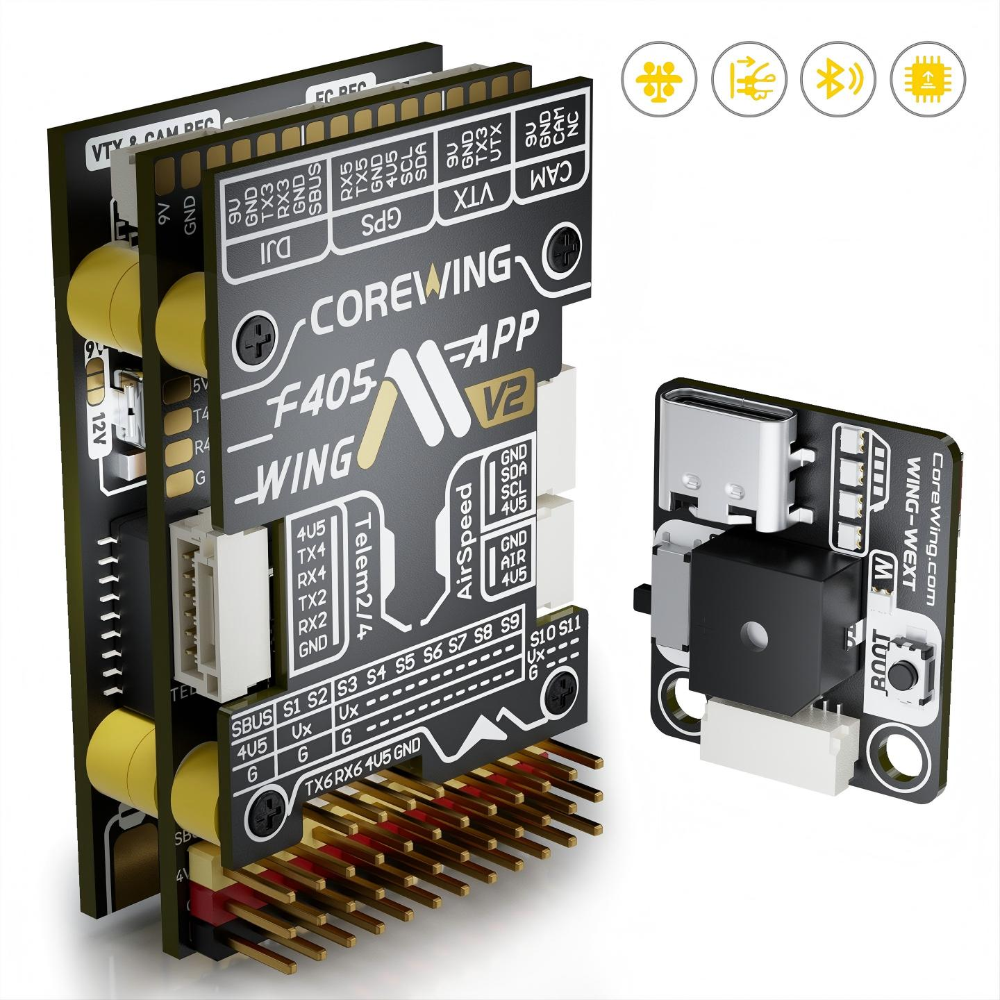
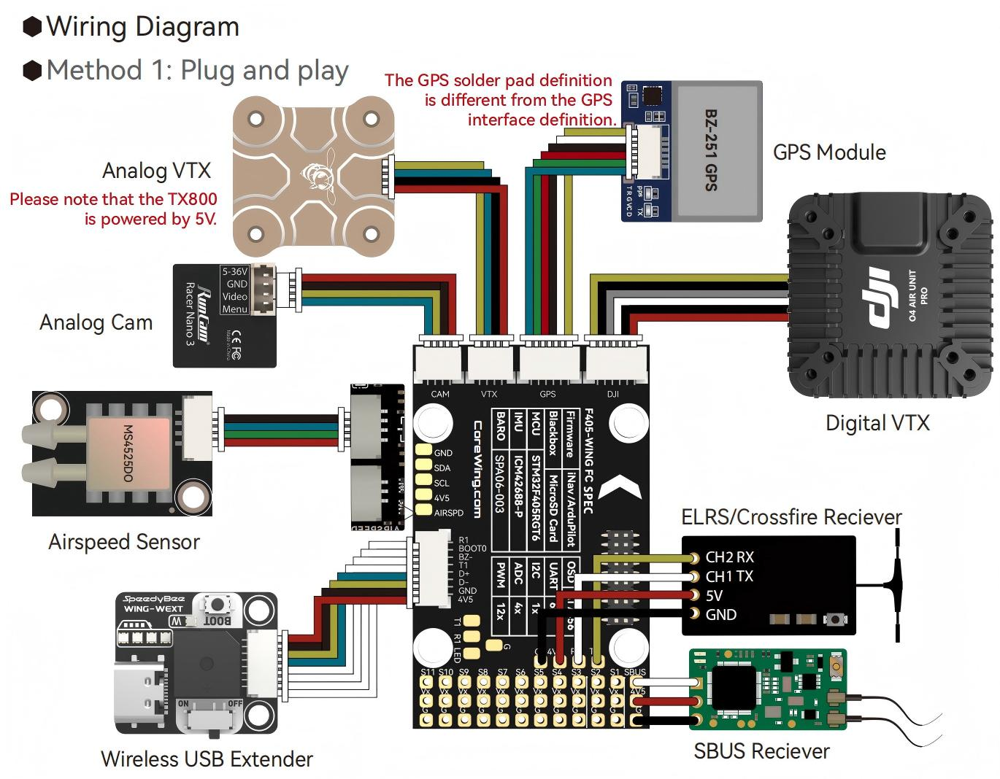
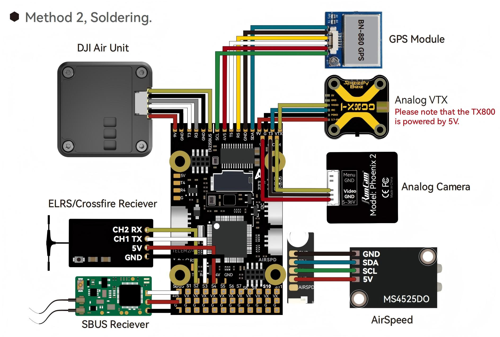
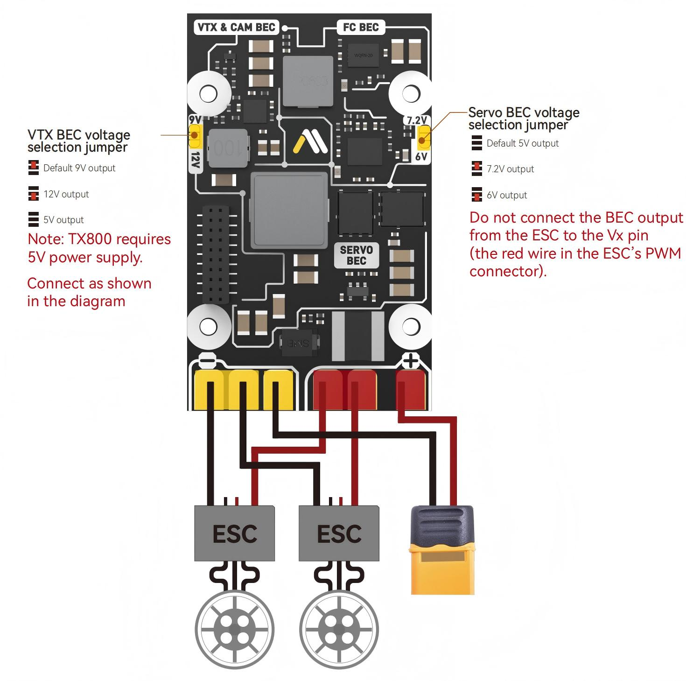

# CoreWingF405WingV2 Flight Controller

The CoreWing F405 Wing V2 is a fixed-wing and QuadPlane/VTOL flight controller produced by [CoreWing](https://www.corewing.com/en/).

## Features

- Processor
  - STM32F405RGT6 ARM, 168MHz
  - AT7456E OSD
  - ESP32-S3 wireless module for BLE/WiFi telemetry
- Sensors
  - ICM-42688P or BMI270 IMU, depending on board variant
  - SPA06-003 barometer
  - Voltage and current sensors
- Power
  - 3S to 6S LiPo input, 10V to 28V
  - 90A continuous / 215A peak current sensing
  - Integrated PDB with separate FC, servo, and VTX/CAM power rails
  - FC BEC: fixed 5.2V, 4A continuous / 5A peak
  - Servo BEC: 5V, 6V, or 7.2V, 8A continuous / 14A peak
  - VTX/CAM BEC: 5V, 9V, or 12V, 2A continuous / 3A peak
- Interfaces
  - 12 PWM outputs
  - PWM 1-10 support PWM/DShot
  - PWM 11-12 support normal PWM only
  - SBUS/PPM input
  - Dedicated serial RC input for CRSF/ELRS/TBS Crossfire
  - 6 UARTs plus USB; UART1 is internally tied to the wireless module
  - I2C port for external compass, digital airspeed, and other I2C peripherals
  - Analog airspeed input
  - Analog RSSI input
  - microSD card slot
  - USB-C port
  - Onboard BLE/WiFi wireless board
  - Switchable VTX/CAM supply

## Pinout

## Wiring Diagram

## UART Mapping

The UARTs are marked Rn and Tn in the above pinouts. The Rn pin is the receive pin for UARTn. The Tn pin is the transmit pin for UARTn.

- SERIAL0 -> USB
- SERIAL1 -> USART1, tied to the wireless module, MAVLink2 telemetry
- SERIAL2 -> USART2, RX tied to the inverted SBUS RC input, but can be used as a normal UART if [BRD_ALT_CONFIG](https://ardupilot.org/copter/docs/parameters.html#brd-alt-config-alternative-hw-config) = 1
- SERIAL3 -> USART3, available on the DJI air unit connector
- SERIAL4 -> UART4, user port
- SERIAL5 -> UART5, GPS
- SERIAL6 -> USART6, serial RC input

Serial protocols shown are defaults, but can be adjusted by the user.

## RC Input

The SBUS input is passed through an inverter to RX2. By default, RX2 is mapped to a timer input instead of the UART and can be used for SBUS, PPM, and receiver protocols that do not require a true UART.

Serial receiver protocols such as CRSF, ELRS, MAVLink RC input, and SRXL2 should be connected to UART6 using TX6 and RX6. SERIAL6_PROTOCOL is set to 23 by default for serial RC input.

Recommended receiver connections:

- PPM: connect to the SBUS input
- SBUS: connect to the SBUS input
- CRSF / TBS Crossfire: connect to TX6 and RX6
- ELRS: connect to TX6 and RX6, same as CRSF; set bit 13 of RC_OPTIONS if required
- DSM / SRXL: connect to RX6
- SRXL2: connect to TX6 and set SERIAL6_OPTIONS to 4
- FPort: connect to TX6 and RX6 through a bidirectional inverter

## PWM Output

All motor/servo outputs are PWM capable. PWM outputs 1 to 10 are also DShot capable, and PWM outputs 1 to 4 additionally support bi-directional DShot. PWM outputs 11 and 12 support normal PWM only.

The PWM outputs are in 5 groups:

- PWM 1,2 in group1
- PWM 3,4 in group2
- PWM 5-7 in group3
- PWM 8-10 in group4
- PWM 11,12 in group5

Channels within the same group need to use the same output rate and protocol. If any DShot-capable output in a group uses DShot then all DShot-capable outputs in that group need to use DShot.

## Integrated PDB and Power Wiring

The board includes an integrated PDB with separate power rails for the flight controller/peripherals, servos, and VTX/camera equipment.

CoreWing F405 Wing V2 includes three onboard BECs: an FC BEC, a servo BEC, and a VTX/CAM BEC. The VTX/CAM BEC output can be selected as 5V, 9V, or 12V. The servo BEC output can be selected as 5V, 6V, or 7.2V.

Do not connect an ESC BEC red wire to the servo rail unless the board power jumper configuration allows an external BEC input.

## Wireless Connection

The onboard CoreWing wireless board supports BLE and WiFi AP/STA modes. The [CoreWing app](https://www.corewing.com/en/app/) can be used for wireless parameter setup, wireless firmware flashing, and wireless board settings. Mission Planner can connect through WiFi using TCP or UDP.

WiFi AP default settings:

- SSID: `CoreWing WING-WiFi`
- Password: `88888888`
- IP address: `192.168.1.1`
- TCP port: `4278`
- UDP port: `14550`

## OSD Support

The CoreWing F405 Wing V2 supports using its internal OSD using OSD_TYPE 1 (MAX7456 driver). External OSD support such as DJI or MSP DisplayPort is supported using UART3 or any other free UART. See [MSP OSD](https://ardupilot.org/copter/docs/common-msp-osd-overview-4.2.html) for more information.

## VTX Control

UART3 TX is located in the video output connector and can be used to control video transmitters that support IRC Tramp or SmartAudio. See [VTX support](https://ardupilot.org/plane/docs/common-vtx.html) for more information.

## VTX Power Control

GPIO 81 controls the VTX/CAM power output. Setting this GPIO high removes voltage supply from the VTX/CAM power pins.

For example, use Channel 7 to control the switch using Relay 1:

- RELAY1_PIN = 81
- RC7_OPTION = 28

## Battery Monitoring

The board has a built-in voltage and current sensor. The current sensor can read up to 90A continuously and 215A peak. The voltage sensor can handle up to 6S LiPo batteries.

The correct battery setting parameters are set by default and are:

- BATT_MONITOR = 4
- BATT_VOLT_PIN = 10
- BATT_CURR_PIN = 11
- BATT_VOLT_MULT = 11.05
- BATT_AMP_PERVLT = 64

A 35V 470uF electrolytic capacitor is included in the package and should be installed on the power input to reduce ESC switching noise.

## Compass and GPS

The board does not have a built-in GPS or compass. An external GPS/compass module can be connected to the GPS connector. UART5 is GPS1 by default and the I2C bus can be used for an external compass.

The 4V5 pins are also powered when USB is connected. Avoid connecting high-current loads to 4V5 when powered only from USB.

## Airspeed

The board supports both analog and digital airspeed sensors.

- Analog airspeed: use the AIR analog input, 0V to 6.6V range (ARSPD_PIN 15, set by default)
- Digital airspeed: use the I2C airspeed connector

The MS4525DO, ASP5033, MS5525, SDP3X and NMEA digital airspeed sensors are enabled by default, in addition to analog airspeed. Other digital airspeed sensor drivers require a custom firmware build using the [Custom Firmware Build Server](https://custom.ardupilot.org).

## RSSI

Analog RSSI input is supported on the RSSI pad. RSSI_ANA_PIN is set to 14 by default; set RSSI_TYPE = 1 to enable it.

## Loading Firmware

Firmware for this board can be found at the [ArduPilot firmware server](https://firmware.ardupilot.org) in the `CoreWingF405WingV2` sub-folder.

Initial firmware load can be done with DFU by plugging in USB with the boot button pressed. Subsequently, firmware can be updated with Mission Planner or the CoreWing app.
