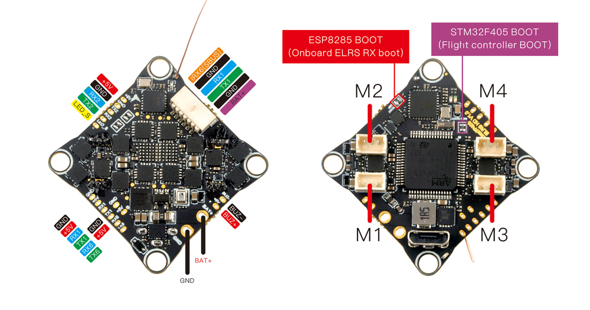
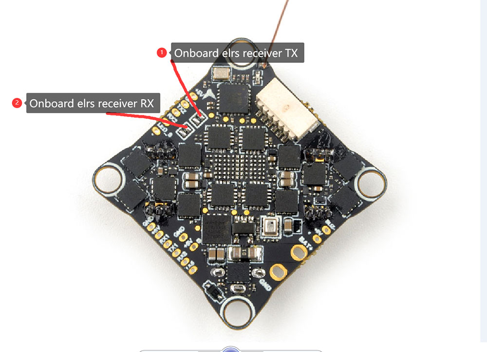

# CrazyF405HD ELRS 1-2SAIO Flight Controller

The CrazyF405HD ELRS 1-2S AIO is a flight controller produced by [Happymodel](https://www.happymodel.cn/index.php/2023/05/26/crazyf405hd-elrs-1-2s-aio-fc-built-in-uart-elrs-receiver-and-12a-blheli_s-esc/.)

## Features

 - MCU: STM32F405RGT6, 168MHz
 - Gyro: BMI270 (SPI)
 - 1Mb Onboard Flash
 - BEC output: 5V, 2A@4V
 - Barometer: BMP280
 - 3 UARTS: (UART1, UART2 ,UART6)
 - 5 PWM outputs (4 motor outputs used internally for integrated 4-in-1 ESC and 1 integrated LED)
 - Integrated 4-in-1 BlueJay ESC
 - Firmware target: BetaflightF4

## Pinout

## UART Mapping

The UARTs are marked Rn and Tn in the above pinouts. The Rn pin is the
receive pin for UARTn. The Tn pin is the transmit pin for UARTn.
|Name|Pin|Function|
|:-|:-|:-|
|SERIAL0|COMPUTER|USB|
|SERIAL1|RX1/TX1|UART1 (Display Port,DMA-enabled)|
|SERIAL2|TX2/RX2|UART2 (RCIN,ELRS, internal)
|SERIAL5|RX6|UART6 (USER,DMA-disabled)|

## RC Input

RC input is configured on the on-board ELRS on UART2 or through (UART2_RX/UART2_TX) pins. It supports all serial RC protocols. 
To disable the onboard ELRS module and use an external RC on TX2/RX2, desolder the RX/TX pads of the onboard ELRS receiver as shown in the image. 

## OSD Support
The CrazyF405HDAIO is optimized for Digital HD FPV and does not require the analog OSD chip (MAX7456); OSD data is transmitted via MSP to the digital VTX.

## PWM Output

The Carzyf405HD AIO has 4 PWM outputs internally connected to its 4-in-1 ESC. The pads for motor output are M1 to M4 on the board. All 4 outputs support DShot, as well as all PWM types. The default configuration is for DShot using the already installed BlueJay firmware.

## Battery Monitoring

The board has a builtin voltage sensor and a current sensor input tied to its 4 in 1 ESC current sensor. The voltage sensor can handle up to 2S
LiPo/Li-Hv batteries.

The correct battery setting parameters are:

 - BATT_MONITOR 4
 - BATT_VOLT_PIN 12
 - BATT_VOLT_MULT 10.9
 - BATT_CURR_PIN 13
 - BATT_CURR_MULT 50

These are set by default in the firmware and shouldn't need to be adjusted

## Compass

The BETAFPV F405 AIO does not have a builtin compass.

## Loading Firmware

Initial firmware load can be done with DFU by plugging in USB with the
bootloader button pressed. Then you should load the "with_bl.hex"
firmware, using your favourite DFU loading tool.

Once the initial firmware is loaded you can update the firmware using
any ArduPilot ground station software. Updates should be done with the
*.apj firmware files.
