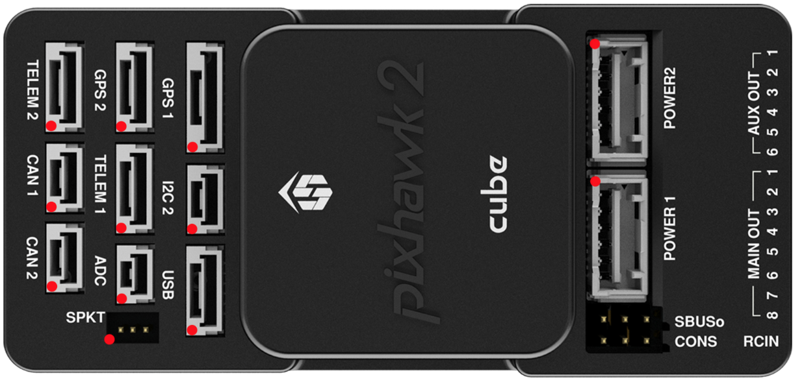

# CubeBlack Flight Controller

The CubePilot CubeBlack flight controller is sold by a range of resellers
listed on the
[CubePilot website](http://cubepilot.org)

## Features

- STM32F427 microcontroller
- Two MPU9250 and one LSM303D/L3GD20 IMUs
- internal heater for IMU temperature control
- internal vibration isolation for first two IMUs
- MS5611 SPI barometer
- builtin SPI LSM303D magnetometer
- microSD card slot
- 5 UARTs plus USB
- 14 PWM outputs
- I2C and CAN ports
- Spektrum satellite connector
- External Buzzer
- builtin RGB LED
- external safety Switch
- voltage monitoring for servo rail and Vcc
- two dedicated power input ports for external power bricks
- external USB connectors (micro USB and JST GH)

## Pinout

On each connector the red dot indicates pin 1.

## UART Mapping

- SERIAL0 -> USB
- SERIAL1 -> UART2 (Telem1)
- SERIAL2 -> UART3 (Telem2)
- SERIAL3 -> UART4 (GPS)
- SERIAL4 -> UART8 (GPS2)
- SERIAL5 -> UART7 (spare, CONS)

The Telem1 and Telem2 ports have RTS/CTS pins, the other UARTs do not
have RTS/CTS.

The CONS port was originally used as a debug console, but is now a
general purpose UART (debug output is now on USB).

## Connectors

Unless noted otherwise all connectors are JST GH

### TELEM1, TELEM2 ports

   | Pin | Signal | Volt |
| --- | --- | --- |
| 1 (red) | VCC | +5V |
| 2 (blk) | TX (OUT) | +3.3V |
| 3 (blk) | RX (IN) | +3.3V |
| 4 (blk) | CTS | +3.3V |
| 5 (blk) | RTS | +3.3V |
| 6 (blk) | GND | GND |

### GPS1 port

   | Pin | Signal | Volt |
| --- | --- | --- |
| 1 (red) | VCC | +5V |
| 2 (blk) | TX (OUT) | +3.3V |
| 3 (blk) | RX (IN) | +3.3V |
| 4 (blk) | SCL I2C1 | +3.3V |
| 5 (blk) | SDA I2C1 | +3.3V |
| 6 (blk) | Button | GND |
| 7 (blk) | button LED | GND |
| (blk) | GND | GND |

### GPS2 port

   | Pin | Signal | Volt |
| --- | --- | --- |
| 1 (red) | VCC | +5V |
| 2 (blk) | TX (OUT) | +3.3V |
| 3 (blk) | RX (IN) | +3.3V |
| 4 (blk) | SCL I2C2 | +3.3V |
| 5 (blk) | SDA I2C2 | +3.3V |
| 6 (blk) | GND | GND |

### CONS port

The CONS port is an additional UART connected to SERIAL5. The pinout
in the CONS port table below is ordered so that the GND pin is closest
to the cube. The TX pin is closest to the servo rail.

   | Pin | Signal | Volt |
| --- | --- | --- |
| 1 | GND | GND |
| 2 | RX (IN) | +3.3V |
| 3 | TX (OUT) | +3.3V |

### SBUS Out port

The SBUSo port is a port attached to the IO processor which can be
used to output all servo channels via SBUS. It is enabled by setting
the BRD_SBUS_OUT parameter.

The pinout below for the SBUSo port is labelled so that GND is closest
to the cube. The 5V pin on the SBUS output port is connected to the
servo rail.

When SBUS output is disabled (by setting BRD_SBUS_OUT to 0) you can
use the port for analog RSSI input from receivers. To enable for RSSI
input you need to set:

- BRD_SBUS_OUT 0
- RSSI_TYPE 1
- RSSI_PIN 103

You cannot have both SBUS output and analog RSSI input at the same time.

   | Pin | Signal | Volt |
| --- | --- | --- |
| 1 | GND | GND |
| 2 | 5v(Vservo) | +5.0V |
| 3 | TX (OUT) | +3.3V |

### SPKT port

The SPKT port provides a connector for Spektrum satellite
receivers. It is needed to allow for software controlled binding of
satellite receivers.

The pinout of the SPKT port given below is given with the 3.3V power
pin closest to the cube (pin 3).

   | Pin | Signal | Volt |
| --- | --- | --- |
| 1 | RX (IN) | +3.3V |
| 2 | GND | GND |
| 3 | 3.3v | +3.3V |

### ADC

   | Pin | Signal | Volt |
| --- | --- | --- |
| 1 (red) | VCC | +5V |
| 2 (blk) | ADC IN |  |
| 3 (blk) | GND | GND |

### I2C2

   | Pin | Signal | Volt |
| --- | --- | --- |
| 1 (red) | VCC | +5V |
| 2 (blk) | SCL | +3.3 (pullups) |
| 3 (blk) | SDA | +3.3 (pullups) |
| 4 (blk) | GND | GND |

### FMU and IO SWD

When the case is removed there are two SWD connectors, one for FMU and
the other for IOMCU. The IO SWD connector is the one closer to the
servo rail. The GND pin of both connectors is the one furthest from
the servo rail.

   | Pin | Signal | Volt |
| --- | --- | --- |
| 1 | VCC | +5V |
| 2 | TX | +3.3 |
| 3 | RX | +3.3 |
| 4 | SWDIO | +3.3 |
| 5 | SWCLK | +3.3 |
| 6 | GND | GND |

### CAN1&2

   | Pin | Signal | Volt |
| --- | --- | --- |
| 1 (red) | VCC | +5V |
| 2 (blk) | CAN_H | +12V |
| 3 (blk) | CAN_L | +12V |
| 4 (blk) | GND | GND |

### POWER1&2

   | Pin | Signal | Volt |
| --- | --- | --- |
| 1 (red) | VCC | +5V |
| 2 (red) | VCC | +5V |
| 3 (blk) | CURRENT | up to +3.3V |
| 4 (blk) | VOLTAGE | up to +3.3V |
| 5 (blk) | GND | GND |
| 6 (blk) | GND | GND |

### USB

   | Pin | Signal | Volt |
| --- | --- | --- |
| 1 (red) | VCC | +5V |
| 2 (blk) | D_plus | +3.3V |
| 3 (blk) | D_minus | +3.3V |
| 4 (blk) | GND | GND |
| 5 (blk) | BUZZER | battery voltage |
| 6 (blk) | Boot/Error LED |  |

## RC Input

RC input is configured on the RCIN pin, at one end of the servo rail,
marked RCIN in the above diagram. This pin supports all RC
protocols. In addition there is a dedicated Spektrum satellite port
which supports software power control, allowing for binding of
Spektrum satellite receivers.

## PWM Output

The CubeBlack supports up to 14 PWM outputs. First first 8 outputs (labelled
"MAIN") are controlled by a dedicated STM32F100 IO controller. These 8
outputs support all PWM output formats, but not DShot.

The remaining 6 outputs (labelled AUX1 to AUX6) are the "auxiliary"
outputs. These are directly attached to the STM32F427 and support all
PWM protocols as well as DShot.

All 14 PWM outputs have GND on the top row, 5V on the middle row and
signal on the bottom row.

The 8 main PWM outputs are in 3 groups:

- PWM 1 and 2 in group1
- PWM 3 and 4 in group2
- PWM 5, 6, 7 and 8 in group3

The 6 auxiliary PWM outputs are in 2 groups:

- PWM 1, 2, 3 and 4 in group1
- PWM 5 and 6 in group2

Channels within the same group need to use the same output rate. If
any channel in a group uses DShot then all channels in the group need
to use DShot.

## Battery Monitoring

The board has two dedicated power monitor ports on 6 pin
connectors. The correct battery setting parameters are dependent on
the type of power brick which is connected.

## Compass

The CubeBlack has two builtin compasses. One is a HMC5843 and the other
is a part of the MPU9250 IMU. Due to potential interference the board
is usually used with an external I2C compass as part of a GPS/Compass
combination.

## GPIOs

The 6 PWM ports can be used as GPIOs (relays, buttons, RPM etc). To
use them you need to limit the number of these pins that is used for
PWM by setting the BRD_PWM_COUNT to a number less than 6. For example
if you set BRD_PWM_COUNT to 4 then PWM5 and PWM6 will be available for
use as GPIOs.

The numbering of the GPIOs for PIN variables in ArduPilot is:

- PWM1 50
- PWM2 51
- PWM3 52
- PWM4 53
- PWM5 54
- PWM6 55

## Analog inputs

The CubeBlack has 7 analog inputs

- ADC Pin2 -> Battery Voltage
- ADC Pin3 -> Battery Current Sensor
- ADC Pin13 -> Battery2 Voltage
- ADC Pin14 -> Battery2 Current Sensor
- ADC Pin4 -> Vdd 5V supply sense
- ADC Pin15 -> ADC 6.6V port
- ADC Pin103 -> RSSI voltage monitoring

## IMU Heater

The IMU heater in the CubeBlack can be controlled with the
BRD_HEAT_TARG parameter, which is in degrees C.

## Loading Firmware

The board comes pre-installed with an ArduPilot compatible bootloader,
allowing the loading of *.apj firmware files with any ArduPilot
compatible ground station.

## Acknowledgements

Thanks to [CubePilot](http://cubepilot.org) for images
