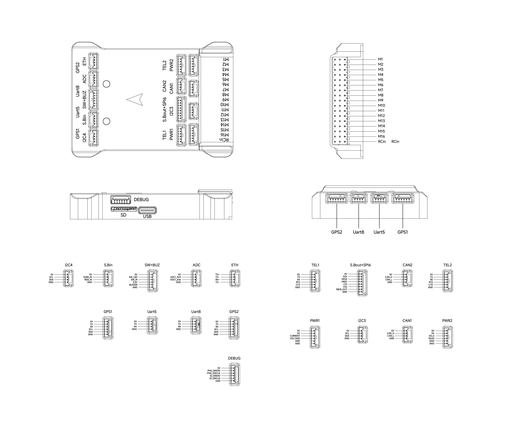

# CyberX-v10 Flight Controller

The CyberX-v10 is manufactured by [CyberCraft International Limited](http://int.woocoo.vip/).
The CyberX-v10 is a separate-flight-core autopilot with an STM32H743 FMU and an STM32F103 IO co-processor.

## Specifications

- **Processor**
  - STM32H743IIK6 32-bit main processor (400MHz, 2MB Flash, 1MB RAM)
  - STM32F103 IO co-processor (72MHz, 128KB Flash, 20KB SRAM)
- **Sensors**
  - IMU1: BMI088 (vibration isolated)
  - IMU2: ICM-42688-P (vibration isolated)
  - IMU3: ICM-20689
  - Triple synced IMUs, constant-temperature IMU heating (~1W)
  - Baro1: BMP581, Baro2: ICP-20100
  - Magnetometer: IST8310 (internal)
- **Interfaces**
  - microSD card slot
  - USB-C
  - 16 PWM outputs (8 IO + 8 FMU)
  - 6 UARTs (TEL1/TEL2 with flow control) plus dedicated RC input
  - Dual CAN
  - 100Mbps Ethernet
  - Two power-monitor inputs (analog PWR1 + I2C INA2xx PWR2)
  - Analog/RSSI/ADC inputs
- **Power**
  - Power Voltage: 4.5V - 5.5V
  - USB Input: 4.75V - 5.25V
- **Dimensions**
  - size: 83mm x 57mm x 15.1mm
  - weight: 72.4g

## Where to Buy

[CyberCraft International Limited](http://int.woocoo.vip/)

## Pinout

## UART Mapping

The UARTs are marked RX and TX in the above pinouts. The RX pin is the receive pin for the UART. The TX pin is the transmit pin.

|Name|Label/Protocol|UART|DMA|
|:-:|:-:|:-:|:-:|
|SERIAL0|USB, MAVLink2|OTG||
|SERIAL1|TEL1, MAVLink2|USART2|DMA Enabled|
|SERIAL2|TEL2, MAVLink2|USART3|DMA Enabled|
|SERIAL3|GPS1, GPS|USART1|DMA Enabled|
|SERIAL4|GPS2, GPS|UART4|DMA Enabled|
|SERIAL5|Uart5, None|UART5|No|
|SERIAL6|RCin/SBUS_in, RCIN|UART8|DMA Enabled|
|SERIAL7|not pinned out, None|UART7|DMA Enabled|
|SERIAL8|USB, Disabled|OTG||

The TEL1 and TEL2 ports have RTS/CTS flow-control pins; the other UARTs do not.

## RC Input

The RCin pin, which by default is mapped to a timer input, can be used for all ArduPilot supported unidirectional receiver protocols. Bi-directional protocols such as CRSF/ELRS and SRXL2 require a true UART connection. FPort, if connected to RCin, will only provide RC without telemetry.

To use CRSF/ELRS or the embedded telemetry available in FPort, CRSF, and SRXL2 receivers, a full UART such as SERIAL6 (UART8) should be used. SERIAL6 is already set up for RC input by default (`SERIAL6_PROTOCOL` = 23).

- FPort would require `SERIAL6_OPTIONS` set to "15".
- CRSF/ELRS would require `SERIAL6_OPTIONS` set to "0".
- SRXL2 would require `SERIAL6_OPTIONS` set to "4" and connects only the TX pin.

The SBUS_IN pin is internally tied to the RCin pin.

Any UART can also be used for RC system connections in ArduPilot and is compatible with all protocols except PPM. See [Radio Control Systems](https://ardupilot.org/copter/docs/common-rc-systems.html) for details.

## PWM Output

The CyberX-v10 supports up to 16 PWM outputs. The first 8 outputs (labelled M1 to M8) are controlled by the dedicated STM32F103 IO controller. The remaining 8 outputs (labelled M9 to M16) are the "auxiliary" outputs directly attached to the STM32H743 FMU.

All 16 outputs support normal PWM. All outputs support DShot except M15 and M16, which are PWM-only (no DMA). Outputs M9 and M11 support bi-directional DShot.

The 8 IO PWM outputs are in 3 groups:

- Outputs 1 and 2 in group1
- Outputs 3 and 4 in group2
- Outputs 5, 6, 7 and 8 in group3

The 8 FMU PWM outputs are in 3 groups:

- Outputs 9, 10, 11 and 12 in group1
- Outputs 13 and 14 in group2
- Outputs 15 and 16 in group3

Channels within the same group need to use the same output rate. If any channel in a group uses DShot then all channels in the group must use DShot.

## GPIOs

All PWM outputs can be used as GPIOs (relays, camera, RPM, etc.). To use them you need to set the output's SERVOx_FUNCTION to -1. The GPIO numbering for the PIN variables in ArduPilot is:

- M1 101
- M2 102
- M3 103
- M4 104
- M5 105
- M6 106
- M7 107
- M8 108
- M9  50
- M10 51
- M11 52
- M12 53
- M13 54
- M14 55
- M15 56
- M16 57

## CAN

The CyberX-v10 has two independent CAN buses, enabled by default. See the CAN1 and CAN2 connectors.

## Ethernet

The board provides a 100Mbps Ethernet port (ETH connector). See [Networking](https://ardupilot.org/copter/docs/common-network.html) for setup.

## Battery Monitor

Two power-monitor interfaces are configured: one analog (PWR1) and one I2C INA2xx (PWR2).

The PWR1 default battery parameters are:

- BATT_MONITOR = 4
- BATT_VOLT_PIN = 16
- BATT_CURR_PIN = 18
- BATT_VOLT_MULT = 15.5
- BATT_AMP_PERVLT = 50 (adjust for the current sensor actually used)

The PWR2 default battery parameters are:

- BATT2_MONITOR = 21
- BATT2_I2C_BUS = 0
- BATT2_I2C_ADDR = 64
- BATT2_SHUNT = 0.0005

## Compass

The CyberX-v10 has a built-in IST8310 compass. Due to potential interference, the autopilot is usually used with an external I2C compass as part of a GPS/compass combination.

## RSSI/Analog Inputs

The CyberX-v10 has the following analog inputs:

- Analog pin 16 -> Battery voltage monitoring
- Analog pin 18 -> Battery current monitoring
- Analog pin 2 -> 6.6V sense
- Analog pin 6 -> 3.3V sense
- Analog pin 9 -> RSSI voltage monitoring

To use analog RSSI on the S.Bin connector, set `RSSI_ANA_PIN` = 9 and `RSSI_TYPE` = 3.

## Firmware

Firmware for the CyberX-v10 can be found [here](https://firmware.ardupilot.org/) in sub-folders labeled "CyberX-v10".

## Loading Firmware

The board comes pre-installed with an ArduPilot compatible bootloader, allowing the loading of `*.apj` firmware files with any ArduPilot compatible ground station.
