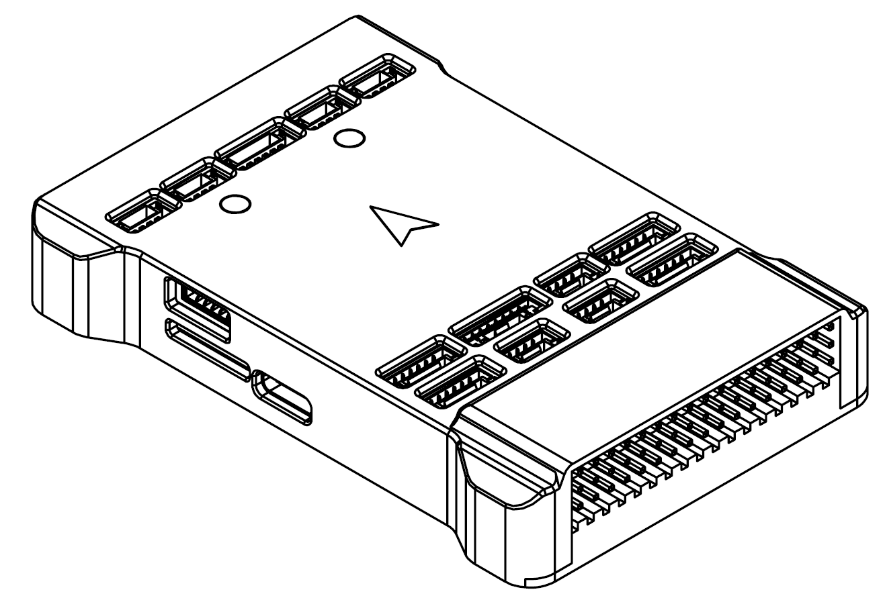
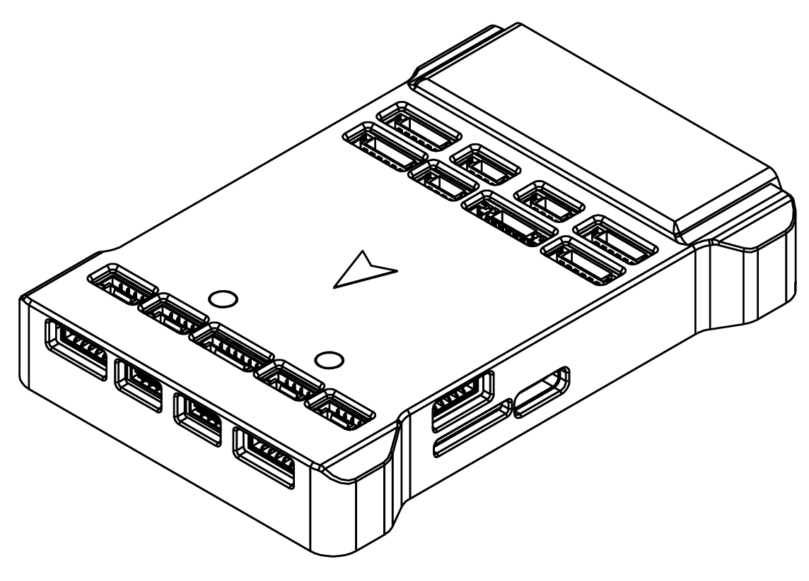
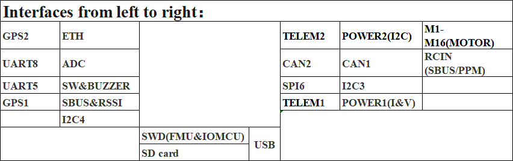
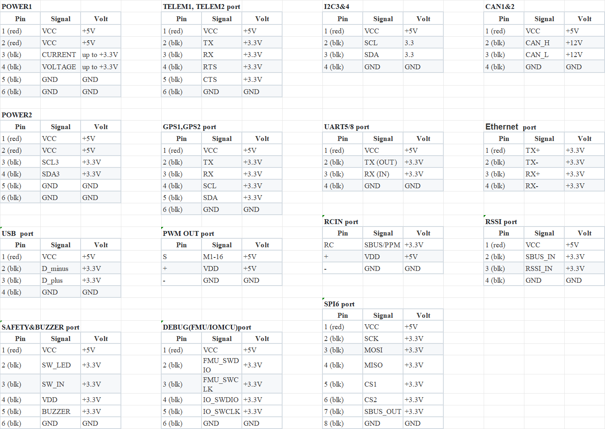

# CyberX-v10 Flight Controller

# This firmware is compatible with CyberX-v10.

## Features:

* Separate flight control core design.
* MCU
STM32H743IIK6 32-bit processor running at 400MHz
2MB Flash
1MB RAM
* IO MCU
STM32F103 at 72MHz 128KB Flash 20kB SRAM
* Sensors
* IMU:
Internal Vibration Isolation for IMUs
IMU constant temperature heating(1 W heating power).
With Triple Synced IMUs, BalancedGyro technology, low noise and more shock-resistant:
IMU1-BMI088(With vibration isolation)
IMU2-ICM42688-P(With vibration isolation)
IMU3-ICM20689(No vibration isolation)
* Baro:
Two barometers:Baro1-BMP581 , Baro2-ICP20100
Magnetometer: builtin IST8310 magnetometer

## Pinout

As shown in the figure above,the interfaces from left to right:

The specific pinout is as follows:					

## UART Mapping

The UARTs are marked Rn and Tn in the above pinouts. The Rn pin is the receive pin for UARTn. The Tn pin is the transmit pin for UARTn.

|Name|Function|MCU PINS|DMA|
|:-:|:-:|:-:|:-:|
|SERIAL0|OTG1|USB|
|SERIAL1|Telem1|USART2|DMA Enabled|
|SERIAL2|Telem2|USART3|DMA Enabled|
|SERIAL3|GPS1|USART1|DMA Enabled|
|SERIAL4|GPS2|UART4|DMA Enabled|
|SERIAL5|DEBUG|UART5|DMA Enabled|
|SERIAL6|RCIN|UART8|DMA Enabled|
|SERIAL7|RESERVE|UART7|DMA Enabled|
|SERIAL8|OTG-SLCAN|USB|

The TELEM1 and TELEM2 ports have RTS/CTS pins, the other UARTs do not have RTS/CTS.

## RC Input

The RCIN pin, which by default is mapped to a timer input, can be used for all ArduPilot supported receiver protocols, except CRSF/ELRS and SRXL2 which require a true UART connection. However, FPort, when connected in this manner, will only provide RC without telemetry.

To allow CRSF and embedded telemetry available in Fport, CRSF, and SRXL2 receivers, a full UART, such as SERIAL6 (UART8) would need to be used for receiver connections. Below are setups using Serial6.

- [SERIAL6_PROTOCOL](https://ardupilot.org/copter/docs/parameters.html#serial6-protocol-serial6-protocol-selection)  should be set to "23".
- CRSF would require  [SERIAL6_OPTIONS](https://ardupilot.org/copter/docs/parameters.html#serial6-options-serial6-options)  set to "0".
- SRXL2 would require [SERIAL6_OPTIONS](https://ardupilot.org/copter/docs/parameters.html#serial6-options-serial6-options) set to "4". And only connect the TX pin.

* The SBUS_IN pin is internally tied to the RCIN pin of RCIN port.

Any UART can also be used for RC system connections in ArduPilot and is compatible with all protocols except PPM.
See [Radio Control Systems](https://ardupilot.org/copter/docs/common-rc-systems.html) for details.

## PWM Output

The CyberX flight controller supports up to 16 PWM outputs.
First 8 outputs (labelled 1 to 8) are controlled by a dedicated STM32F103 IO controller.
The remaining 8 outputs (labelled 9 to 16) are the "auxiliary" outputs. These are directly attached to the STM32H743 FMU controller.
All 16 outputs support normal PWM output formats. All 16 outputs support DShot, except 15 and 16.

The 8 IO PWM outputs are in 3 groups:

* Outputs 1 and 2 in group1
* Outputs 3 and 4 in group2
* Outputs 5, 6, 7 and 8 in group3

The 8 FMU PWM outputs are in 3 groups:

* Outputs 1, 2, 3 and 4 in group1
* Outputs 5 and 6 in group2
* Outputs 7 and 8 in group3

Channels within the same group need to use the same output rate. If any channel in a group uses DShot then all channels in the group need to use DShot.

## GPIO

All PWM outputs can be used as GPIOs (relays, camera, RPM etc). To use them you need to set the output’s SERVOx_FUNCTION to -1. The numbering of the GPIOs for PIN variables in ArduPilot is:

* M1 101
* M2 102
* M3 103
* M4 104
* M5 105
* M6 106
* M7 107
* M8 108
* M9  50
* M10 51
* M11 52
* M12 53
* M13 54
* M14 55
* M15 56
* M16 57

## CAN

The CyberX has two independent CAN buses.

## Battery Monitoring

Two power monitor interfaces have been configured,including one analog monitoring and one I2C monitoring.
These are set by default in the firmware and shouldn't need to be adjusted.

## Compass

The CyberX flight controllers have an integrated IST8310 high-precision magnetometer.
In addition to the built-in IST8310 compass, the board also supports an external IST8310 connected to any I2C bus (address 0x0E).

## Analog inputs

The CyberX flight controller has 2 analog inputs.

* ADC Pin13 -> ADC 6.6V Sense
* ADC Pin12 -> ADC 3.3V Sense
* RSSI input pin = 103

## Loading Firmware

The board comes pre-installed with an ArduPilot compatible bootloader, allowing the loading of xxxxxx.apj firmware files with any ArduPilot compatible ground station.

Firmware for these boards can be found [here](https://firmware.ardupilot.org/) in sub-folders labeled “CyberX-v10”.

