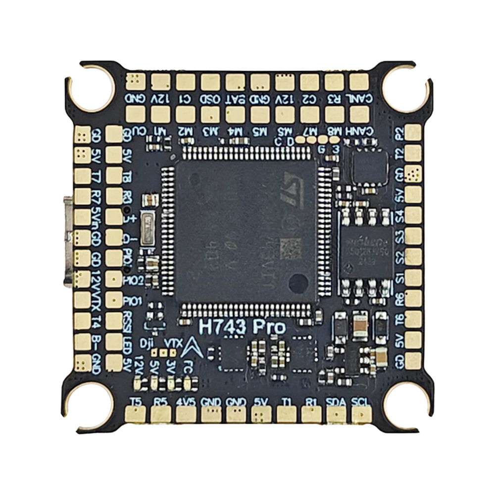
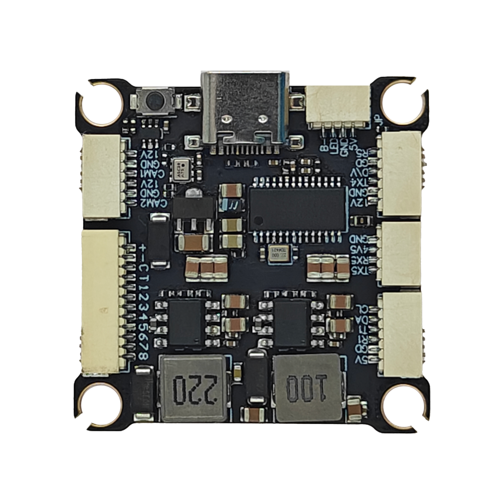
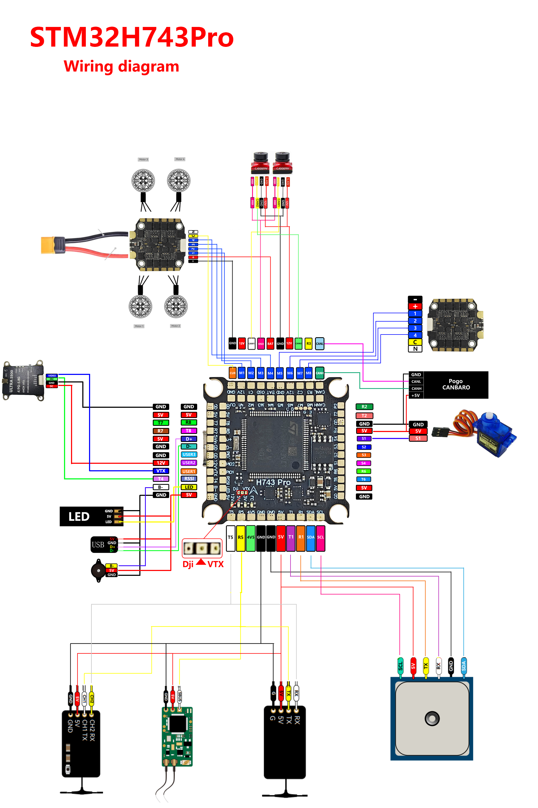

# DAKEFPV H743 Pro Flight Controller

The DAKEFPV H743 Pro is a flight controller produced by [DAKEFPV](https://www.dakefpv.com/).

## Features

 - MCU - STM32H743 32-bit processor running at 480 MHz
 - IMU - Dual ICM42688
 - Barometer - SPL06
 - OSD - AT7456E
 - Onboard Flash: 16MByte
 - 8x UARTs
 - 1x CAN port
 - 13x PWM Outputs (12 Motor Output, 1 LED)
 - Battery input voltage: 4S-12S
 - BEC 3.3V 0.5A
 - BEC 5V 3A
 - BEC 12V 3A for video, gpio controlled
 - Dual switchable camera inputs

## Pinout

## DAKEFPV H743 Pro Wiring Diagram
### DAKEFPV H743 Pro Wiring Diagram Top

### DAKEFPV H743 Pro Wiring Diagram Bottom

## UART Mapping

The UARTs are marked Rn and Tn in the above pinouts. The Rn pin is the
receive pin for UARTn. The Tn pin is the transmit pin for UARTn.

 - SERIAL0 -> USB
 - SERIAL1 -> UART1 (GPS) DMA capable
 - SERIAL2 -> UART2 (MAVLink2)
 - SERIAL3 -> UART3 (ESC Telemetry)
 - SERIAL4 -> UART4 (DisplayPort) DMA capable
 - SERIAL5 -> UART5 (RCin) RX DMA capable
 - SERIAL6 -> UART6 (User) DMA capable
 - SERIAL7 -> UART7 (User) DMA Capable
 - SERIAL8 -> UART8 (User)

## RC Input

RC input is configured by default via the USART5 RX input. It supports all unidirectional serial RC protocols except PPM . The SBUS pin is inverted and tied to R5 for SBUS support.

* FPort requires an external bi-directional inverter attached to T5 and :ref:`SERIAL5_OPTIONS<SERIAL5_OPTIONS>` set to 4 (half-duplex).  See :ref:`common-FPort-receivers`.
* CRSF/ELRS uses RX5/TX5.
* SRXL2 requires a connection to T5 and automatically provides telemetry.  Set :ref:`SERIAL5_OPTIONS<SERIAL5_OPTIONS>` to "4".

## FrSky Telemetry

FrSky Telemetry is supported using an unused UART, such as the TX2 pin (UART2 transmit).
You need to set the following parameters to enable support for FrSky S.PORT:

  - :ref:`SERIAL2_PROTOCOL<SERIAL2_PROTOCOL>` 10
  - :ref:`SERIAL2_OPTIONS<SERIAL2_OPTIONS>` 7

## PWM Output

The DAKEFPV H743 Pro supports up to 14 outputs. The pads for motor output
M1 to M8 are provided on both the motor connectors and on separate pads, plus
S1-4, LED on  separate pads for LED strip and other PWM outputs. M1-8,S1,and S2 support B-Directional DShot, S2-4 support only PWM, the LED output supports serial LED or DShot.

The PWM is in 4 groups:

 - PWM 1-4     in group1
 - PWM 5-8     in group2
The outputs are in 7 groups:

 - M 1-4     in group1
 - M 5,6     in group2
 - M 7,8    in group3
 - S 1,2    in group4
 - S 3,4    in group5 
 - OSD    in group 6
 - LED    in group 7
 - PWM 11-12   in group4
 - PWM 13      in group5 (CAMERA_CONTROL)
 - PWM 14(LED) in group6 (set as Serial LED output function by default) 

Channels within the same group need to use the same output rate. If
any channel in a group uses DShot then all channels in the group need
to use DShot.

## Battery Monitoring

The board has a built-in voltage sensor and external current sensor input. The current
sensor can read up to 130 Amps. The voltage sensor can handle up to 12S LiPo batteries.

The correct battery setting parameters are:

 - :ref:`BATT_MONITOR<BATT_MONITOR>` 4
 - :ref:`BATT_VOLT_PIN<BATT_VOLT_PIN__AP_BattMonitor_Analog>` 11 
 - :ref:`BATT_CURR_PIN<BATT_CURR_PIN__AP_BattMonitor_Analog>` 10
 - :ref:`BATT_VOLT_MULT<BATT_VOLT_MULT__AP_BattMonitor_Analog>` 16.0
 - :ref:`BATT_AMP_PERVLT<BATT_AMP_PERVLT__AP_BattMonitor_Analog>` 83.3

## RSSI

 - ADC Pin 8 -> Analog RSSI voltage monitoring. Set :ref:`RSSI_TYPE<RSSI_TYPE>` = 1 and :ref:`RSSI_ANA_PIN<RSSI_ANA_PIN>` = 8. For RSSI embedded in digital RC protocols like CRSF, set :ref:`RSSI_TYPE<RSSI_TYPE>` = 3

## Compass

The DAKEFPV H743 Pro does not have a builtin compass, but you can attach an external compass using I2C on the SDA and SCL pads.

## Camera control

GPIO 81 controls the camera output to the connectors marked "CAM1" and "CAM2". Setting this GPIO low switches the video output from CAM1 to CAM2. By default RELAY1 is configured to control this pin and sets the GPIO high.

## VTX Power Control
GPIO 82 controls the VTX power output to the connectors marked "12V". Setting this GPIO low switches the video power off. By default RELAY1 is configured to control this pin and sets the GPIO high.

## OSD Support
The DAKEFPVH743Pro has an onboard OSD using a MAX7456 chip and is enabled by default. The CAM1/2 and VTX pins provide connections for using the internal OSD. Simultaneous DisplayPort OSD is also possible and is configured by default.
The HD VTX connector can have RX4 replaced by the analog VTX signal if that connector is used for analog VTX connection by using the DJI/VTX jumper pads.

## Loading Firmware
Firmware for these boards can be found `here <https://firmware.ardupilot.org>`__ in sub-folders labeled "DAKEFPVH743Pro".
Initial firmware load can be done with DFU by plugging in USB with the
bootloader button pressed. Then you should load the "with_bl.hex"
firmware, using your favourite DFU loading tool.

Once the initial firmware is loaded you can update the firmware using
any ArduPilot ground station software. Updates should be done with the
\*.apj firmware files.
