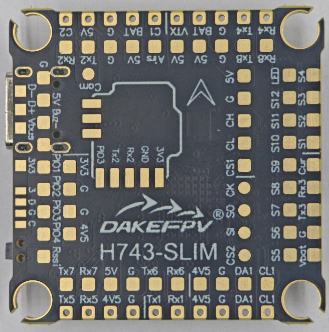
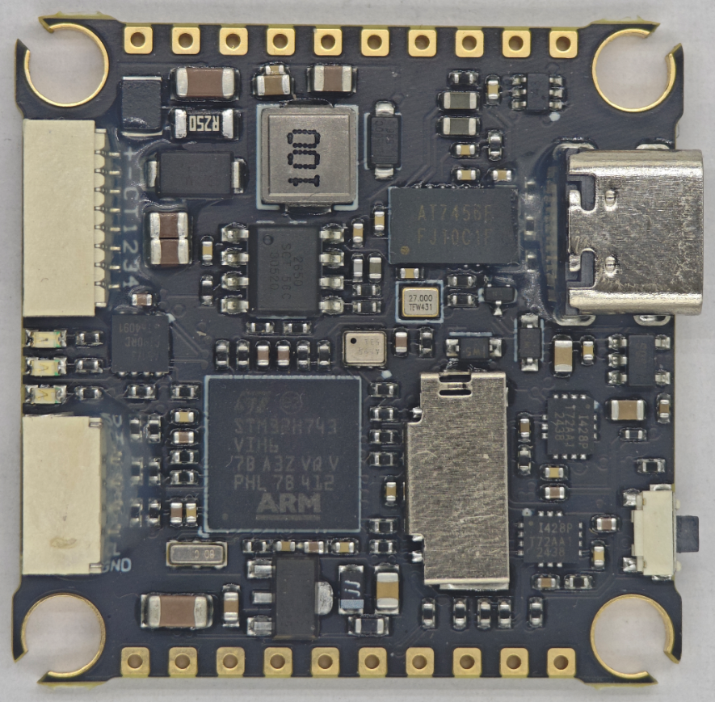
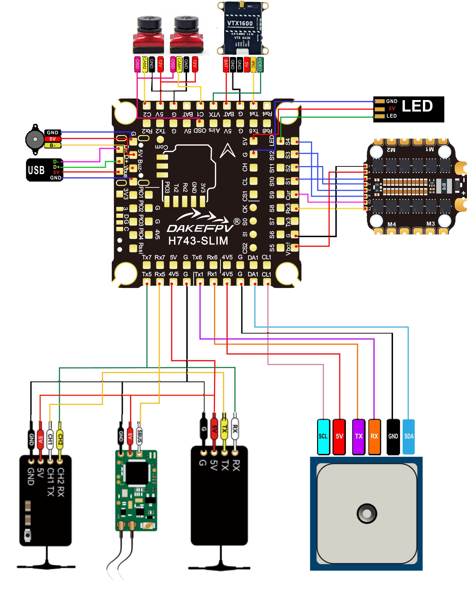
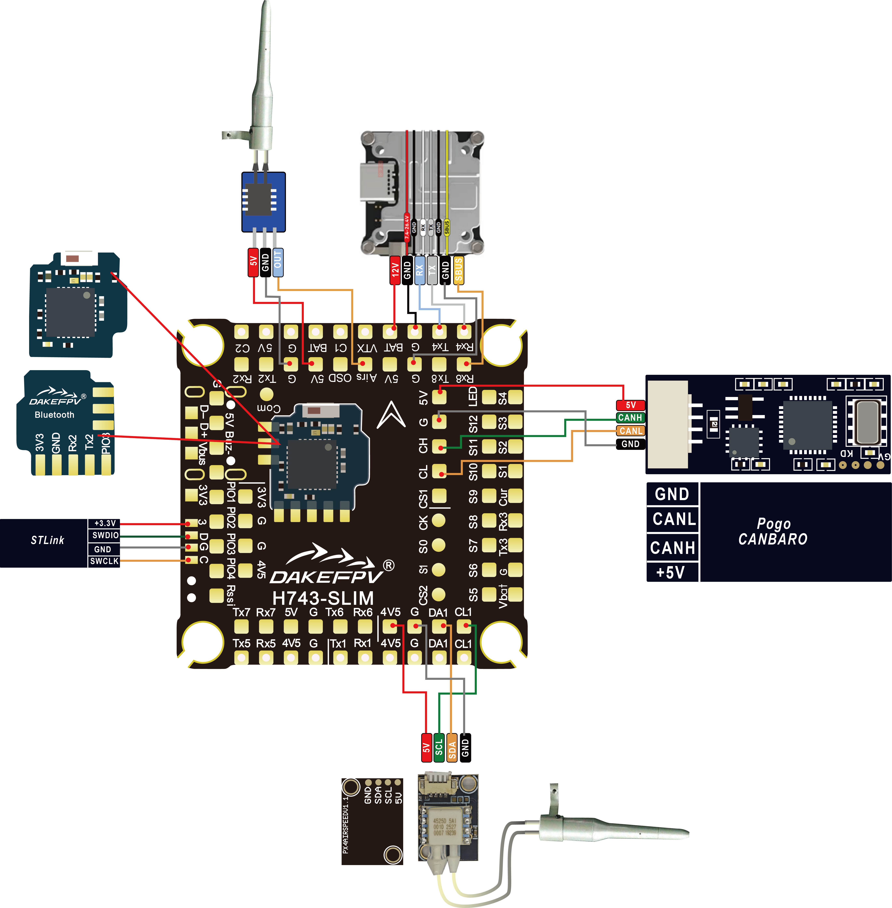
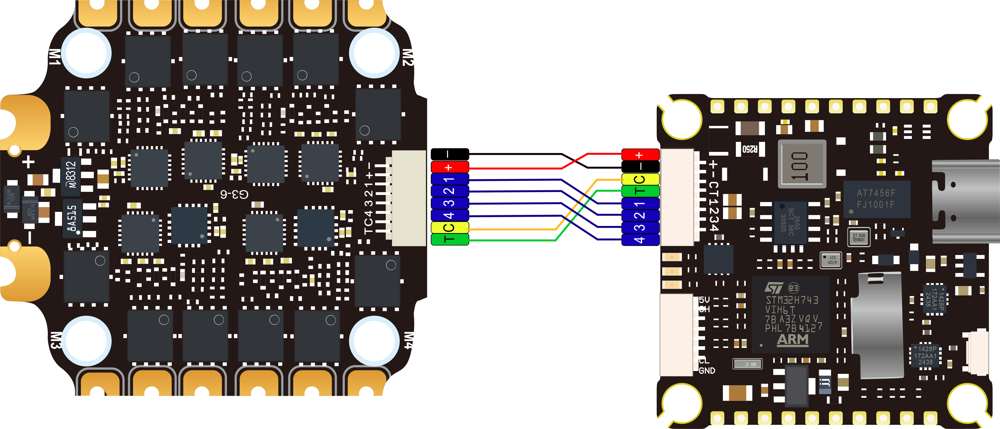

# DAKEFPV H743 SLIM Flight Controller

The DAKEFPV H743 SLIM is a flight controller produced by [DAKEFPV](https://www.dakefpv.com/).

## Features

 - MCU - STM32H743 32-bit processor running at 480 MHz
 - IMU - Dual ICM42688
 - Barometer - SPL06
 - OSD - AT7456E
 - 8x UARTs
 - 1x CAN port
 - 13x PWM Outputs (12 Motor Output, 1 LED)
 - Battery input voltage: 4S-12S
 - BEC 3.3V 0.5A
 - BEC 5V 3A
 - Dual switchable camera inputs

## Pinout

## DAKEFPV H743 SLIM Wiring Diagram
### DAKEFPV H743 SLIM Wiring Diagram Top

### DAKEFPV H743 SLIM Wiring Diagram Bottom

## UART Mapping

The UARTs are marked Rxn and Txn in the above pinouts. The Rxn pin is the
receive pin for UARTn. The Tn pin is the transmit pin for UARTn.

 - SERIAL0 -> USB
 - SERIAL1 -> UART1 (GPS) DMA capable
 - SERIAL2 -> UART2 (MAVLink2)
 - SERIAL3 -> UART3 (ESC Telemetry)
 - SERIAL4 -> UART4 (DisplayPort) DMA capable
 - SERIAL5 -> UART5 (RCin) RX DMA capable
 - SERIAL6 -> UART6 (User) DMA capable
 - SERIAL7 -> UART7 (User) DMA Capable
 - SERIAL8 -> UART8 (USER)

## RC Input

RC input is configured by default via the USART5 RX input. It supports all serial RC protocols except PPM .

* FPort requires an external bi-directional inverter attached to T5 and :ref:`SERIAL5_OPTIONS<SERIAL5_OPTIONS>` set to 4 (half-duplex).  See :ref:`common-FPort-receivers`.
* CRSF/ELRS uses RX5/TX5.
* SRXL2 requires a connection to T5 and automatically provides telemetry.  Set :ref:`SERIAL5_OPTIONS<SERIAL5_OPTIONS>` to "4".

If the user wishes to use the SBUS from a DJI air unit for RC control, it is suggested that the RX8 padd be used as shown in the wiring diagram and :ref:`SERIAL8_PROTOCOL <SERIAL8_PROTOCOL>` be set to "23" and :ref:`SERIAL5_PROTOCOL<SERIAL5_PROTOCOL>` be changed from "23" to something else.

## FrSky Telemetry

FrSky Telemetry is supported using an unused UART, such as the TX2 pin (UART2 transmit).
You need to set the following parameters to enable support for FrSky S.PORT:

  - :ref:`SERIAL2_PROTOCOL<SERIAL2_PROTOCOL>` 10
  - :ref:`SERIAL2_OPTIONS<SERIAL2_OPTIONS>` 7

## PWM Output

The DAKEFPV H743 SLIM supports up to 14 outputs. Motor outputs M1 to M8 are available on separate pads, along with independent pads for S1-4 and LED for LED strips and other PWM outputs. M1-8, S1, and S4 support bidirectional DShot, and the LED outputs support serial LEDs or DShot. M1-8 support Bi-Directional DShot.

The PWM is in 5 groups:

 - PWM 1-4     in group1
 - PWM 5-8     in group2
 - PWM 9-12    in group3 (marked as S1-4)
 - PWM 13      in group4 (Marked OSD)
 - PWM 14(LED) in group5 (set as Serial LED output function by default) 

Channels within the same group need to use the same output rate. If
any channel in a group uses DShot then all channels in the group need
to use DShot.

## Battery Monitoring

The board has a built-in voltage sensor and external current sensor input. The current
sensor can read up to 130 Amps. The voltage sensor can handle up to 12S LiPo batteries.

The correct battery setting parameters are:

 - :ref:`BATT_MONITOR<BATT_MONITOR>` 4
 - :ref:`BATT_VOLT_PIN<BATT_VOLT_PIN__AP_BattMonitor_Analog>` 11 
 - :ref:`BATT_CURR_PIN<BATT_CURR_PIN__AP_BattMonitor_Analog>` 10
 - :ref:`BATT_VOLT_MULT<BATT_VOLT_MULT__AP_BattMonitor_Analog>` 16.0
 - :ref:`BATT_AMP_PERVLT<BATT_AMP_PERVLT__AP_BattMonitor_Analog>` 83.3

## RSSI

 - ADC Pin 8 -> Analog RSSI voltage monitoring. Set :ref:`RSSI_TYPE<RSSI_TYPE>` = 1 and :ref:`RSSI_ANA_PIN<RSSI_ANA_PIN>` = 8. For RSSI embedded in digital RC protocols like CRSF, set :ref:`RSSI_TYPE<RSSI_TYPE>` = 3

## Compass

The DAKEFPV H743 SLIM does not have a builtin compass, but you can attach an external compass using I2C on the SDA and SCL pads.

## Camera control

GPIO 81 controls the camera output to the connectors marked "CAM1" and "CAM2". Setting this GPIO low switches the video output from CAM1 to CAM2. By default RELAY1 is configured to control this pin and sets the GPIO high.

## User DIY (PIO2) 

GPIO 82. PIO2 provides user-customizable control. RELAY 2 controls this GPIO

## Bluetooth

GPIO 83. The Bluetooth module is optional for users, and the flight controller has reserved solder pads for the DAKEFPV Bluetooth. The flight controller communicates with the Bluetooth module via UART2 and controls the Bluetooth module enable through PIO3 which is controlled by RELAY 3.

## PIO4

GPIO_CAN1_SILENT on Betaflight is PINIO4.

## DJI HD VTX connector

When using DJI HD video transmission, the flight controller needs to connect to DJI TX and RX via Serial 4. In the settings, set `SERIAL4_PROTOCOL `to `42` (default). If you are also using a DJI remote controller, you can connect Rx8 to the DJI SBUS interface, set `SERIAL8_PROTOCOL `to 15, and set `SERIAL5_PROTOCOL `to something else.

## OSD Support
The DAKEFPVH743_SLIM has an onboard OSD using a MAX7456 chip and is enabled by default. The CAM1/2 and VTX pins provide connections for using the internal OSD. Simultaneous DisplayPort OSD is also possible and is configured by default.
The HD VTX connector can have RX4 replaced by the analog VTX signal if that connector is used for analog VTX connection by using the DJI/VTX jumper pads.

## Loading Firmware
Firmware for these boards can be found `here <https://firmware.ardupilot.org>`__ in sub-folders labeled "DAKEFPVH743_SLIM".
Initial firmware load can be done with DFU by plugging in USB with the
bootloader button pressed. Then you should load the "with_bl.hex"
firmware, using your favourite DFU loading tool.

Once the initial firmware is loaded you can update the firmware using
any ArduPilot ground station software. Updates should be done with the
\*.apj firmware files.
