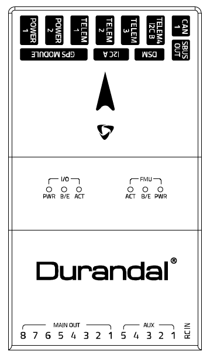
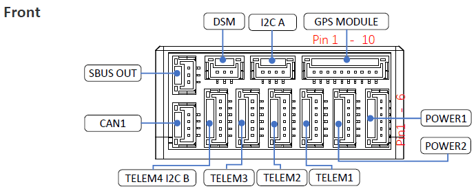
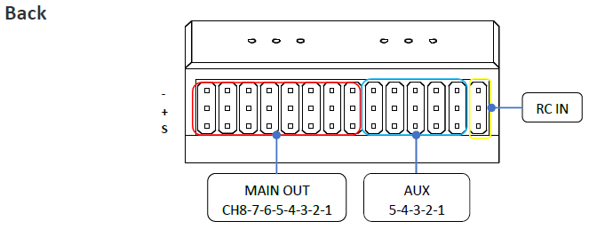
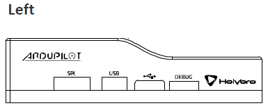
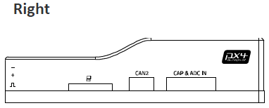

# Durandal Flight Controller

The Holybro Durandal flight controller is sold by a range of
resellers, linked from [Holybro](https://www.holybro.com)

The [full schematics](https://github.com/ArduPilot/Schematics/tree/master/Holybro/Durandal) of the board are available.

## Features

- STM32H743 microcontroller
- ICM20689 and BMI088 IMUs
- internal heater for IMU temperature control
- internal vibration isolation for IMUs
- MS5611 SPI barometer
- builtin IST8310 compass
- microSD card slot
- 6 UARTs plus dual USB
- 16 PWM outputs
- I2C and dual CAN ports
- DSM and RCIN ports
- external safety Switch
- voltage monitoring for servo rail and Vcc
- dual power input ports for external power bricks
- external USB connectors (micro USB and JST GH)

## Pinout

## UART Mapping

- SERIAL0 -> USB
- SERIAL1 -> UART2 (Telem1)
- SERIAL2 -> UART3 (Telem2)
- SERIAL3 -> UART1 (GPS)
- SERIAL4 -> UART4 (GPS2, Telem4/I2C)
- SERIAL5 -> UART6 (Telem3)
- SERIAL6 -> UART7 (debug port)
- SERIAL7 -> USB2

The Telem1, Telem2 and Telem3 ports have RTS/CTS pins, the other UARTs do not
have RTS/CTS.

## Connectors

Unless noted otherwise all connectors are JST GH

### TELEM1, TELEM2, TELEM3 ports

   | Pin | Signal | Volt |
| --- | --- | --- |
| 1 (red) | VCC | +5V |
| 2 (blk) | TX (OUT) | +3.3V |
| 3 (blk) | RX (IN) | +3.3V |
| 4 (blk) | CTS | +3.3V |
| 5 (blk) | RTS | +3.3V |
| 6 (blk) | GND | GND |

### GPS1 port

   | Pin | Signal | Volt |
| --- | --- | --- |
| 1 (red) | VCC | +5V |
| 2 (blk) | TX (OUT) | +3.3V |
| 3 (blk) | RX (IN) | +3.3V |
| 4 (blk) | SCL I2C1 | +3.3V |
| 5 (blk) | SDA I2C1 | +3.3V |
| 6 (blk) | Button | GND |
| 7 (blk) | button LED | GND |
| 8 (blk) | 3.3V | 3.3 |
| 9 (blk) | buzzer | GND |
| (blk) | GND | GND |

### GPS2, Telem4/I2C port

   | Pin | Signal | Volt |
| --- | --- | --- |
| 1 (red) | VCC | +5V |
| 2 (blk) | TX (OUT) | +3.3V |
| 3 (blk) | RX (IN) | +3.3V |
| 4 (blk) | SCL I2C2 | +3.3V |
| 5 (blk) | SDA I2C2 | +3.3V |
| 6 (blk) | GND | GND |

### SBUS Out port

The SBUS out port is a port attached to the IO processor which can be
used to output all servo channels via SBUS. It is enabled by setting
the BRD_SBUS_OUT parameter.

When SBUS output is disabled (by setting BRD_SBUS_OUT to 0) you can
use the port for analog RSSI input from receivers. To enable for RSSI
input you need to set:

- BRD_SBUS_OUT 0
- RSSI_TYPE 1
- RSSI_PIN 103

You cannot have both SBUS output and analog RSSI input at the same time.

   | Pin | Signal | Volt |
| --- | --- | --- |
| 1 | GND | GND |
| 2 | 5v(Vservo) | +5.0V |
| 3 | TX (OUT) | +3.3V |

### DSM/SPKT port

The SPKT port provides a connector for Spektrum satellite
receivers. It is needed to allow for software controlled binding of
satellite receivers.

   | Pin | Signal | Volt |
| --- | --- | --- |
| 1 | RX (IN) | +3.3V |
| 2 | GND | GND |
| 3 | 3.3v | +3.3V |

### ADC / CAPTURE

   | Pin | Signal | Volt |
| --- | --- | --- |
| 1 (red) | VCC | +5V |
| 2 (blk) | FMU_CAP6, AUX6, GPIO 55 |  |
| 3 (blk) | FMU_CAP5, AUX7, GPIO 56 |  |
| 4 (blk) | FMU_CAP4, AUX8, GPIO 57 |  |
| 5 (blk) | FMU_CAP3, GPIO 60 |  |
| 6 (blk) | FMU_CAP2, GPIO 59 |  |
| 7 (blk) | FMU_CAP1, GPIO 58 |  |
| 8 (blk) | ADC1_3V3 (ADC pin 4) |  |
| 9 (blk) | ADC1_6V6 (ADC pin 18) |  |
| 10 (blk) | GND | GND |

### I2C

   | Pin | Signal | Volt |
| --- | --- | --- |
| 1 (red) | VCC | +5V |
| 2 (blk) | SCL | +3.3 (pullups) |
| 3 (blk) | SDA | +3.3 (pullups) |
| 4 (blk) | GND | GND |

### CAN1&2

   | Pin | Signal | Volt |
| --- | --- | --- |
| 1 (red) | VCC | +5V |
| 2 (blk) | CAN_H | +12V |
| 3 (blk) | CAN_L | +12V |
| 4 (blk) | GND | GND |

### POWER1&2

   | Pin | Signal | Volt |
| --- | --- | --- |
| 1 (red) | VCC | +5V |
| 2 (red) | VCC | +5V |
| 3 (blk) | CURRENT | up to +3.3V |
| 4 (blk) | VOLTAGE | up to +3.3V |
| 5 (blk) | GND | GND |
| 6 (blk) | GND | GND |

### USB

   | Pin | Signal | Volt |
| --- | --- | --- |
| 1 (red) | VCC | +5V |
| 2 (blk) | D_minus | +3.3V |
| 3 (blk) | D_plus | +3.3V |
| 4 (blk) | GND | GND |

## RC Input

RC input is configured on the RCIN pin, at one end of the servo rail,
marked RCIN in the above diagram. This pin supports all RC
protocols. In addition there is a dedicated Spektrum satellite port
which supports software power control, allowing for binding of
Spektrum satellite receivers.

## PWM Output

The Durandal supports up to 16 PWM outputs. First first 8 outputs (labelled
"MAIN") are controlled by a dedicated STM32F100 IO controller. These 8
outputs support all PWM output formats, but not DShot.

The remaining 6 outputs (labelled AUX1 to AUX6) are the "auxiliary"
outputs. These are directly attached to the STM32F427 and support all
PWM protocols as well as DShot.

All 14 PWM outputs have GND on the top row, 5V on the middle row and
signal on the bottom row.

The 8 main PWM outputs are in 3 groups:

- PWM 1 and 2 in group1
- PWM 3 and 4 in group2
- PWM 5, 6, 7 and 8 in group3

The 8 auxiliary PWM outputs are in 2 groups:

- PWM 1, 2, 3 and 4 in group4
- PWM 5 and 6 in group5
- PWM 7 and 8 in group6 (no DMA, no DShot)

Channels within the same group need to use the same output rate. If
any channel in a group uses DShot then all channels in the group need
to use DShot.

## Battery Monitoring

The board has two dedicated power monitor ports on 6 pin
connectors. The correct battery setting parameters are dependent on
the type of power brick which is connected.

## Compass

The Durandal has one builtin IST8310 compass.

## GPIOs

The 8 PWM ports can be used as GPIOs (relays, buttons, RPM etc). To
use them you need to limit the number of these pins that is used for
PWM by setting the BRD_PWM_COUNT to a number less than 8. For example
if you set BRD_PWM_COUNT to 6 then PWM7 and PWM8 will be available for
use as GPIOs.

The numbering of the GPIOs for PIN variables in ArduPilot is:

- PWM1 50
- PWM2 51
- PWM3 52
- PWM4 53
- PWM5 54
- PWM6 55
- PWM7 56
- PWM8 57

## Analog inputs

The Durandal has 7 analog inputs

- ADC Pin16 -> Battery Voltage
- ADC Pin17 -> Battery Current Sensor
- ADC Pin14 -> Battery2 Voltage
- ADC Pin15 -> Battery2 Current Sensor
- ADC Pin4 -> ADC port pin 8 (3.3V limit)
- ADC Pin18 -> ADC port pin 9 (6.6V limit)
- ADC Pin9 -> RSSI in
- ADC Pin10 -> 5V Sense
- ADC Pin11 -> 3.3V Sense

## IMU Heater

The IMU heater in the Durandal can be controlled with the
BRD_HEAT_TARG parameter, which is in degrees C.

## Loading Firmware

The board comes pre-installed with an ArduPilot compatible bootloader,
allowing the loading of *.apj firmware files with any ArduPilot
compatible ground station.

## Acknowledgements

Thanks to [Holybro](http://www.holybro.com) for images
