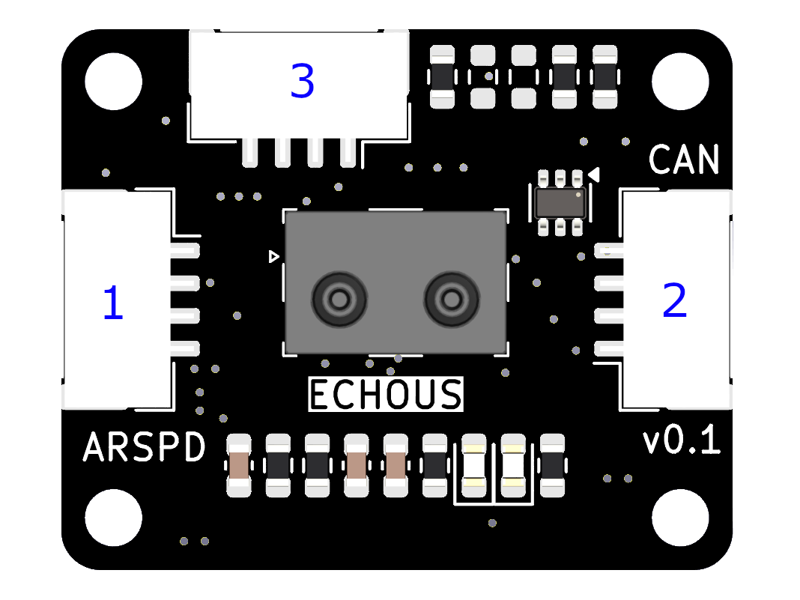
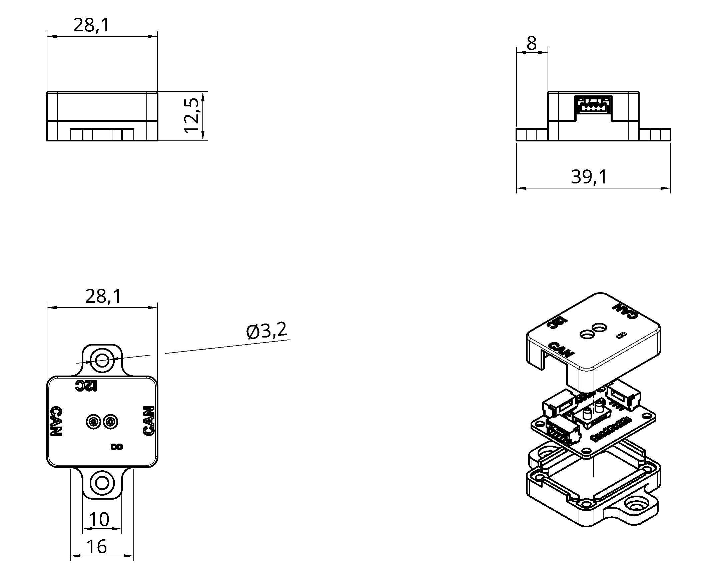

# EchoUS SDP3x CAN Airspeed Sensor

The EchoUS SDP3x Airspeed Sensor is a CAN-connected airspeed node running AP_Periph firmware on the STM32L431 microcontroller. It uses an SDP3x series differential pressure sensor connected via I2C and communicates with the flight controller over DroneCAN.

For more information see the [EchoUS SDP3x Airspeed Sensor documentation](https://echo-us.github.io/sdp3x-airspeed-sensor/can-version).

## Features

- STM32L431 microcontroller
- AP_Periph firmware
- SDP3x differential pressure sensor (default: DLVR 10", ±1500 Pa / ±2 in. H₂O)
- Maximum airspeed: 50 m/s
- Calibrated and temperature-compensated
- Sampling rate: 2 kHz at 16-bit resolution
- Dual CAN connectors (CAN passthrough) for daisy-chaining
- I2C connector for direct sensor access
- No I2C address selection needed (CAN version)
- M3 mounting holes
- Input voltage: 5V (maximum 5.5V)

## Connector Pinouts

### CAN 1 & CAN 2 (4-Pin)

| Pin | Name  | Function     |
|-----|-------|--------------|
| 1   | 5V    | Power supply |
| 2   | CAN H | CAN High     |
| 3   | CAN L | CAN Low      |
| 4   | GND   | Ground       |

### I2C JST (4-Pin)

| Pin | Name | Function       |
|-----|------|----------------|
| 1   | 5V   | Power supply   |
| 2   | SCL  | I2C Clock line |
| 3   | SDA  | I2C Data line  |
| 4   | GND  | Ground         |

The red dot on the plug side denotes Pin 1.

## Dimensions

## ArduPilot Configuration

Enable DroneCAN on the flight controller CAN port:

- Set `CAN_P1_DRIVER = 1` (enable DroneCAN on CAN1)
- Set `CAN_D1_PROTOCOL = 1` (DroneCAN)

The airspeed sensor will be detected automatically. To verify:

- Set `ARSPD_TYPE = 8` (DroneCAN)
- Set `ARSPD_BUS = 0`

## Firmware

Firmware for this board is available from the [ArduPilot Firmware Server](https://firmware.ardupilot.org) under the `EchoUS-Airspeed` target.

## Loading Firmware

Initial firmware loading is done via the bootloader using DFU or the CAN bootloader. Subsequent updates can be applied via DroneCAN using a ground station such as Mission Planner or QGroundControl.
