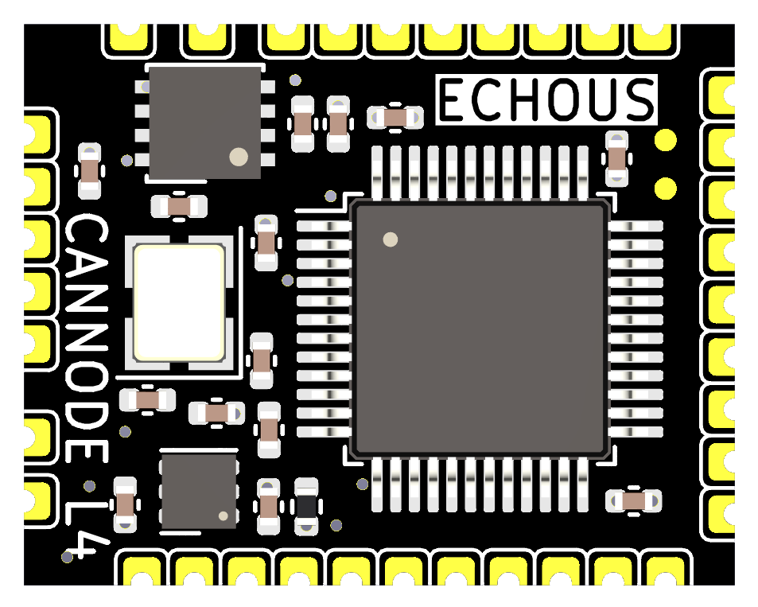

# EchoUS CAN Node

Featuring compatibility directly with AP_Periph firmware, the EchoUS CAN Node allows integration to another level with proven CAN circuitry, and an optimised layout and compact size.

Taking 5V (5.5V maximum) input, all the needed circuitry is integrated into the node, meaning the only external component needed is one termination resistor to best fit the usage scenario.

For more information see the [EchoUS CAN Node documentation](https://echo-us.github.io/can-node/overview).

## Features

- STM32L431 microcontroller
- AP_Periph firmware
- DroneCAN interface
- SPI1 with RM3100 magnetometer support
- I2C2 bus
- 3x UARTs (debug, MSP, GPS)
- SWD debug interface
- Input voltage: 5V (maximum 5.5V)

## Pin Assignments

**MCU:** STM32L431xx | **Flash:** 256 KB | **Crystal:** 8 MHz

### CAN Bus

| Pin | Function | Notes |
|-----|----------|-------|
| PB8 | CAN1_RX  | DroneCAN |
| PB9 | CAN1_TX  | DroneCAN |

### I2C

| Pin  | Function | Notes      |
|------|----------|------------|
| PB13 | I2C2_SCL | Sensor bus |
| PB14 | I2C2_SDA | Sensor bus |

### SPI1 — RM3100 Compass

| Pin | Function  | Notes              |
|-----|-----------|--------------------|
| PA4 | MAG_CS    | Chip select        |
| PA5 | SPI1_SCK  | Clock              |
| PA6 | SPI1_MISO | Data in            |
| PA7 | SPI1_MOSI | Data out           |
| PB2 | SPARE_CS  | Spare chip select  |

### UARTs

| Pin  | Function  | Role  | Notes      |
|------|-----------|-------|------------|
| PA9  | USART1_TX | Debug | 57600 baud |
| PA10 | USART1_RX | Debug | 57600 baud |
| PA2  | USART2_TX | MSP   |            |
| PA3  | USART2_RX | MSP   |            |
| PB10 | USART3_TX | GPS   | No DMA     |
| PB11 | USART3_RX | GPS   | No DMA     |

### Debug

| Pin  | Function | Notes     |
|------|----------|-----------|
| PA13 | SWDIO    | SWD debug |
| PA14 | SWCLK    | SWD debug |

## Firmware

Firmware for this board is available from the [ArduPilot Firmware Server](https://firmware.ardupilot.org) under the `EchoUS-L431` target.

## Loading Firmware

Initial firmware loading is done via the bootloader using DFU or the CAN bootloader. Subsequent updates can be applied via DroneCAN using a ground station such as Mission Planner or QGroundControl.
