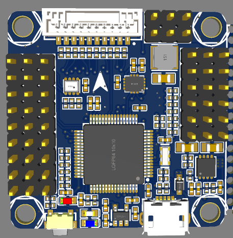
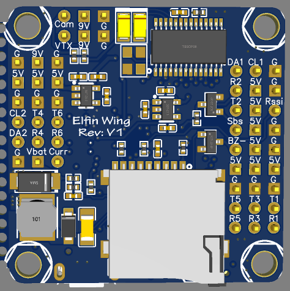

# Elfin-Wing v1 Flight Controller

Elfin-Wing v1 is an open-source and self-made flight controller. [Elfin-Wing](https://github.com/suiaiyun/Elfin-Wing-FC.git)

## Features

 - STM32F405 microcontroller
 - ICM-42688-p IMU
 - SPL06-001 barometer
 - SDCard
 - AT7456E OSD
 - 6 UARTs
 - 10 PWM outputs

## Pinout

## Default UART

 - SERIAL0 = USB
 - SERIAL1 = USART1
 - SERIAL2 = empty
 - SERIAL3 = USART3
 - SERIAL4 = UART4
 - SERIAL5 = UART5
 - SERIAL6 = USART6
 - SERIAL7 = USART2 (only if BRD_ALT_CONFIG =1)

## RC Input

RC input is configured on the R2 (UART2_RX) pin for most RC unidirectional protocols except SBUS which should be applied at the SBUS pin. PPM is not supported.
  
## OSD Support

The Elfin-Wing v1 supports OSD using OSD_TYPE 1 (MAX7456 driver).

## PWM Output

The first 9 servo/motor outputs are marked on the board: S1-S9. S10 is connected to the pin marked LED in ArduPilot’s definition. Using S10 allows the easy grouping for odd numbers of motors with a common DShot or PWM frequency without sacrificing the use of an output for servo use due to rate issues (see above Dshot discussion).

## Battery Monitoring

These settings are set as defaults when the firmware is loaded (except BATT_AMP_PERVLT which needs to be changed from the default value). However, if they are ever lost, you can manually set the parameters:

The default battery parameters are:

 - BATT_MONITOR 4
 - BATT_VOLT_PIN 10
 - BATT_CURR_PIN 11
 - BATT_VOLT_MULT 11
 - BATT_AMP_PERVLT 31.7

## Loading Firmware

Initial firmware load can be done with DFU by plugging in USB with the
bootloader button pressed. Then you should load the "with_bl.hex"
firmware, using your favourite DFU loading tool.

Once the initial firmware is loaded you can update the firmware using
any ArduPilot ground station software. Updates should be done with the
*.apj firmware files.