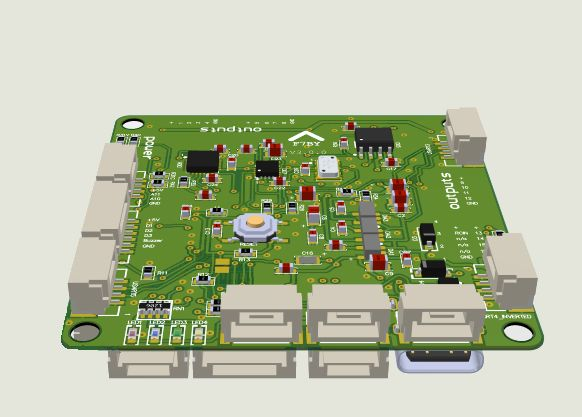
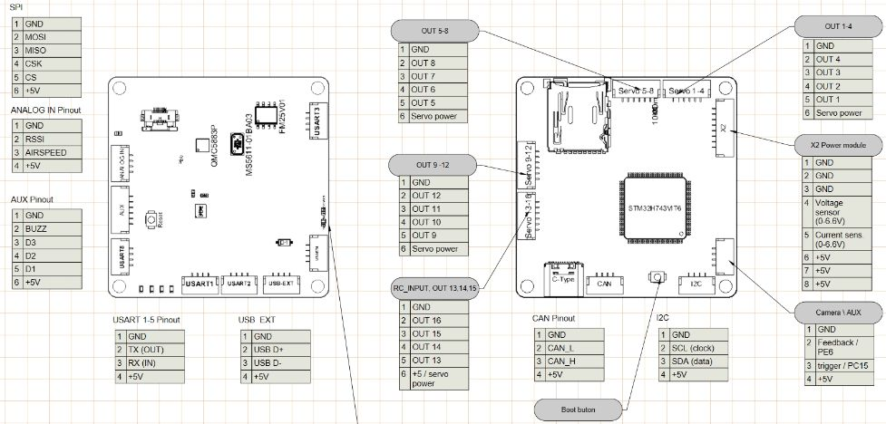
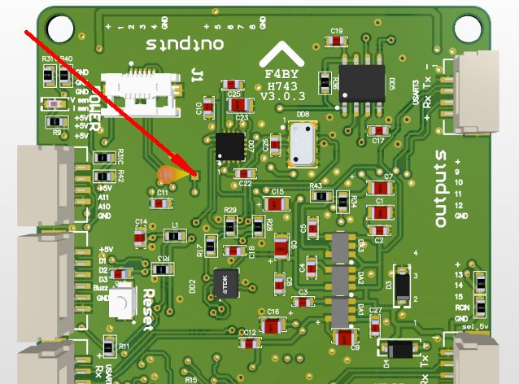

=========
F4BY_H743
=========

The F4BY_H743 autopilot is manufactured by `F4BY Team <https://f4by.com>`__

Where to Buy
============

Shop `here https://f4by.com/en/?order/our_product`__
The instructions, schematic, 3D model  are available `here https://f4by.com/en/?doc/fc_f4by_v3.0.1_h743`__

Specifications
==============
    - Processor

        - STM32H743 32-bit processor, 480Mhz
        - 2MB Flash
        - 1MB RAM

    Sensors
        - ICM-42688-P IMU (F4BY_H743 v3.0.3)  
        - IIM-42652   IMU (F4BY_H743 v3.0.2)
        - MPU6000     IMU (F4BY_H743 v3.0.1)   
        - MS5611 Barometer 
        - QMC5883P Compass   
    Power
        - Power from external power module (range +5.0 ... +6.0V)
        - Anslog current and voltage analog inputs (range 0 ... +6,6V)
    Interfaces
        - 16x PWM outputs DShot capable (include 4x BDShot)
        - 1x RC input
        - 5x UARTs/serial for GPS, bi-directional RC and other peripherals)
        - 1x I2C port for external compass, airspeed, etc.
        - 1x CAN bus
        - Buzzer output
        - micro SD Card for logging, Lua scripts etc.
        - USB type-C port
        - USB GHS type port for external connector.
        - DFU bootloader button

Analog sensors
==============

- Analog airspeed PC0 (0...+3.3v range) pin 10
- Analog rssi PC1     (0...+3.3v range) pin 11
- Voltage sensing PC3 (0...+6.6v range) pin 13
- Current sensing PC2 (0...+6.6v range) pin 12
- Board power sensing PC4 (0...+6.6v range)
- Servo power sensing PC5 (0...+9.9v range)

Analog Airspeed
===============
If the ARSPD pin is used for analog airspeed  input. 
Set :ref:`ARSPD_PIN<ARSPD_PIN>` to 10. 
Set :ref:`ARSPD_TYPE<ARSPD_TYPE>` to "1".

Analog RSSI
===========
If the RSSI pin is used for analog RSSI input. Set :ref:`RSSI_ANA_PIN<RSSI_ANA_PIN>` to 11. 
Set :ref:`RSSI_TYPE<RSSI_TYPE>` to "1" .

UART Mapping
============
The UARTs are marked Rn and Tn in the above pinouts. The Rn pin is the receive pin for UARTn. The Tn pin is the transmit pin for UARTn

|Port  | UART    |Protocol        |RX DMA |TX DMA |
|------|---------|----------------|-------|-------|
|0     |  USB    |  MAVLink2      |  ✘    |   ✘   |
|1     |  USART2 |  RC            |  ✔    |   ✔   |
|2     |  UART1  |  MAVLink2      |  ✔    |   ✔   |
|3     |  USART3 |  GPS           |  ✘    |   ✔   |
|4     |  UART4  |  None          |  ✘    |   ✔   |
|5     |  UART5  |  None          |  ✘    |   ✔   |

RC Input
========

- RCin  PB0  
Using the RCin pin will support all unidirectional RC protocols. (PPM, SBUS, iBus, PPM-Sum, DSM,DSM2,DSM-X,SRXL and SUM-D)

- USART2 for Bi-directional protocols (CRSF/ELRS,SRXL2,IRC Ghost, and FPort) see `here <https://ardupilot.org/sub/docs/common-rc-systems.html#common-rc-systems>`

PWM Output
==========

PWM/DShot capable motor outputs:

Group #1

|Out   | Port    |GPIOPIN |BDSHOT |
|------|---------|--------|-------|
|1     | PA0     | 50     | ✔     |
|2     | PA1     | 51     | ✔     |
|3     | PA2     | 52     | ✔     |
|4     | PA0     | 53     | ✔     |

Group #2

|Out   | Port    |GPIOPIN |BDSHOT |
|------|---------|--------|-------|
|5     | PE9     | 54     | ✔     |
|6     | PE11    | 55     | ✔     |
|7     | PE13    | 56     | ✔     |
|8     | PE14    | 57     | ✔     |

Group #3

|Out   | Port    |GPIOPIN |BDSHOT |
|------|---------|--------|-------|
|9     | PD13    | 58     |       |
|10    | PD12    | 59     |       |
|11    | PD15    | 60     |       |
|12    | PD14    | 61     |       |

Group #4

|Out   | Port    |GPIOPIN |BDSHOT |
|------|---------|--------|-------|
|13    | PC7     | 62     |       |
|14    | PC6     | 63     |       |
|15    | PC8     | 64     |       |
|16    | PC9     | 65     |       |

**Note:** All outputs of a group must be of the same type (PWM or DSHOT). 

GPIOs
=====

-D1 pin 1
-D2 pin 2
-D3 pin 3
-Cam Feedback pin 4
-Cam Trigger pin 5

**Note:**  0 ... +3.3V range. This pins can be used for relay control, camera shutter, camera feedback e.t.c.

Dimensions 
==========

- Size: 50 x 50 mm  
- Mounting holes: 45 x 45 mm (M3)  
- Weight: 15.5 g

Pinout
======

RCIN solder pad location for board version 3.0.3

Battery Monitor
===============

The board has a external current and voltage sensor input. The sensors range from 0v to +6.6V.

The default battery parameters are:

* :ref:`BATT_MONITOR<BATT_MONITOR>` = 4
* :ref:`BATT_VOLT_PIN<BATT_VOLT_PIN__AP_BattMonitor_Analog>` = 13
* :ref:`BATT_CURR_PIN<BATT_CURR_PIN__AP_BattMonitor_Analog>` = 12
* :ref:`BATT_VOLT_MULT<BATT_VOLT_MULT__AP_BattMonitor_Analog>` = 16.04981
* :ref:`BATT_AMP_PERVLT<BATT_AMP_PERVLT__AP_BattMonitor_Analog>` = 100 (will need to be adjusted for whichever current sensor is attached)

Compass
=======

The F4BY_H743 has a built-in compass. Due to potential interference, the autopilot is usually used with an external I2C compass as part of a GPS/Compass combination.

Firmware 
========

for F4BY_H743 can be found `here <https://firmware.ardupilot.org>`  in sub-folders labeled “F4BY_H743”.

Loading Firmware
================

The board comes pre-installed with an ArduPilot compatible bootloader, allowing the loading of xxxxxx.apj firmware files with any ArduPilot compatible ground station.

Initial firmware load can be done via DFU mode by plugging in USB while holding the bootloader button. Load the "with_bl.hex" firmware using your preferred DFU tool.

