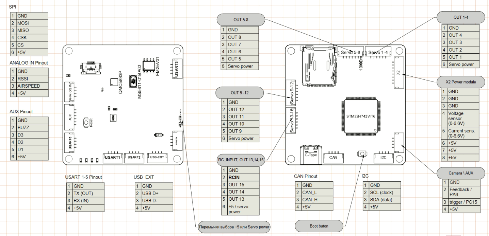

# F4BY_H743 Flight Controller with STM32H743VIT MCU

The F4BY_H743 flight controller shop: https://f4by.com/en/?order/our_product
The instructions, schematic, 3D model  are available here: https://f4by.com/en/?doc/fc_f4by_v3.0.1_h743

## Features
    Processor
        STM32H743VIT6 MCU (2M flash)
    Sensors
        ICM-42688-P IMU (F4BY_H743 v3.0.3)  
        IIM-42652   IMU (F4BY_H743 v3.0.2)
        MPU6000     IMU (F4BY_H743 v3.0.1)   
        MS5611 Barometer 
        QMC5883P Compass   
    Power
        power from external power module (range +5.0 ... +6.0V)
        anslog current and voltage analog inputs (range 0 ... +6,6V)
    Interfaces
        12x PWM outputs DShot capable 
        1x RC input
        5x UARTs/serial for GPS, bi-directional RC and other peripherals)
        1x I2C port for external compass, airspeed, etc.
        1x CAN bus
        Buzzer output
        microSDCard for logging, Lua scripts etc.
        USB type-C port
        USB GHS type port for external connector.
        DFU bootloader button

## Analog sensors

- Analog airspeed PC0 (0...+3.3v range) pin 10
- Analog rssi PC1     (0...+3.3v range) pin 11
- Voltage sensing PC3 (0...+6.6v range) pin 13
- Current sensing PC2 (0...+6.6v range) pin 12
- Board power sensing PC4 (0...+6.6v range)
- Servo power sensing PC5 (0...+9.9v range)

## UART Mapping
 
- **USB**: SERIAL0
- **UART1**: SERIAL2  PB6 (TX),  PB7 (RX) – DMA 
- **USART2**: SERIAL1 PD5 (TX),  PD6 (RX) - DMA at RX   
- **USART3**: SERIAL3 PD8 (TX),  PD9 (RX) - DMA at RX
- **UART4**: SERIAL4  PC10 (TX), PC11 (RX)– DMA at RX 
- **UART5**: Serial5  PC12 (TX), PD2 (RX) – No DMA  

## RC Input
- RCin  PB0  
Using the RCin pin will support all unidirectional RC protocols. (PPM, SBUS, iBus, PPM-Sum, DSM,DSM2,DSM-X,SRXL and SUM-D)

- USART2 for Bi-directional protocols (CRSF/ELRS,SRXL2,IRC Ghost, and FPort) see `here <https://ardupilot.org/sub/docs/common-rc-systems.html#common-rc-systems>`

## PWM Output

PWM/DShot capable motor outputs:

Group #1
- M1: PA0 (TIM2_CH1)  pin 50
- M2: PA1 (TIM2_CH2)  pin 51
- M3: PA2 (TIM2_CH3)  pin 52
- M4: PA0 (TIM2_CH4)  pin 53

Group #2
- M5: PE9  (TIM1_CH1)  pin 54
- M6: PE11 (TIM1_CH2)  pin 55
- M7: PE13 (TIM1_CH3)  pin 56
- M8: PE14 (TIM1_CH4)  pin 57

Group #3
- M9:  PD13 (TIM4_CH2)  pin 58
- M10: PD12 (TIM4_CH1)  pin 59
- M11: PD15 (TIM4_CH4)  pin 60
- M12: PD14 (TIM4_CH3)  pin 61

Group #4
- M13: PC7 (TIM8_CH2)  pin 62
- M14: PC6 (TIM8_CH1)  pin 63
- M15: PC8 (TIM8_CH3)  pin 64
- M16: PC9 (TIM8_CH4)  pin 65

**Note:** All outputs of a group must be of the same type. 

## Digital inputs/outputs:

- PC14  pin 1
- PC13  pin 2
- PE4   pin 3
- PE6   pin 4
- PC15  pin 5

**Note:**  0 ... +3.3V range. This pins can be used for relay control, camera shutter, camera feedback e.t.c.

### Dimensions 
- Size: 50 x 50 mm  
- Mounting holes: 45 x 45 mm (M3)  
- Weight: 15.5 g

## Pinout

## Battery Monitor

The board has a external current and voltage sensor input. The sensors range from 0v to +6.6V.

The default battery parameters are:

* :ref:`BATT_MONITOR<BATT_MONITOR>` = 4
* :ref:`BATT_VOLT_PIN<BATT_VOLT_PIN__AP_BattMonitor_Analog>` = 13
* :ref:`BATT_CURR_PIN<BATT_CURR_PIN__AP_BattMonitor_Analog>` = 12
* :ref:`BATT_VOLT_MULT<BATT_VOLT_MULT__AP_BattMonitor_Analog>` = 16.04981
* :ref:`BATT_AMP_PERVLT<BATT_AMP_PERVLT__AP_BattMonitor_Analog>` = 100 (will need to be adjusted for whichever current sensor is attached)

## Compass

The F4BY_H743 has a built-in compass. Due to potential interference, the autopilot is usually used with an external I2C compass as part of a GPS/Compass combination.

## Firmware 
for F4BY_H743 can be found `here <https://firmware.ardupilot.org>`  in sub-folders labeled “F4BY_H743”.

## Loading Firmware

The board comes pre-installed with an ArduPilot compatible bootloader, allowing the loading of xxxxxx.apj firmware files with any ArduPilot compatible ground station.

Initial firmware load can be done via DFU mode by plugging in USB while holding the bootloader button. Load the "with_bl.hex" firmware using your preferred DFU tool.

