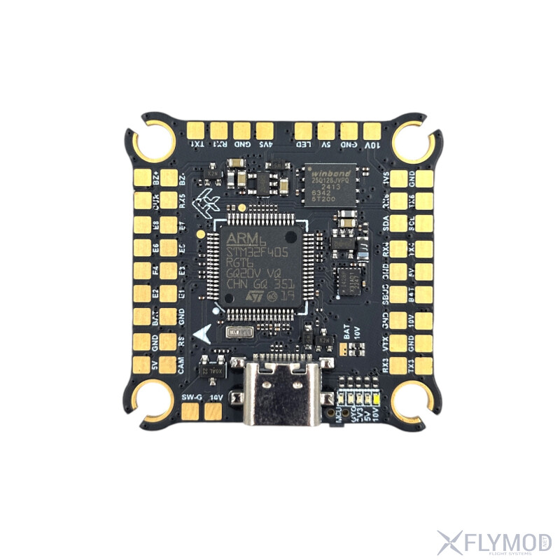
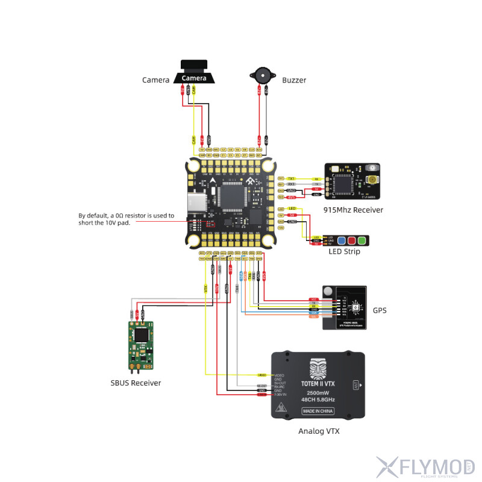

# FlyFishRC F405 Flight Controller

The FlyFishRC F405 is a flight controller based on the STM32F405xx microcontroller.

## Features

- STM32F405xx microcontroller
- IMU: ICM-42688-P (SPI1, CW90 rotation)
- Barometer: DPS310 (I2C1)
- OSD: MAX7456 analog OSD (SPI2)
- Dataflash: onboard SPI flash (SPI3)
- 8 PWM/DShot motor outputs
- 1 NeoPixel LED output
- 6 UARTs and USB
- Battery voltage and current sensing
- Buzzer
- 2 PINIO outputs (VTX power / camera switch)

## UART Mapping

- SERIAL0 -> USB (OTG1)
- SERIAL1 -> USART1 (RC input, default CRSF/ELRS)
- SERIAL2 -> USART2 (general purpose)
- SERIAL3 -> USART3 (general purpose)
- SERIAL4 -> UART4 (general purpose)
- SERIAL5 -> UART5 (RX only, TX conflicts with SPI3)
- SERIAL6 -> USART6 (GPS)

## RC Input

RC input is configured on USART1 (SERIAL1). It supports all serial RC protocols including CRSF/ELRS.

## PWM Output

The FlyFishRC F405 supports up to 8 PWM/DShot outputs and 1 NeoPixel output. All motor outputs support DShot.

PWM outputs are in the following groups:

- PWM 1,2 in group1 (TIM8, CH3/CH4)
- PWM 3,4,5 in group2 (TIM1, CH1/CH2/CH3)
- PWM 6,7,8 in group3 (TIM3, CH1/CH3/CH4)
- PWM 9 (NeoPixel, TIM2 CH2)

## GPIOs

| PWM Channel | Pin  |
| ----------- | ---- |
| PWM1        | 50   |
| PWM2        | 51   |
| PWM3        | 52   |
| PWM4        | 53   |
| PWM5        | 54   |
| PWM6        | 55   |
| PWM7        | 56   |
| PWM8        | 57   |

## Battery Monitoring

Battery monitoring is configured by default:

- BATT_MONITOR 4
- BATT_VOLT_PIN 11
- BATT_CURR_PIN 13
- BATT_VOLT_SCALE 11.0
- BATT_AMP_PERVLT 40.0

## Compass

The FlyFishRC F405 has no internal compass. An external compass can be connected via I2C (SDA/SCL pads).

## Board Images





## Loading Firmware

Firmware for this board can be found at the [ArduPilot firmware server](https://firmware.ardupilot.org) in sub-folders labeled "FlyFishRCF405".

Initial firmware load can be done with DFU by plugging in USB with the boot button pressed. Then load the "FlyFishRCF405_bl.hex" bootloader using a DFU tool:

```bash
dfu-util -a 0 -s 0x08000000:leave -D FlyFishRCF405_bl.hex
```

Subsequently, firmware can be updated via Mission Planner or QGroundControl.
