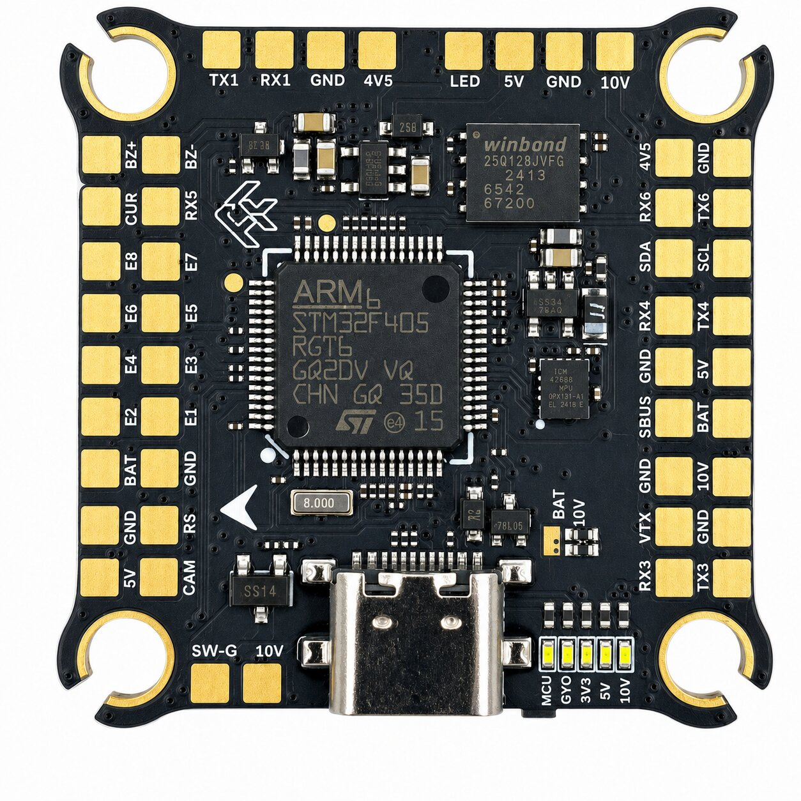

# FlyFishRC F405 Flight Controller

The FlyFishRC F405 is a flight controller produced by [FlyFishRC](https://www.flyfishrc.com/).

## Features

- MCU - STM32F405 32-bit processor, 1024KBytes Flash
- IMU - ICM-42688-P
- Barometer - DPS310
- OSD - AT7456E
- Onboard Flash: 16MByte
- 6x UARTs
- 9x PWM Outputs (8 Motor Output, 1 LED)
- Battery input voltage: 2S-8S (7.4V - 33.6V)
- BEC 5V 3A
- BEC 10V 2.5A for video, jumper selectable to battery voltage
- 4V5 output for the receiver, also powered from USB
- Hardware SBUS inverter
- Analog RSSI input
- Switched VTX power output
- Dimensions: 36 x 36 x 8 mm
- Mounting: 30.5 x 30.5mm, M3
- Weight: 9.6g

## Pinout

## UART Mapping

The UARTs are marked Rn and Tn on the board.

| Port    | UART   | Protocol | TX DMA | RX DMA | Pads                     |
|---------|--------|----------|--------|--------|--------------------------|
| SERIAL0 | USB    | MAVLink2 | ✘      | ✘      |                          |
| SERIAL1 | USART1 | RCIN     | ✔      | ✔      | TX1, RX1                 |
| SERIAL2 | USART2 | None     | ✔      | ✔      | SBUS (RX only, inverted) |
| SERIAL3 | USART3 | None     | ✔      | ✘      | TX3, RX3                 |
| SERIAL4 | UART4  | None     | ✘      | ✘      | TX4, RX4                 |
| SERIAL5 | UART5  | None     | n/a    | ✘      | RX5 only                 |
| SERIAL6 | USART6 | GPS      | ✔      | ✘      | TX6, RX6                 |

UART5 has no TX pad; only `RX5` is broken out on the board.

## RC Input

RC input is defaulted to SERIAL1 (USART1) on the `TX1`/`RX1` pads. This is a full
UART, which CRSF/ELRS requires for reliable operation. CRSF/ELRS connects here with
SERIAL1_OPTIONS left at 0. SRXL2 connects to `TX1` only, with SERIAL1_OPTIONS set to 4.

SBUS must use the SBUS pad. The `SBUS` pad is wired to USART2 RX through the onboard
hardware inverter, which is the only inverted port on this board. To use it set
SERIAL2_PROTOCOL to 23, SERIAL2_OPTIONS to 1, and SERIAL1_PROTOCOL to 0, since only
one serial port can be used for RC input.

This board has no timer-based RC input pin, so PPM is not supported.

FPort requires using a Bi-directional inverter, see
[Radio Control Systems](https://ardupilot.org/copter/docs/common-rc-systems.html)
for details on this and on other specific RC systems.

## OSD Support

The FlyFishRC F405 has a built-in analog OSD, enabled by default
(`OSD_TYPE` = 1). Connect the camera to the `CAM` pad and the video transmitter to
the `VTX` pad.

## PWM Output

The FlyFishRC F405 supports up to 8 PWM/DShot motor outputs plus one serial LED
output. PWM9 is the serial LED output on the `LED` pad and defaults to that function.

PWM outputs are in the following groups:

- PWM 1,2 in group1
- PWM 3,4,5 in group2
- PWM 6,7,8 in group3
- PWM 9 in group4

Channels within the same group need to use the same output rate. If any channel in a
group uses DShot, all channels in that group must use DShot.

## GPIOs

| Pad  | GPIO |
|------|------|
| E1   | 50   |
| E2   | 51   |
| E3   | 52   |
| E4   | 53   |
| E5   | 54   |
| E6   | 55   |
| E7   | 56   |
| E8   | 57   |
| LED  | 58   |
| BZ+  | 80   |
| SW-G | 82   |

## VTX Power Switch

The video transmitter power can be turned off/on using GPIO 82, which is already
assigned by default to RELAY1. Connect the video transmitter supply between the
adjacent `10V` pad and the `SW-G` pad, which RELAY1 switches to ground. It is off at
boot, so the video transmitter is not powered until the relay is turned on. This relay
can be controlled either from the GCS or using a transmitter channel (see
[auxiliary functions](https://ardupilot.org/copter/docs/common-auxiliary-functions.html)).

## 10V / BAT Jumper

The `10V` video power pads are fed from the onboard 10V regulator, selected by a 0 ohm
resistor fitted on the `10V` side of the `BAT` / `10V` solder jumper on the right-hand
side of the board. Moving that resistor to the `BAT` side connects the pads directly to
battery voltage instead, for video transmitters that accept full pack voltage.

## Battery Monitoring

Battery monitoring is configured by default:

- BATT_MONITOR = 4
- BATT_VOLT_PIN = 11
- BATT_CURR_PIN = 13
- BATT_VOLT_MULT = 11.0
- BATT_AMP_PERVLT = 40.0 (starting value; calibrate against actual current after install)

The 11:1 voltage divider supports up to 8S (33.6V maximum).

## Compass

The FlyFishRC F405 does not have a builtin compass, but you can attach an external
compass using I2C on the SDA and SCL pads.

## Status LEDs

A row of indicator LEDs is fitted beside the USB connector, labelled `MCU`, `GYO`,
`3V3`, `5V` and `10V`. The `3V3`, `5V` and `10V` LEDs indicate the corresponding power
rails. `MCU` and `GYO` are the two autopilot-controlled status LEDs.

## Other Pads

- `RS` - analog RSSI input. RSSI_ANA_PIN is preset to 12. Set RSSI_TYPE = 1 to enable
  it. RSSI_PIN_HIGH defaults to 5.0V, so lower it to 3.3 if the receiver outputs a
  0-3.3V RSSI voltage.
- `SW-G` - switched ground for the video transmitter, controlled by RELAY1. See
  "VTX Power Switch" above.
- `4V5` - output for the receiver and GPS. It is fed through a diode from both the USB
  supply and the onboard 5V BEC, which is where the lower voltage comes from, so the
  `4V5` pads stay powered when only USB is connected while all other 5V pads need a
  battery. That allows a receiver to be bound and configured, or a GPS lock acquired,
  without a battery. It is not a separate regulator, so its current comes out of the 5V
  BEC budget; be careful not to present too much load to the USB source or voltage
  droop may occur.
- `CUR` - current sense input from the ESC.

## Where to Buy

- [FlyFishRC F405 Stack at FlyMod](https://flymod.net/en/item/stack_flyfishrc_f405_v12_esc)

## Loading Firmware

Firmware for this board can be found at the
[ArduPilot firmware server](https://firmware.ardupilot.org) in sub-folders
labeled "FlyFishRCF405".

Initial firmware load can be done with DFU by plugging in USB with the boot
button pressed. Then you should load the "ardu*_with_bl.hex" firmware, using your
favourite DFU loading tool. eg STM32CubeProgrammer

Subsequently, you can update firmware with Mission Planner.
