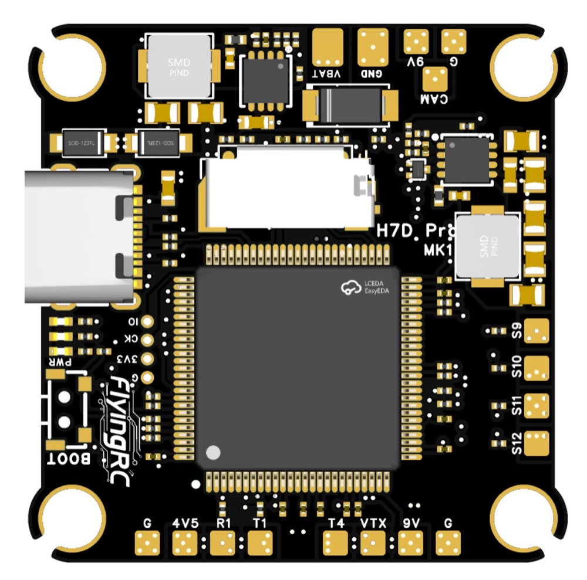

# FlyingRCH7DPro-bdshot

This is the bi-directional DShot variant of the FlyingRC H7D Pro target.

For board hardware details, pinout, and images, see the main
[FlyingRCH7DPro README](../FlyingRCH7DPro/README.md).

