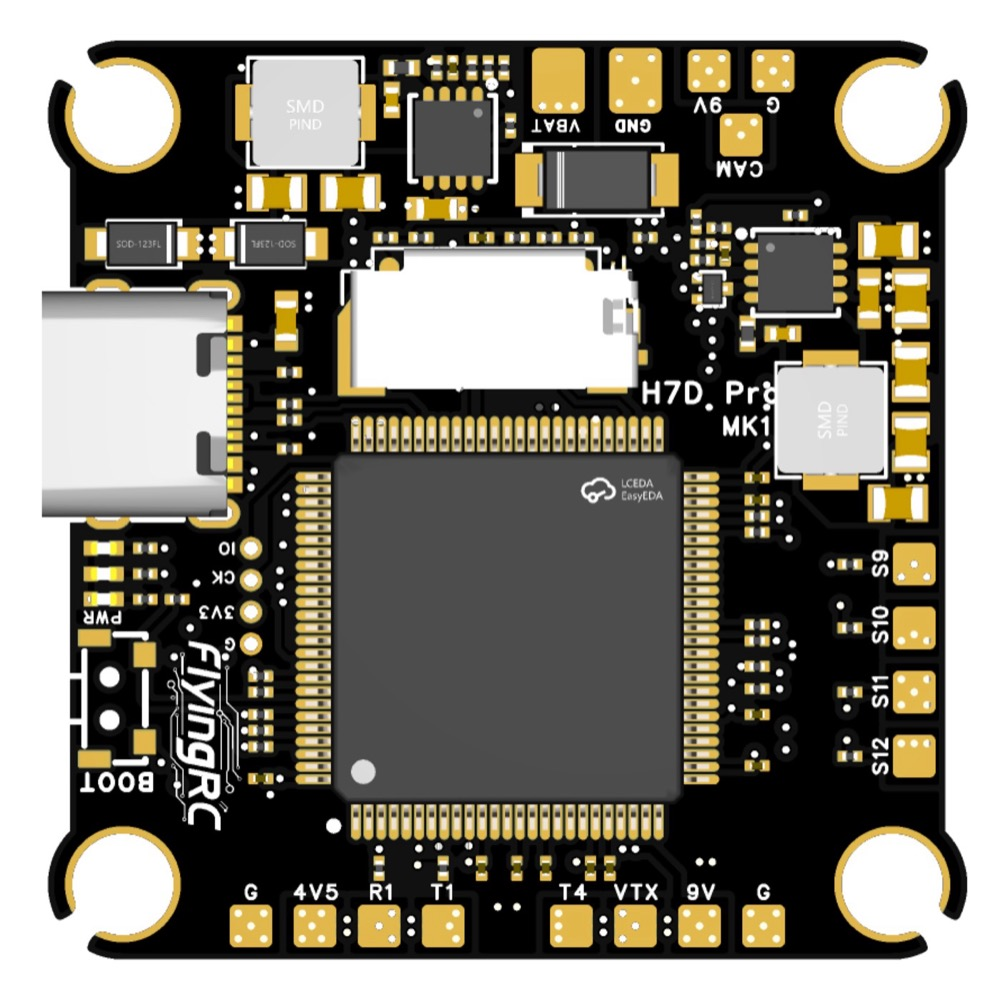

# FlyingRCH7DPro-bdshot

This is the bi-directional DShot variant of the FlyingRC H7D Pro target.

For board hardware details, pinout, and images, see the main
[FlyingRCH7DPro README](../FlyingRCH7DPro/README.md).

This target uses USART6 (`SERIAL7`, connector `UART6 RCIN`) as the receiver
UART and defaults `SERIAL7_PROTOCOL` to RCIN. USART6 RX/TX both have DMA, so
CRSF/ELRS can use `R6` and `T6` for bidirectional telemetry. Unidirectional
serial protocols such as SBUS remain supported on `R6`, but PPM is not
available because the timer is used by the BDShot motor outputs.

The DJI digital VTX connector's `R8` pin is UART8 RX (`SERIAL5`) and can be
used as an alternate SBUS input by setting `SERIAL5_PROTOCOL=23` and
`SERIAL5_OPTIONS=3`. UART8 is RX-only and interrupt-driven.

The Digital VTX connector uses UART4 (`SERIAL6`) and defaults to MSP
DisplayPort with `OSD_TYPE2=5`. UART4 TX has DMA; RX is interrupt-driven to
preserve the exclusive DMA allocations required by the IMU SPI buses and the
BDShot motor timer groups.

