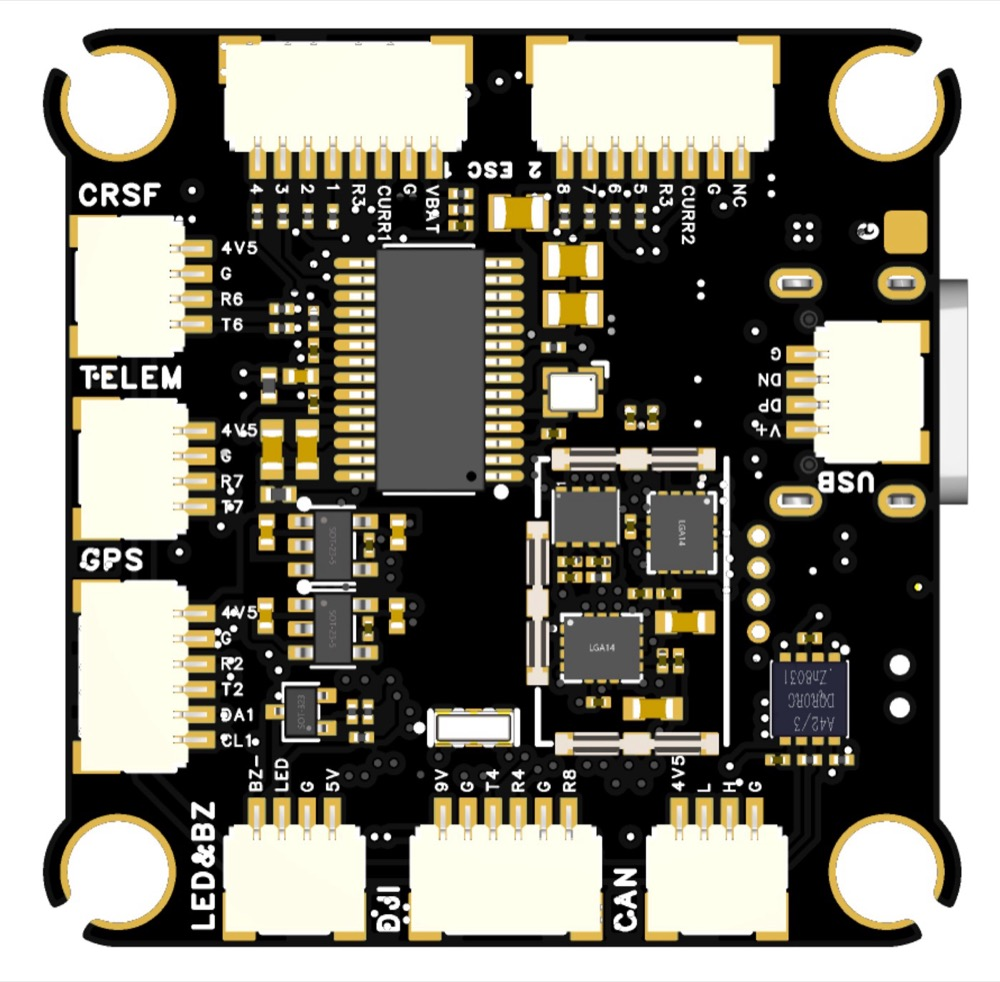
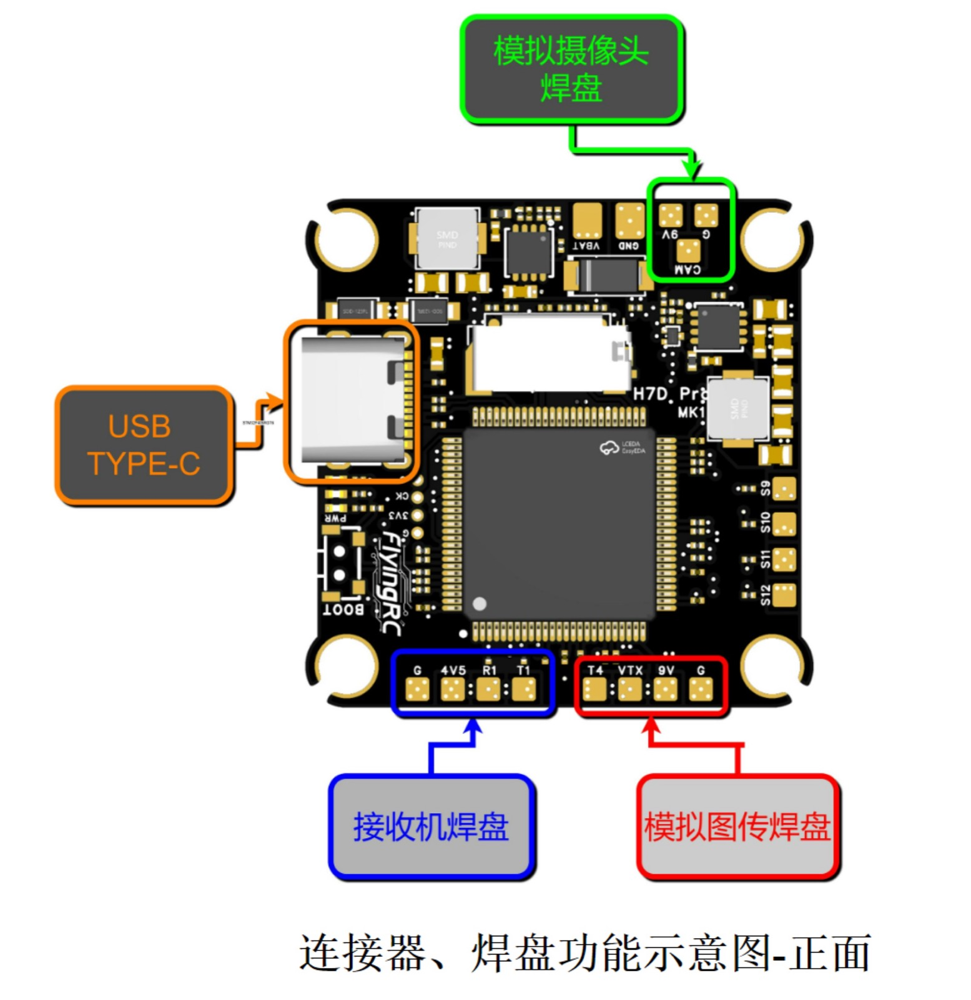
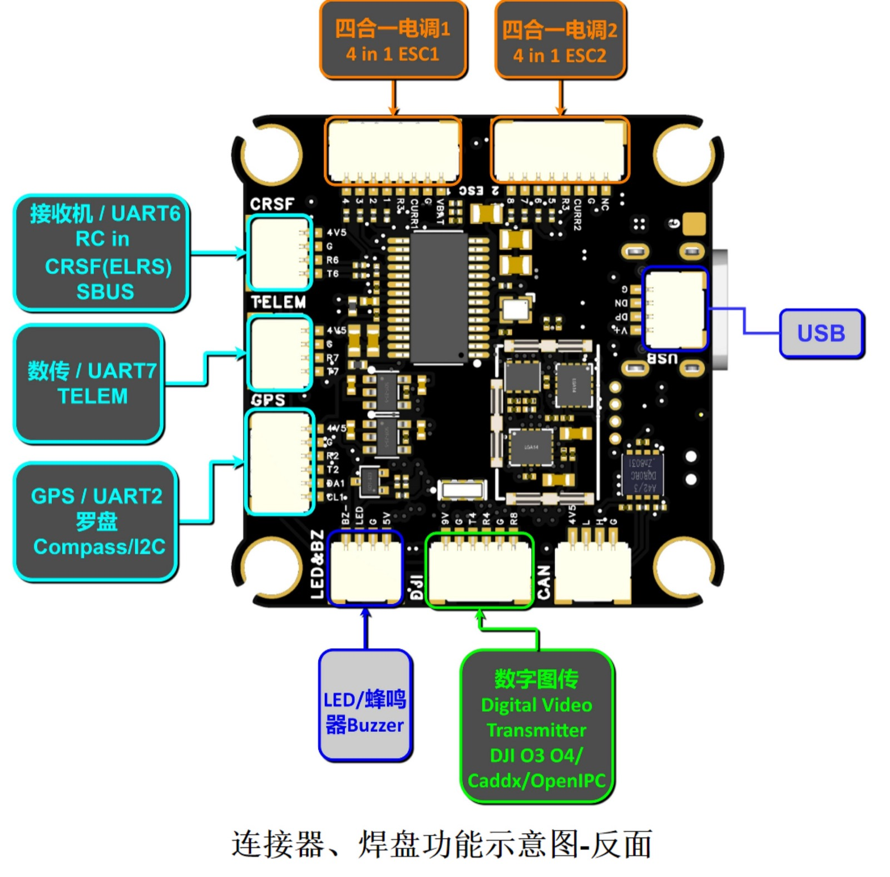

# FlyingRC H7D Pro Flight Controller

The FlyingRC H7D Pro is an STM32H743-based FPV flight controller for
feature-rich multirotor builds.

Product documentation and wiring references are published on the
[FlyingRC site](https://flyingrc-official.github.io/product.html?p=h7d-pro).

## Features

- STM32H743 microcontroller.
- Dual ICM42688 IMUs:
  - `icm42688_1` on SPI1, chip select `IMU1_CS` / PC15.
  - `icm42688_2` on SPI4, chip select `IMU3_CS` / PC13.
- Barometer support for DPS310 / SPL06 on I2C2.
- AT7456E analog OSD.
- microSD card support.
- CAN1 bus.
- Onboard voltage and current sensing.
- External compass probing on I2C.
- WS2812 LED output on PWM13 / S13.
- Switchable onboard 9 V VTX/camera BEC controlled by `PINIO1` / User1.

## Physical




## Pinout





## Firmware Targets

Two ArduPilot targets are provided:

- `FlyingRCH7DPro`: standard target.
- `FlyingRCH7DPro-bdshot`: bi-directional DShot target with the timer and DMA
  remapping required for BDShot.

The BDShot target reuses the standard `FlyingRCH7DPro` bootloader with:

```text
USE_BOOTLOADER_FROM_BOARD FlyingRCH7DPro
```

## UART Mapping

ArduPilot SERIAL numbers do not match the board UART labels one-to-one. The
current hwdef uses this order:

| ArduPilot port | Hardware port | Typical label / use |
| --- | --- | --- |
| SERIAL0 | USB OTG1 | USB |
| SERIAL1 | UART7 | Telem1 |
| SERIAL2 | USART1 | Telem2 |
| SERIAL3 | USART2 | GPS1 |
| SERIAL4 | USART3 | GPS2 |
| SERIAL5 | UART8 | Spare |
| SERIAL6 | UART4 | Spare |
| SERIAL7 | USART6 | RC input |

## RC Input

The standard target keeps RC input on `PC7` as timer-based `RCININT` and also
provides an alternate USART6 RX definition for UART-based receiver protocols.

The `FlyingRCH7DPro-bdshot` target uses USART6 as the RC input UART because the
timer resources are needed for bi-directional DShot.

## OSD Support

The FlyingRC H7D Pro supports onboard analog OSD using OSD_TYPE 1
(AT7456E/MAX7456-compatible driver).

## PWM Outputs

The standard target provides 12 PWM outputs plus PWM13 for the WS2812 LED pad.

| Output | Pin | Standard target | BDShot target |
| --- | --- | --- | --- |
| PWM1 | PB0 | TIM8_CH2N | TIM3_CH3, BIDIR |
| PWM2 | PB1 | TIM8_CH3N | TIM3_CH4 |
| PWM3 | PA0 | TIM5_CH1 | TIM2_CH1, BIDIR |
| PWM4 | PA1 | TIM5_CH2 | TIM2_CH2 |
| PWM5 | PA2 | TIM5_CH3 | TIM5_CH3, BIDIR |
| PWM6 | PA3 | TIM5_CH4 | TIM5_CH4 |
| PWM7 | PD12 | TIM4_CH1 | TIM4_CH1, BIDIR |
| PWM8 | PD13 | TIM4_CH2 | TIM4_CH2 |
| PWM9 | PD14 | TIM4_CH3 | TIM4_CH3, NODMA |
| PWM10 | PD15 | TIM4_CH4 | TIM4_CH4, NODMA |
| PWM11 | PE5 | TIM15_CH1 | TIM15_CH1, NODMA |
| PWM12 | PE6 | TIM15_CH2 | TIM15_CH2, NODMA |
| PWM13 | PA8 | TIM1_CH1 | TIM1_CH1, WS2812 LED |

In the BDShot target, M1/M3/M5/M7 carry the `BIDIR` timer-capture definitions
needed for the M1-M8 bi-directional DShot motor set. PWM9-PWM12 have DMA
disabled so that the LED output keeps a usable DMA channel.

## Battery Monitoring

Default battery monitor settings in the hwdef:

- `BATT_MONITOR`: 4
- `BATT_VOLT_PIN`: 10
- `BATT_CURR_PIN`: 11
- `BATT_VOLT_MULT`: 21.0
- `BATT_AMP_PERVLT`: 100.0

The product material lists the board for 12-28 V DC / 3S-6S LiPo input. Verify
the actual power wiring and current-sensor calibration before flight.

## PINIO / VTX Power

`PINIO1` is assigned to PD10 / GPIO81 and is intended for VTX BEC power switch
control:

```text
PD10 PINIO1 OUTPUT GPIO(81) LOW
```

The product documentation describes this as a switchable onboard 9 V VTX/camera
BEC controlled through PINIO1/User1.

## Compass and IMUs

The current ArduPilot target probes the two ICM42688 IMUs with these
orientations:

```text
IMU Invensensev3 SPI:icm42688_1 ROTATION_YAW_270
IMU Invensensev3 SPI:icm42688_2 ROTATION_YAW_180
```

The board has no built-in compass in this hwdef. External compass probing is
enabled on the I2C bus.

## Loading Firmware

For an initial DFU flash, hold the boot button while plugging in USB and load a
`*_with_bl.hex` firmware image. After the bootloader is installed, firmware can
normally be updated from an ArduPilot-compatible ground station with the `.apj`
file for the matching target.

Use the target that matches the build:

- Standard DShot / PWM builds: `FlyingRCH7DPro`
- Bi-directional DShot builds: `FlyingRCH7DPro-bdshot`

Always verify board target, wiring, sensor orientation, motor order, and battery
monitor calibration before flight.
