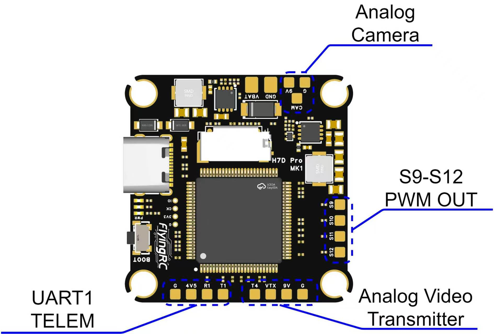
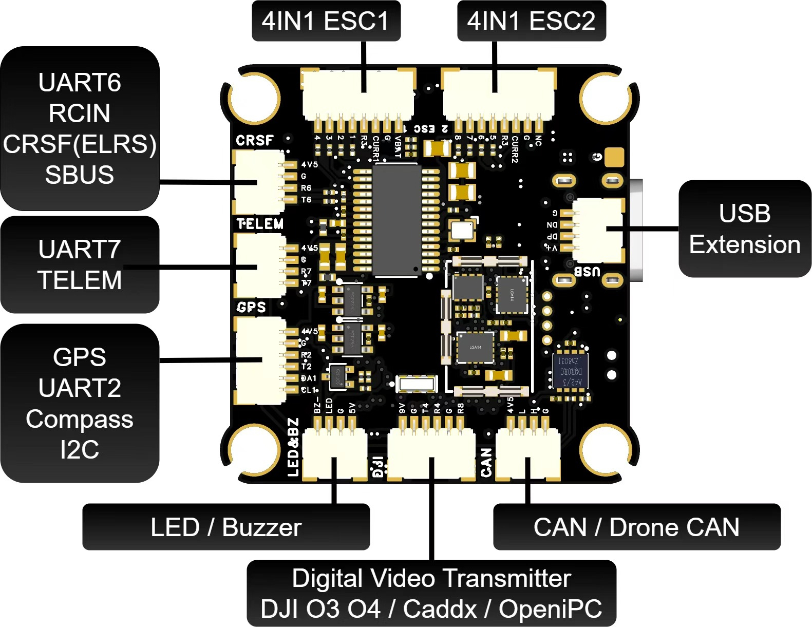

# FlyingRC H7D Pro Flight Controller

The FlyingRC H7D Pro is an STM32H743-based FPV flight controller for
feature-rich multirotor builds.

Product documentation and wiring references are published on the
[FlyingRC H7D Pro product page](https://flyingrc-official.github.io/en/products/h7d-pro/).

## Where to Buy

The FlyingRC H7D Pro is available from the
[FlyingRC Taobao store](https://e7wgwo2ehnynhjklw2knt535zmlw176.world.taobao.com/shop/view_shop.htm?appUid=RAzN8HAiDiXrnbmP2phqB88hKp1Wt).

## Features

- STM32H743 microcontroller.
- Dual ICM42688 IMUs:
  - `icm42688_1` on SPI1, chip select `IMU1_CS` / PC15.
  - `icm42688_2` on SPI4, chip select `IMU2_CS` / PC13.
- Barometer support for DPS310 / SPL06 on I2C2.
- AT7456E analog OSD.
- microSD card support.
- CAN1 bus.
- Onboard voltage sensing and two independent ESC current-sense inputs.
- External compass probing on I2C through the GPS connector `DA1`/`CL1` pins.
- WS2812 LED output on PWM13 / `LED`.
- Switchable onboard 9 V VTX/camera BEC controlled by `RELAY1`.
- Digital VTX connector on UART4 (`T4`/`R4`, ArduPilot `SERIAL6`).
- DJI digital VTX SBUS input on UART8 (`R8`, ArduPilot `SERIAL5`).

## Physical


## Pinout





## Firmware Targets

Two ArduPilot targets are provided:

- `FlyingRCH7DPro`: standard target.
- `FlyingRCH7DPro-bdshot`: bi-directional DShot target with the timer and DMA
  remapping required for BDShot.

Firmware for the FlyingRC H7D Pro is available from the
[ArduPilot Firmware Server](https://firmware.ardupilot.org) under the
`FlyingRCH7DPro` and `FlyingRCH7DPro-bdshot` targets.

The BDShot target reuses the standard `FlyingRCH7DPro` bootloader with:

```text
USE_BOOTLOADER_FROM_BOARD FlyingRCH7DPro
```

## UART Mapping

ArduPilot SERIAL numbers do not match the board UART labels one-to-one. The DMA
column lists RX/TX DMA availability for the standard target first and notes any
BDShot-target difference.

| ArduPilot port | Hardware port | Board label / use | Default protocol | DMA | Flow control |
| --- | --- | --- | --- | --- | --- |
| SERIAL0 | USB OTG1 | USB | MAVLink2 | N/A | N/A |
| SERIAL1 | UART7 | Telem1 | MAVLink2 | RX and TX | Not exposed |
| SERIAL2 | USART1 | Telem2 | MAVLink2 | RX and TX | None |
| SERIAL3 | USART2 | GPS1 | GPS | RX and TX | None |
| SERIAL4 | USART3 | R3, ESC telemetry | ESC telemetry | RX only | None |
| SERIAL5 | UART8 | DJI VTX SBUS input, R8 | None | RX only, interrupt-driven | None |
| SERIAL6 | UART4 | Digital VTX, T4/R4 | MSP DisplayPort | Standard: RX and TX; BDShot: TX only | None |
| SERIAL7 | USART6 | UART6 RCIN, R6/T6 | RCIN | RX and TX | None |

Both 4-in-1 ESC connectors expose the same `R3` signal, which is
`USART3_RX`/PD9 (`SERIAL4`). It is an RX-only ESC telemetry input; there is no
`T3` pad and this port is not assigned as GPS2. Connect only one telemetry
source to the shared `R3` signal.

The Telem1 connector exposes only `4V5`, `G`, `R7`, and `T7`. UART7 CTS and RTS
are not routed to the connector, so hardware flow control is unavailable on
`SERIAL1`.

## CAN

The board provides one DroneCAN/CAN1 connector with `4V5`, `G`, `H`, and `L`
pins. The CAN transceiver silent-mode control is GPIO70. It starts LOW, which
enables the transceiver for normal CAN operation.

## RC Input

The receiver connector is labelled `UART6 RCIN` and exposes `4V5`, `G`, `R6`,
and `T6`. Both targets default to the full USART6 UART with
`SERIAL7_PROTOCOL=23` (RCIN), so CRSF/ELRS can use `R6` and `T6` for
bidirectional telemetry. USART6 RX and TX both have DMA. Serial receiver
protocols such as SBUS are auto-detected on `R6`; PPM is not supported on this
connector.

For common serial receiver configurations:

- FPort on `R6`: connect the single wire to `R6` and set `SERIAL7_OPTIONS=15`.
- FPort on `T6`: connect the single wire to `T6` and set `SERIAL7_OPTIONS=7`.
- CRSF/ELRS: connect both `R6` and `T6` and set `SERIAL7_OPTIONS=0`.
- SRXL2: connect the receiver to `T6` and set `SERIAL7_OPTIONS=4`.

The DJI digital VTX connector also exposes its SBUS output on `R8`, which is
UART8 RX (`SERIAL5`). To use it as an alternate RC input, set
`SERIAL7_PROTOCOL=-1` to disable the primary RC input, then set
`SERIAL5_PROTOCOL=23`. SBUS inversion is handled automatically by the RC
protocol detector, so no `SERIAL5_OPTIONS` change is required. UART8 is RX-only
on this board and uses interrupt-driven input rather than DMA. See the
[ArduPilot RC systems documentation](https://ardupilot.org/copter/docs/common-rc-systems.html)
for receiver-specific setup.

## OSD Support

The FlyingRC H7D Pro supports onboard analog OSD using `OSD_TYPE=1`
(AT7456E/MAX7456-compatible driver).

The analog camera connector exposes `9V`/`G`/`CAM`, where `CAM` is the composite
video input to the onboard OSD. The analog video transmitter connector exposes
`T4`/`VTX`/`9V`/`G`, where `VTX` is the OSD-processed composite video output.

The Digital VTX connector `T4`/`R4` is UART4 (`SERIAL6`). Both targets default
`SERIAL6_PROTOCOL` to MSP DisplayPort and `OSD_TYPE2=5`. The standard target has
DMA on both UART4 directions; the BDShot target keeps DMA on UART4 TX and uses
interrupt-driven RX so the IMU and motor-timer DMA allocations remain
conflict-free.

The onboard analog OSD video path operates alongside MSP DisplayPort OSD by
default. Only the `T4` control signal is shared: UART4 TX is routed to both the
digital VTX connector and the analog VTX control pad. To control an analog VTX,
change `SERIAL6_PROTOCOL` from MSP DisplayPort to SmartAudio or Tramp as required
by the VTX, and set `OSD_TYPE2=0` to disable DisplayPort and avoid a pre-arm
warning. The shared `T4` signal cannot provide analog VTX control and MSP
DisplayPort at the same time; this does not affect the independent `CAM` to
`VTX` analog video path.

## PWM Outputs

The standard target provides 12 PWM outputs plus PWM13 for the WS2812 `LED` pad.
It supports DShot on the motor outputs, but not bi-directional DShot. Bi-directional
DShot is available only on the `FlyingRCH7DPro-bdshot` target.

| Output | Board label | Standard target | BDShot target |
| --- | --- | --- | --- |
| PWM1 | 1 ESC: 1 | TIM8_CH2N | TIM3_CH3, BIDIR |
| PWM2 | 1 ESC: 2 | TIM8_CH3N | TIM3_CH4, BIDIR |
| PWM3 | 1 ESC: 3 | TIM5_CH1 | TIM2_CH1, BIDIR |
| PWM4 | 1 ESC: 4 | TIM5_CH2 | TIM2_CH2, BIDIR |
| PWM5 | 2 ESC: 5 | TIM5_CH3 | TIM5_CH3, BIDIR |
| PWM6 | 2 ESC: 6 | TIM5_CH4 | TIM5_CH4, BIDIR |
| PWM7 | 2 ESC: 7 | TIM4_CH1 | TIM4_CH1, BIDIR |
| PWM8 | 2 ESC: 8 | TIM4_CH2 | TIM4_CH2, BIDIR |
| PWM9 | S9 | TIM4_CH3 | TIM4_CH3 |
| PWM10 | S10 | TIM4_CH4 | TIM4_CH4 |
| PWM11 | S11 | TIM15_CH1 | TIM15_CH1 |
| PWM12 | S12 | TIM15_CH2 | TIM15_CH2 |
| PWM13 | LED | TIM1_CH1 | TIM1_CH1, WS2812 LED |

Outputs are grouped by timer. Every output in a timer group must use the same
output protocol and rate:

| Target | Timer | Outputs |
| --- | --- | --- |
| Standard | TIM8 | PWM1, PWM2 |
| Standard | TIM5 | PWM3, PWM4, PWM5, PWM6 |
| Standard | TIM4 | PWM7, PWM8, PWM9, PWM10 |
| Standard | TIM15 | PWM11, PWM12 |
| Standard | TIM1 | PWM13 |
| BDShot | TIM3 | PWM1, PWM2 |
| BDShot | TIM2 | PWM3, PWM4 |
| BDShot | TIM5 | PWM5, PWM6 |
| BDShot | TIM4 | PWM7, PWM8, PWM9, PWM10 |
| BDShot | TIM15 | PWM11, PWM12 |
| BDShot | TIM1 | PWM13 |

In both targets, PWM7-PWM10 share TIM4. This means motors M7/M8 on PWM7/PWM8
and auxiliary pads S9/S10 on PWM9/PWM10 must all use the same output protocol
and rate.

In the BDShot target, M1/M3/M5/M7 carry the `BIDIR` timer-capture definitions
needed for the M1-M8 bi-directional DShot motor set. DMA sharing is constrained
with `DMA_NOSHARE SPI1* SPI4* TIM3* TIM2* TIM5* TIM4*` so the IMU SPI buses do
not share DMA with the BDShot motor timer groups.

## Buzzer

The `LED&BZ` connector exposes the buzzer output on the `BZ-` pad.
On the standard target, PA15 uses TIM2 as the normal ArduPilot `ALARM` tone
generator and supports the standard alarm tone patterns. On the BDShot target,
TIM2 is repurposed for bi-directional motor output, so PA15 is driven as a plain
GPIO through `HAL_BUZZER_PIN`; the buzzer can only switch on or off and therefore
produces a single tone instead of the normal alarm patterns.

## Battery Monitoring

The two ESC connectors provide separate current-sense signals; they are not
summed on the board:

- `CURR1` is routed to PC1 / ADC pin 11 (`BATT_CURR_PIN`).
- `CURR2` is routed to PA7 / ADC pin 7 (`BATT2_CURR_PIN`).

Default battery monitor settings in the hwdef are:

- `BATT_MONITOR`: 4
- `BATT_VOLT_PIN`: 10
- `BATT_CURR_PIN`: 11
- `BATT_VOLT_MULT`: 21.0
- `BATT_AMP_PERVLT`: 100.0

To use the second, current-only input, set:

- `BATT2_MONITOR`: 31 (Analog Current Only)
- `BATT2_CURR_PIN`: 7
- `BATT2_AMP_PERVLT`: 100.0 initially

For current-production FlyingRC H7D Pro hardware, the reference defaults are
confirmed as 21.0 for the voltage-divider multiplier and 100.0 A/V for both
current inputs. The older 11.0 / 66.7 values published in an earlier product
manual are stale and do not apply to current-production hardware. Because
`CURR1` and `CURR2` measure current-sense outputs supplied by the connected
ESCs, installations using a different ESC or current-sense circuit must
calibrate each current input against a known load before flight. The product
material lists the board for 12-28 V DC / 3S-6S LiPo input.

## Relay / VTX Power

The onboard 9 V VTX/camera BEC is mapped to `RELAY1` on GPIO81. Its control
signal is active-low, so Relay1 is inverted and defaults to ON:

```text
RELAY1_PIN       81
RELAY1_FUNCTION  1
RELAY1_DEFAULT   1
RELAY1_INVERTED  1
```

Use the normal ArduPilot relay controls to switch the BEC off or on. The
bootloader also holds the active-low control signal low so the 9 V rail remains
on once the ArduPilot bootloader is running, including during bootloader-based
firmware updates.

## Compass and IMUs

The current ArduPilot target probes the two ICM42688 IMUs with these
orientations:

```text
IMU Invensensev3 SPI:icm42688_1 ROTATION_YAW_270
IMU Invensensev3 SPI:icm42688_2 ROTATION_YAW_180
```

Fast sampling and 19-bit high-resolution FIFO mode are enabled for both IMUs.

The board has no built-in compass in this hwdef. An external compass can be
connected to the GPS connector's `DA1` and `CL1` pins; external compass probing
is enabled on that I2C bus. I2C1 and I2C2 both have onboard pull-ups to 3.3 V.

## Loading Firmware

To load ArduPilot firmware for the first time, hold the boot button while
plugging in USB to enter STM32 DFU mode. Then use STM32CubeProgrammer or another
DFU utility to load the `FlyingRCH7DPro_bl.bin` bootloader file. Subsequently,
an ArduPilot-compatible ground station can update firmware using the `.apj` file
for the matching target.

Use the target that matches the build:

- Standard DShot / PWM builds: `FlyingRCH7DPro`
- Bi-directional DShot builds: `FlyingRCH7DPro-bdshot`

Always verify board target, wiring, sensor orientation, motor order, and battery
monitor calibration before flight.
