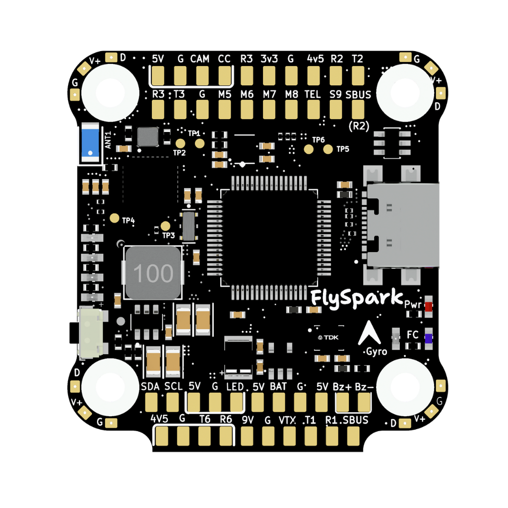
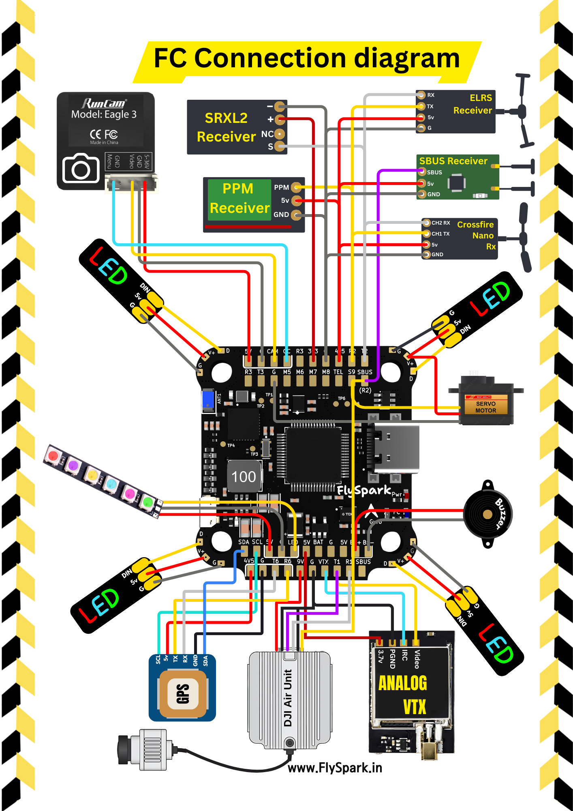
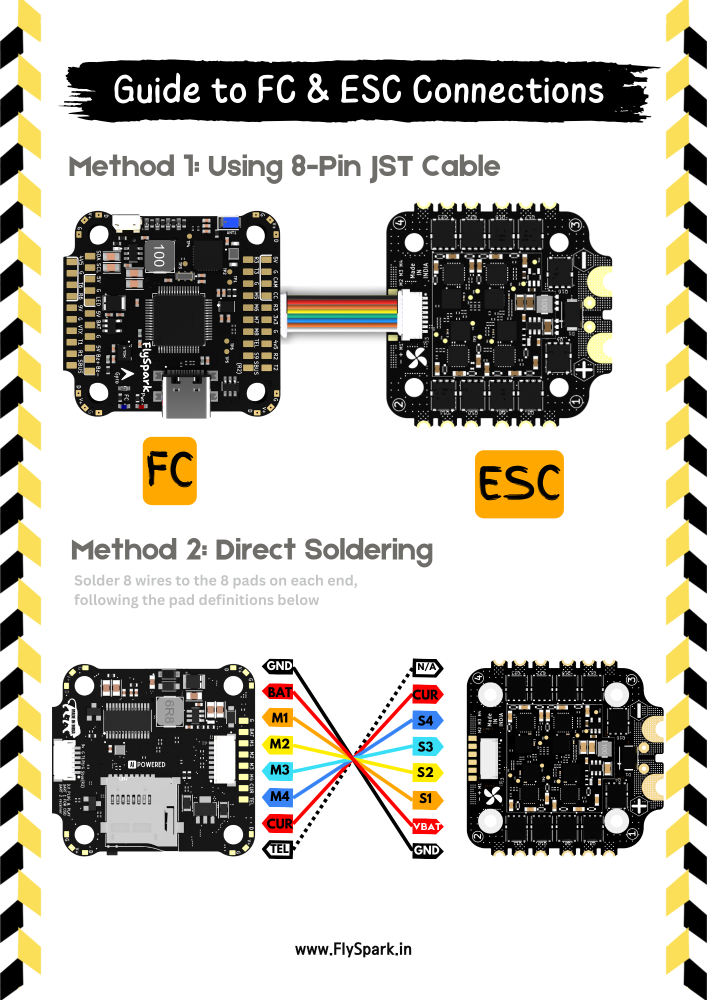

# FlySpark F4 — hwdef for ArduPilot / AP_HAL_ChibiOS

The **FlySpark F4** flight controller is sold by [FlySpark](https://flyspark.in/product/flyspark-f4-v1-flight-controller/)

## Features

 - STM32F405 Microcontroller (168 MHz, 1 MB Flash)
 - ICM-42688-P 6-axis IMU (Gyro + Accel)
 - DPS310 Barometer
 - MAX7456 OSD chip
 - MicroSD card slot
 - USB-C port for firmware flashing and telemetry
 - 6 UART ports (UART1–UART6), UART4 is blocked is only for bluetooth which does not work with ArduPilot
 - 8 PWM motor outputs (M1–M8)
 - I2C port
 - 5 V (3 A) and 9 V (3 A) regulated power outputs
 - 3.3 V (500 mA) and 4.5 V (1 A) aux rails
 - Buzzer pads (BZ+ / BZ−)
 - RSSI input pad
 - BOOT button for DFU mode
 - 3 S – 6 S LiPo input voltage range
 - 30.5 × 30.5 mm mounting pattern (⌀4 mm holes)

## Mechanical

 - 41.6mm x 39.4mm x 7.8mm
 - 10.5g
 - Mounting: 30.5mmx30.5mm (4 mm holes)

## Wiring / Pinout

| Function | MCU / Pin | Notes |
|---|---|---|
| ESC / motor outputs | M1–M8 | M1–M4 bottom, M5–M8 front side |
| UART1 | TX1 / RX1 | DisplayPort |
| UART2 | TX2 / RX2 | For RC. SBUS pins are inverted and connected directly to to RX2. |
| UART3 | TX3 / RX3 | Spare |
| UART4 | TX4 / RX4 | Bluetooth, NOT supported by ArduPilot |
| UART5 | TX5 / RX5 | ESC telemetry |
| UART6 | TX6 / RX6 | GPS |
| I2C | SDA / SCL pads | Magnetometer, Rangefinder, etc. |
| SPI | SPI pins | IMU |
| ADC / analog | Current sensor input |
| Buzzer | BZ+ / BZ− | 5 V buzzer support |
| RSSI | RS pad | RSSI voltage input |
| Boot button | BOOT | Forces DFU mode |
| SD  | SD card slot | |
| OSD | Via VTX,CAM,CC pins | |

---

## UART Mapping

| Port | UART    | Protocol       | TX DMA | RX DMA |
|------|----------|----------------|:------:|:------:|
| 0    | USB      | MAVLink2       | ✘      | ✘      |
| 1    | USART1   | DJI_FPV        | ✘      | ✘      |
| 2    | USART2   | RCIN           | ✔      | ✔      |
| 3    | USART3   | None           | ✘      | ✘      |
| 4    | UART4    | None           | ✘      | ✘      |
| 5    | UART5    | ESCTelemetry   | ✘      | ✘      |
| 6    | USART6   | GPS            | ✔      | ✔      |

---

## RC Input

RC input is provided for SBUS on the SBUS pads, or RX2/TX2 for other protocols, see https://ardupilot.org/plane/docs/common-rc-systems.html for more information. Note FPort will work on SBUS inputs but not provide telemetry. To obtain FPort telem a bi-directional inveter will need to be used.
SBUS pins are inverted and connected directly to to RX2.

---

## PWM Output

The FlySpark F4 supports **8 PWM outputs** (M1–M8). All outputs support PWM and DShot, Outputs 1-4 support bi-directional DShot. In addition a ninth output is defaulted to serial LED.

PWM groups:

| Group | Channels |
|--------|-----------|
| 1 | PWM1, PWM2 |
| 2 | PWM3, PWM4 |
| 3 | PWM5, PWM6 |
| 4 | PWM7, PWM8 |
| 5 | PWM9 |

All channels within a group must share the same output rate.
If any channel in a group uses DShot, all channels in that group must also use DShot.

---

## Battery Monitoring

The board includes a built-in voltage and current sensor connected to ADC pins.
Default configuration:

 - :ref:`BATT_MONITOR<BATT_MONITOR>` 4
 - :ref:`BATT_VOLT_PIN<BATT_VOLT_PIN__AP_BattMonitor_Analog>` 10
 - :ref:`BATT_CURR_PIN<BATT_CURR_PIN__AP_BattMonitor_Analog>` 11
 - :ref:`BATT_VOLT_MULT<BATT_VOLT_MULT__AP_BattMonitor_Analog>` 11.0
 - :ref:`BATT_AMP_PERVLT<BATT_AMP_PERVLT__AP_BattMonitor_Analog>` 25.0

Supports direct 3 S–6 S LiPo voltage measurement.

---

## Compass

There is **no onboard compass**.
ArduPilot automatically probes for **external I2C compasses** on I2C1.

---

## Camera Control (CC) Output

The **CC pin** is controlled as a standard GPIO via **RELAY2**.

---

## OSD

Analog OSD is supported via the internal **AT7456** chip.

Simultaneously, **DisplayPort HD OSD** is available by default via **UART1**,  

---

## RSSI Input

Analog RSSI input is supported through **RSSI_ANA_PIN = 15**.
Connect your receiver’s analog RSSI output to this pad to enable RSSI display in OSD and telemetry.

---

## Loading Firmware

Firmware can be downloaded from: https://firmware.ardupilot.org/, by going into the right vehicle directory/version and looking for "FlysparkF4".

Initial firmware load can be done with DFU by plugging in USB with the bootloader button pressed. Then you should load the "with_bl.hex" firmware, using your favorite DFU loading tool.

	Once the initial firmware is loaded you can update the firmware using any ArduPilot ground station software. Updates should be done with the *.apj firmware files.
---