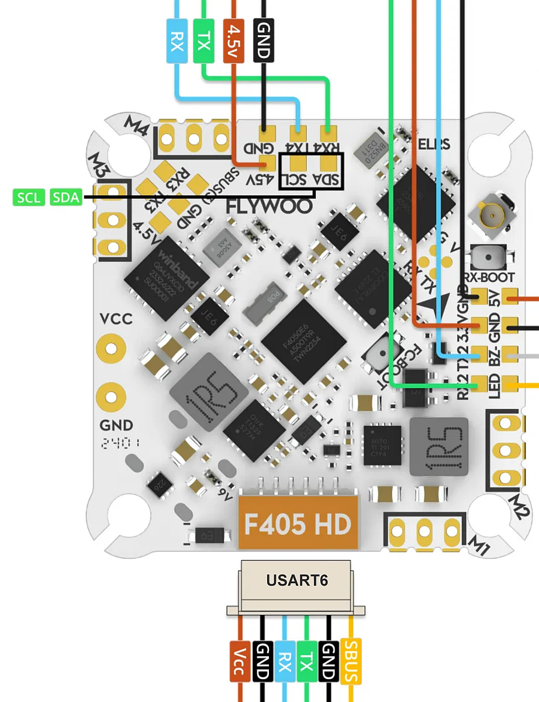

# GOKU F405 HD 1-2S AIO v2 w/ built-in ELRS 2.4g RX

https://flywoo.net/products/goku-f405-hd-1-2s-elrs-aio-v2

The Flywoo GOKU F405 HD AIO v2 is a flight controller produced by [Flywoo](https://flywoo.net/).

## Features

- MCU: STM32F405 32-bit processor. 1024Kbytes Flash
- IMU: MPU6000 (SPI) or ICM42688 (SPI)
- Barometer: DPS310/SPL06
- Onboard LED：WS2812*2
- USB VCP Driver (all UARTs usable simultaneously; USB does not take up a UART)
- 6 hardware UARTS (UART1,2,3,4,5,6)
- Built-in ELRS 2.4 GHz serial receiver (on some models)
- Also supports external serial receivers (SBUS, iBus, Spektrum, Crossfire)
- Onbord 8 Mbytes for Blackbox logging
- 5V Power Out: 2.0A max
- 9V Power Out: 2.0A max (on/off software controllable via PINIO)
- Dimensions: 30x30mm
- Mounting Holes: Standard 25.5/25.5mm square to center of holes 
- Weight: 4.9g

- Built-in 12A BLHeli_S 4in1 ESC
- Supports BLheli_S / BlueJay / J-ESC
- Supports Oneshot125, Oneshot42, Multishot, Dshot150, Dshot300, Dshot600
- Input Voltage: 1-2S Lipo
- Continuous Current: 12A
- Firmware: Z_H_30_REV16.7

## Pinout

## UART Mapping

The UARTs are marked Rn and Tn in the above pinouts. The Rn pin is the
receive pin for UARTn. The Tn pin is the transmit pin for UARTn.
|Name|Pin|Function|
|:-|:-|:-|
|SERIAL0|COMPUTER|USB|
|SERIAL1|RX1/TX1|USART1 (ELRS, DMA-enabled)|
|SERIAL2|TX2/RX2|USART2 (Telem, DMA on RX)|
|SERIAL3|TX3/RX3|USART3 (USER, DMA-enabled)|
|SERIAL4|TX4/RX4|UART4 (GPS)|
|SERIAL5|TX5/RX5|UART5|
|SERIAL6|TX6/RX6|UART6 (DisplayPort)|

USART1 and USART3 supports RX and TX DMA. UART4 supports TX DMA. USART2 supports RX DMA. UART5 and UART6 do not support DMA.

## RC Input
 
RC input is configured  as ELRS by default using UART1. Alternatively, UART3 could be used for RC inputs other than ELRS but its protocol would need to be changed to 23 and UART1 disabled by setting its protocol as -1. This board does not support PPM.
  
## OSD Support

The GOKU F405 HD AIO v2 supports OSD using OSD_TYPE 5 (MSP DisplayPort).

## PWM Output

The GOKU F405 AIO supports up to 5 PWM outputs. The pads for motor output ESC1 to ESC4 on the above diagram are the first 4 outputs. All 5 outputs support DShot.

The PWM are in 3 groups:

PWM 1-2: Group 1
PWM 3-4: Group 2
LED: Group 3

Channels within the same group need to use the same output rate. If
any channel in a group uses DShot then all channels in the group need
to use DShot. PWM 1-4 support bidirectional dshot.
.. note:: for users migrating from BetaflightX quads, the first four outputs M1-M4 have been configured for use with existing motor wiring using these default parameters:

- :ref:`FRAME_CLASS<FRAME_CLASS>` = 1 (Quad)
- :ref:`FRAME_TYPE<FRAME_TYPE>` = 12 (BetaFlightX) 
## Battery Monitoring

The board has a builtin voltage sensor. The voltage sensor can handle 2S to 6S
LiPo batteries.

The correct battery setting parameters are:

 - BATT_MONITOR 4
 - BATT_VOLT_PIN 13
 - BATT_VOLT_MULT around 11
 - BATT_CURR_PIN 12
 - BATT_AMP_PERVLT around 60.2

These are set by default in the firmware and shouldn't need to be adjusted

## Compass

The GOKU F405 HD AIO v2 does not have a builtin compass but it does have an external I2C connector.

## NeoPixel LED

The board includes a NeoPixel LED pad.

## 9V/VTX Electronic Switch

9V/VTX state can be controlled using ArduPilot Relay, GPIO pin 81.

## Loading Firmware (you will need to compile your own firmware)

Initial firmware load can be done with DFU by plugging in USB with the
bootloader button pressed. Then you should load the "with_bl.hex"
firmware, using your favourite DFU loading tool.

Once the initial firmware is loaded you can update the firmware using
any ArduPilot ground station software. Updates should be done with the
*.apj firmware files.
