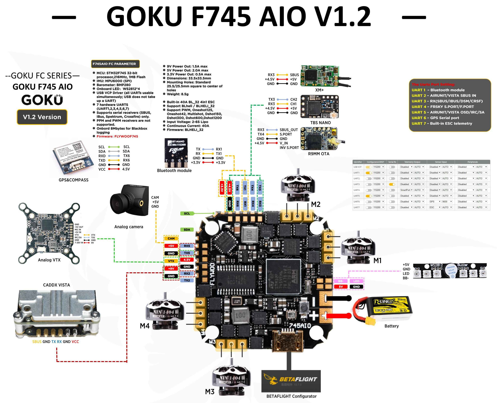
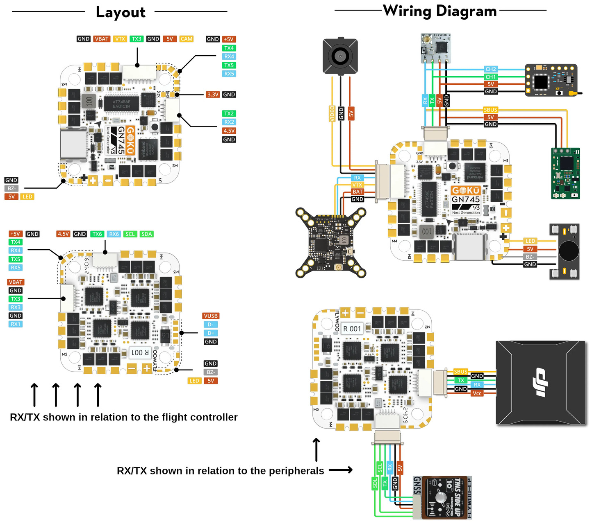

# Flywoo GOKU GN 745 40A/45A AIO

https://flywoo.net/products/goku-gn745-45a-aio-bl_32-mpu6000-v3
https://flywoo.net/products/goku-gn745-40a-aio-bl_32-mpu6000-25-5-x-25-5

The Flywoo GOKU GN 745 AIO is a flight controller produced by [Flywoo](https://flywoo.net/).

## Features

- MCU: STM32F745 32-bit processor, 216MHz, 1M Flash
- IMU: MPU6000 or ICM42668P (SPI)
- Barometer: BMP280
- Onboard LED：WS2812*4
- USB VCP Driver (all UARTs usable simultaneously; USB does not take up a UART)
- 7 hardware UARTS (UART1, 2, 3, 4, 5, 6, 7; only RX in UART1 in v3)
- Supports serial receivers (SBUS, iBus, Spektrum, Crossfire) only.
- PPM and PWM receivers are not supported.
- Onbord 8 Mbytes (versions 1.0 and 1.2) or 16 MBytes (version 3) for Blackbox logging
- 9V Power Out: 1.5A max
- 5V Power Out: 2.0A max
- 3.3V Power Out: 0.5A max
- Dimensions: 33.5x33.5mm
- Mounting Holes: Standard 25.5/26.5mm square to center of holes 
- Weight: 8.5g

- Built-in 40A BL_32 4in1 ESC (45A in v3)
- Support BLHeli_32 (or AM32 in v3 options)
- Support PWM, Oneshot125, Oneshot42, Multishot, Dshot150, Dshot300, Dshot600, Dshot1200
- Input Voltage: 2-6S Lipo
- Continuous Current: 40A (45A in v3)
- Firmware: BLHELI_32 or AM32

## Pinout

This board had three versions produced, with different pinouts. This is the original v1.0 board.

The newer v1.2 board is shown below. Unfortunately, due to the reduced number of pads, some features, such as motors 5-8, are no longer available.

The newest v3 revision is shown below. For certain peripherals, soldering pads were replaced with connectors.

## UART Mapping

The UARTs are marked Rn and Tn in the above pinouts. The Rn pin is the
receive pin for UARTn. The Tn pin is the transmit pin for UARTn.
|Name|Pin|Function|
|:-|:-|:-|
|SERIAL0|COMPUTER|USB|
|SERIAL1|RX1/TX1|UART1 (TELEM-MAVLink2), only RX in v3|
|SERIAL2|TX2/RX2|UART2 (TELEM-MAVLink2), RC in v3|
|SERIAL3|TX3/RX3|UART3 (RC Input/Output)|
|SERIAL4|TX4/RX4|UART4 (User)|
|SERIAL5|TX5/RX5|UART5 (User)|
|SERIAL6|TX6/RX6|UART6 (GPS)|
|SERIAL7|TX7/RX7|UART7 (User)|

UART3 supports RX and TX DMA. UART1, UART2, UART4, and UART6 supports TX DMA. UART5 and UART7 do not support DMA.

## RC Input
 
In versions 1.0 and 1.2, RC input is usually configured on the UART3, which supports serial RC protocols. This board does not support PPM.
In version 3, the connector intended for RC input is on the UART2, so the default protocol will need to be changed for SERIAL 2 to "23" and SERIAL 33 protocol changed to something else.
 
## OSD Support

The GOKU GN 745 AIO supports OSD using OSD_TYPE 1 (MAX7456 driver).

## PWM Output

The GOKU GN 745 AIO supports up to 8 PWM outputs. The pads for motor output ESC1 to ESC4 on the above diagram are the first 4 outputs, there are four additional pads for PWM 5-8. All 8 outputs support DShot as well as all PWM types.

The PWM are in 5 groups:

 - PWM 6: Group 1
 - PWM 1-2 and 7-8: Group 2
 - LED: Group 3
 - PWM: Group 4
 - PWM 3-4: Group 5

Channels within the same group need to use the same output rate. If
any channel in a group uses DShot then all channels in the group need
to use DShot. PWM 1-4 support bidirectional dshot.

ESC outputs are in the Betaflight order, which would work out of the box with the following settings (set by default):
 - FRAME_CLASS = 1 (Quad)
 - FRAME_TYPE = 12 (BetaFlightX)

## Battery Monitoring

The board has a builtin voltage sensor. The voltage sensor can handle 2S to 6S
LiPo batteries.

The correct battery setting parameters are:

 - BATT_MONITOR 4
 - BATT_VOLT_PIN 12
 - BATT_CURR_PIN 13
 - BATT_VOLT_MULT 10.9

These are set by default in the firmware and shouldn't need to be adjusted. Current calibration, on the other hand, is required for best results. Here are some parameters found experimentally with some of the boards:

for version 1.2: 
 - BATT_AMP_PERVLT around 21.0
 - BATT_AMP_OFFSET around -0.018

for version 3.0:
 - BATT_AMP_PERVLT around 14.0
 - BATT_AMP_OFFSET around 0.0055

## Sensor Orientation

For version 3, the orientation needs to be changed:
 - AHRS_ORIENTATION = 5 (Yaw225)

## Compass

The GOKU GN 745 AIO does not have a builtin compass but it does have an external I2C connector.

## NeoPixel LED

The board includes a NeoPixel LED pad.

## Loading Firmware

Firmware for this board can be found on the ArduPilot firmware server, https://firmware.ardupilot.org, in folders labeled "FlywooF745".

Initial firmware load can be done with DFU by plugging in USB with the
bootloader button pressed. Then you should load the "with_bl.hex"
firmware, using your favourite DFU loading tool.

Once the initial firmware is loaded you can update the firmware using
any ArduPilot ground station software. Updates should be done with the
*.apj firmware files.
