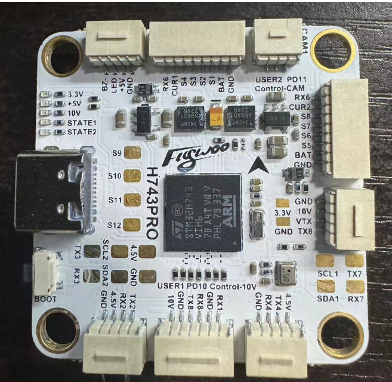

# Flywoo H743 Pro Flight Controller

The Flywoo H743 Pro is a flight controller produced by [Flywoo](https://www.flywoo.net/).

## Features

 - MCU - STM32H743 32-bit processor running at 480 MHz
 - IMU - Dual ICM42688
 - Barometer - SPL06
 - OSD - AT7456E
 - Onboard Flash: 500MByte
 - 7x UARTs
 - 13x PWM Outputs (12 Motor Output, 1 LED)
 - Battery input voltage: 2S-6S
 - BEC 3.3V 0.5A
 - BEC 5V 3A
 - BEC 10V 3A for video, gpio controlled
 - Dual switchable camera inputs

## Pinout

## UART Mapping

The UARTs are marked Rn and Tn in the above pinouts. The Rn pin is the
receive pin for UARTn. The Tn pin is the transmit pin for UARTn.

 - SERIAL0 -> USB
 - SERIAL1 -> UART1 (User, DMA-enabled)
 - SERIAL2 -> UART2 (RX, DMA-enabled)
 - SERIAL3 -> UART3 (User)
 - SERIAL4 -> UART4 (GPS, DMA-enabled)
 - SERIAL6 -> UART6 (ESC Telemetry)
 - SERIAL7 -> UART7 (User)
 - SERIAL8 -> UART8 (DisplayPort, DMA-enabled)

## RC Input

RC input is configured by default via the USART2 RX input. It supports all serial RC protocols except PPM.

Note: If the receiver is FPort the receiver must be tied to the USART2 TX pin , RSSI_TYPE set to 3,
and SERIAL2_OPTIONS must be set to 7 (invert TX/RX, half duplex). For full duplex like CRSF/ELRS use both
RX1 and TX1 and set RSSI_TYPE also to 3.
 
## FrSky Telemetry
 
FrSky Telemetry is supported using an unused UART, such as the T3 pin (UART3 transmit).
You need to set the following parameters to enable support for FrSky S.PORT:
 
  - SERIAL3_PROTOCOL 10
  - SERIAL3_OPTIONS 7
  
## OSD Support

The Flywoo H743 Pro supports OSD using OSD_TYPE 1 (MAX7456 driver) and simultaneously DisplayPort using TX8/RX8 on the HD VTX connector.

## PWM Output

The Flywoo H743 Pro supports up to 13 PWM or DShot outputs. The pads for motor output
M1 to M8 are provided on both the motor connectors and on separate pads, plus
M9-13 on a separate pads for LED strip and other PWM outputs.

The PWM is in 4 groups:

 - PWM 1-2   in group1
 - PWM 3-6   in group2
 - PWM 7-10  in group3
 - PWM 11-12 in group4
 - PWM 13    in group5

Channels within the same group need to use the same output rate. If
any channel in a group uses DShot then all channels in the group need
to use DShot. Channels 1-10 support bi-directional dshot.

## Battery Monitoring

The board has a built-in voltage sensor and external current sensor input. The current
sensor can read up to 130 Amps. The voltage sensor can handle up to 6S
LiPo batteries.

The correct battery setting parameters are:

 - BATT_MONITOR 4
 - BATT_VOLT_PIN 11
 - BATT_CURR_PIN 13
 - BATT_VOLT_MULT 11.1
 - BATT_AMP_PERVLT 40

## Compass

The Flywoo H743 Pro does not have a builtin compass, but you can attach an external compass using I2C on the SDA and SCL pads.

## VTX power control

GPIO 81 controls the VTX BEC output to pins marked "10V". Setting this GPIO low removes voltage supply to pins.
By default RELAY2 is configured to control this pin and sets the GPIO high.

## Camera control

GPIO 82 controls the camera output to the connectors marked "CAM1" and "CAM2". Setting this GPIO low switches the video output from CAM1 to CAM2. By default RELAY3 is configured to control this pin and sets the GPIO high.

## Loading Firmware

Initial firmware load can be done with DFU by plugging in USB with the
bootloader button pressed. Then you should load the "with_bl.hex"
firmware, using your favourite DFU loading tool.

Once the initial firmware is loaded you can update the firmware using
any ArduPilot ground station software. Updates should be done with the
\*.apj firmware files.
