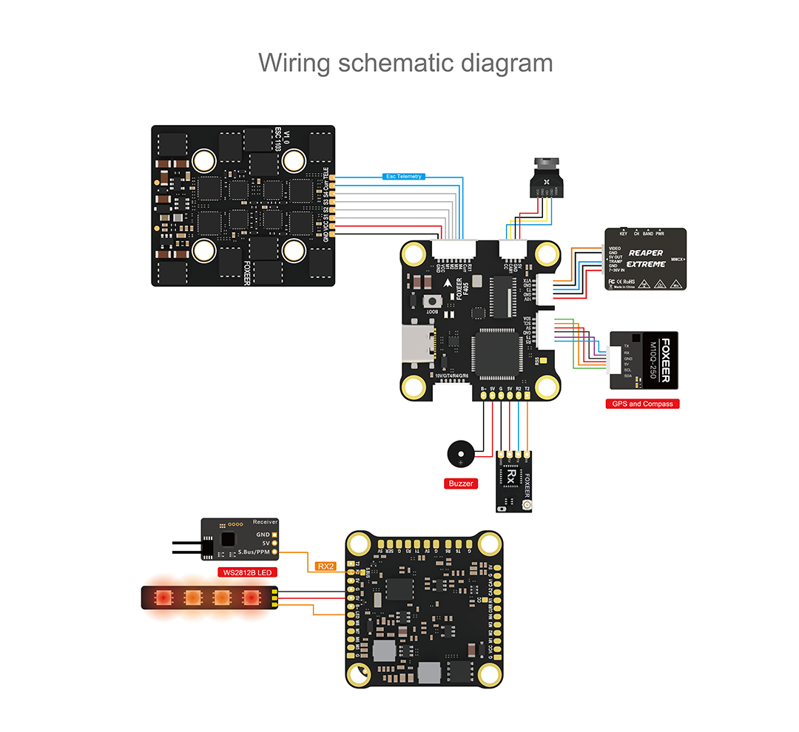

# FoxeerF405v2 Flight Controller

The FoxeerF405v2 is a flight controller produced by [Foxeer](https://www.foxeer.com/).

## Features

 - MCU - STM32F405 32-bit processor
 - IMU - ICM42688
 - Barometer - DPS310
 - OSD - AT7456E
 - Onboard Flash: 128Mbit
 - 6x UARTs
 - 9x PWM Outputs (8 Motor Output, 1 LED)
 - Battery input voltage: 2S-8S
 - BEC 3.3V 0.5A
 - BEC 5V 2A
 - BEC 10V 2A

## Pinout

## UART Mapping

The UARTs are marked Rn and Tn in the above pinouts. The Rn pin is the
receive pin for UARTn. The Tn pin is the transmit pin for UARTn.

 - SERIAL0 -> USB
 - SERIAL1 -> UART1 (ESC Telemetry)
 - SERIAL2 -> UART2 (RX, DMA-enabled)
 - SERIAL3 -> UART3 (VTX Tramp)
 - SERIAL4 -> UART4 (MSP DisplayPort, DMA-enabled)
 - SERIAL5 -> UART5 (GPS, DMA-enabled)
 - SERIAL6 -> UART6 (RX in DJI connector)
 
## RC Input

RC input is configured by default on the R2 (UART2_RX) pad. It supports all serial RC
protocols. Half-duplex serial protocols should be configured on T2 (UART2_TX). RC input is also
supported on UART6_RX within the DJI connector, although because it is not inverted it cannot be
used for SBUS.
  
## OSD Support

The FoxeerF405v2 supports OSD using OSD_TYPE 1 (MAX7456 driver) or OSD_TYPE 3 if using DJI OSD

## PWM Output

The FoxeerF405v2 supports up to 9 PWM outputs. The pads for motor output
M1 to M8 are provided on both the motor connectors and on separate pads, plus
M9 on a separate pad for LED strip or another PWM output.

The PWM is in 4 groups:

 - PWM 1,4 in group1
 - PWM 2,3 in group2
 - PWM 5,9 in group3
 - PWM 6-8 in group4

Channels within the same group need to use the same output rate. If
any channel in a group uses DShot then all channels in the group need
to use DShot. Note that channel 9 is explicitly configured as NeoPixel output
which means that channel 5 cannot be used as a motor output without disabling NeoPixel 
support on channel 9.

## Battery Monitoring

The board has a built-in voltage and current sensor. The current
sensor can read up to 130 Amps. The voltage sensor can handle up to 8S
LiPo batteries.

The correct battery setting parameters are:

 - BATT_MONITOR 4
 - BATT_VOLT_PIN 10
 - BATT_CURR_PIN 11
 - BATT_VOLT_MULT 11
 - BATT_AMP_PERVLT 142.9

## Compass

The FoxeerF405v2 does not have a builtin compass, but you can attach an external compass using I2C on the SDA and SCL pads.

## Control GPIO pins
GPIO pin 71 can be used to control camera switching. It is configured
by default on relay 3 and so you can associate an RC switch with relay 3 in order
to switch camera outputs.

## Loading Firmware

Initial firmware load can be done with DFU by plugging in USB with the
bootloader button pressed. Then you should load the "with_bl.hex"
firmware, using your favourite DFU loading tool.

Once the initial firmware is loaded you can update the firmware using
any ArduPilot ground station software. Updates should be done with the
*.apj firmware files.

