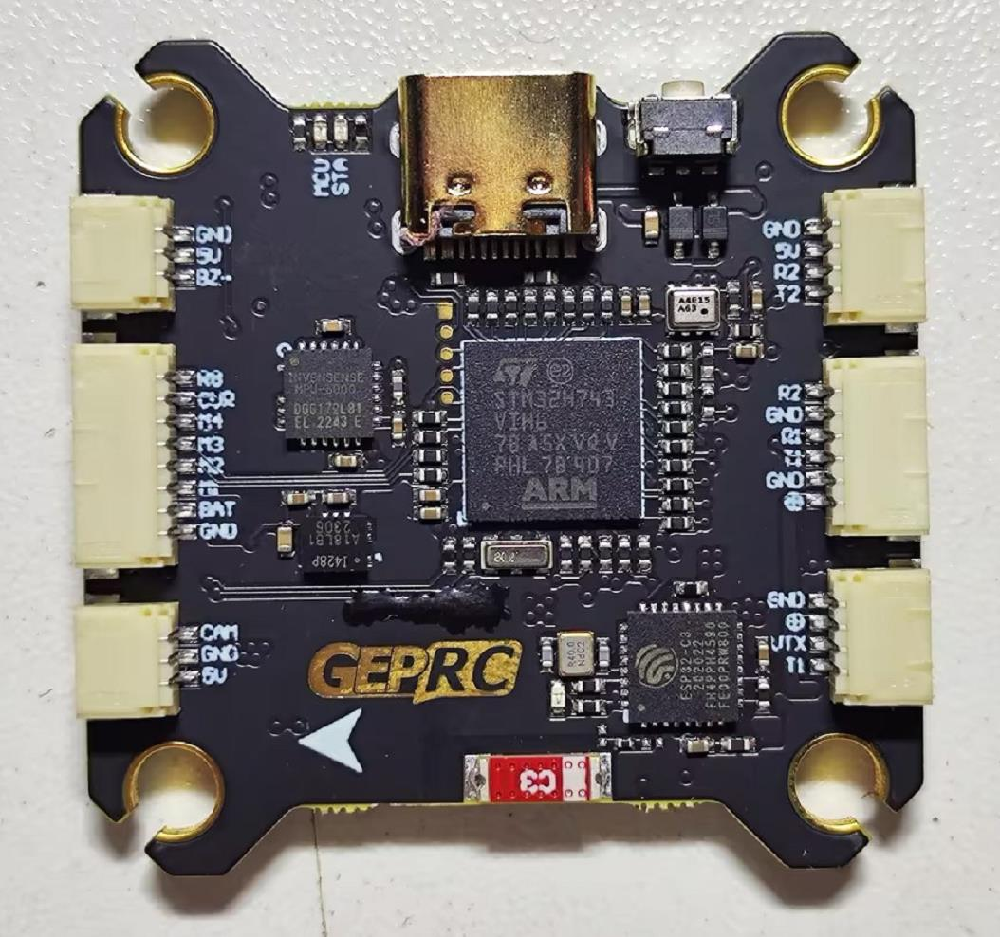

# GEPRC TAKER H743 BT Flight Controller

The TAKER H743 BT is a flight controller produced by [GEPRC](https://geprc.com/).

## Features

 - STM32H743 microcontroller
 - MPU6000+ICM42688 dual IMU
 - SPL06-001 barometer
 - microSD based 512MB flash logging
 - AT7456E OSD
 - 7 UARTs
 - 8 PWM outputs

## Pinout

## UART Mapping

The UARTs are marked Rn and Tn in the above pinouts. The Rn pin is the
receive pin for UARTn. The Tn pin is the transmit pin for UARTn.

 - SERIAL0 -> USB
 - SERIAL1 -> UART1 (DisplayPort, DMA-enabled)
 - SERIAL2 -> UART2 (RCIN, DMA-enabled) 
 - SERIAL3 -> UART3 (connected to internal BT module, not currently usable by ArduPilot)
 - SERIAL4 -> UART4 (GPS)
 - SERIAL6 -> UART6 (User)
 - SERIAL7 -> UART7 (User)
 - SERIAL8 -> UART8 (ESC Telemetry)

## RC Input

RC input is configured by default via the USAR2 RX input. It supports all unidirectional RC protocols except PPM. FPort and full duplex protocols, like CRSF/ELRS, will need to use TX2 also.

Note:
If the receiver is FPort or a full duplex protocol, then the receiver must be tied to the USART2 TX pin and [SERIAL2_OPTIONS](https://ardupilot.org/copter/docs/parameters.html#serial2-options) = 7 (invert TX/RX, half duplex), and [RSSI_TYPE](https://ardupilot.org/copter/docs/parameters.html#rssi-type) =3.

## FrSky Telemetry
 
FrSky Telemetry is supported using the Tx pin of any UART excluding SERIAL3UART3. To enable support for FrSky S.PORT (the example shows SERIAL6), you need to set the following parameters.
 
  - SERIAL6_PROTOCOL 10
  - SERIAL6_OPTIONS 7
  
## OSD Support

The TAKER H743 BT supports analog OSD using its internal OSD chip and simultaneously HD goggle DisplayPort OSDs via the HD VTX connector.

## VTX Support

The SH1.0-6P connector supports a standard DJI HD VTX connection. Pin 1 of the connector is 12v (or VBAT by solder pad selection) so be careful not to connect to devices expecting 5v.

## PWM Output

The TAKER H743 BT supports up to 9 PWM/DShot outputs. The pads for motor output
M1 to M4 are on the esc connector, M5-M8 are solder pads, plus M9 is defaulted for serial LED strip or can be used as another PWM output.

The PWM is in 4 groups:

 - PWM 1-4 in group1
 - PWM 5-6 in group2
 - PWM 7-8 in group3
 - PWM 9 in group4

Channels within the same group need to use the same output rate. If
any channel in a group uses DShot then all channels in the group need
to use DShot. Channels 1-8 support bi-directional DShot.

## Battery Monitoring

The board has a internal voltage sensor and connections on the ESC connector for an external current sensor input.
The voltage sensor can handle up to 6S.
LiPo batteries.

The default battery parameters are:

 - BATT_MONITOR 4
 - BATT_VOLT_PIN 13
 - BATT_VOLT_SCALE 11.1
 - BATT_CURR_PIN 12
 - BATT_CURR_SCALE 28.5

## Compass

The TAKER H743 BT does not have a builtin compass, but you can attach an external compass using I2C on the SDA and SCL pads.

## Loading Firmware

Initial firmware load can be done with DFU by plugging in USB with the
bootloader button pressed. Then you should load the "with_bl.hex"
firmware, using your favourite DFU loading tool.

Once the initial firmware is loaded you can update the firmware using
any ArduPilot ground station software. Updates should be done with the
\*.apj firmware files.

