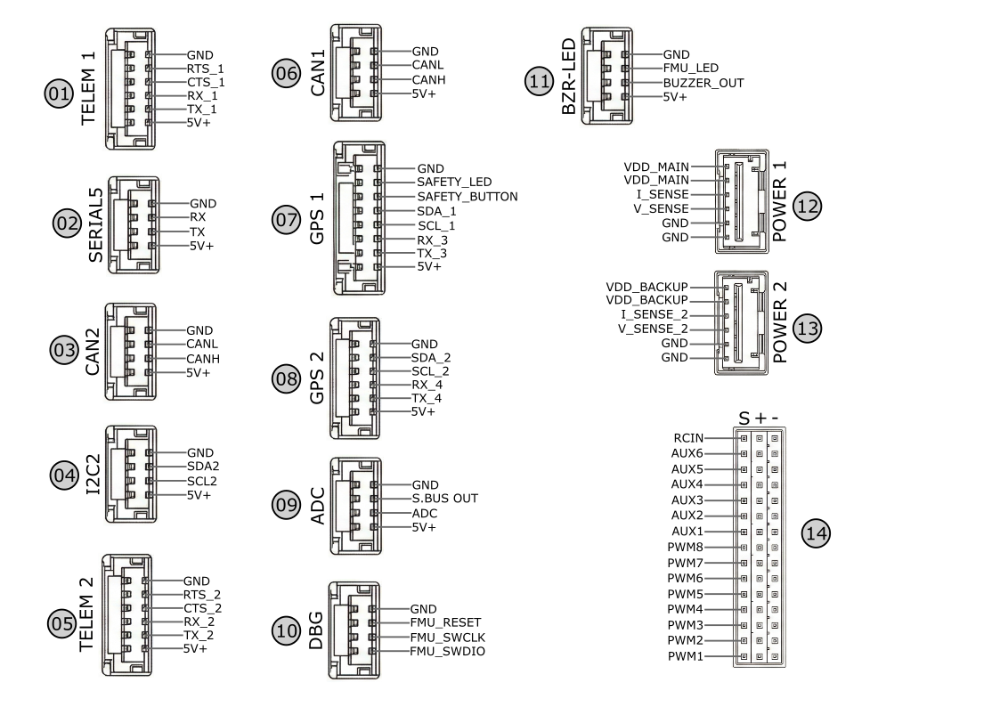

# G-Pilot P1 Flight Controller

*G-Pilot P1 acts as a highly reliable brain for aircraft, thanks to its high-performance dual-processor architecture. While the main STM32H7 processor rapidly handles complex flight algorithms and navigation, the accompanying IOMCU coprocessor ensures robust fail-safe management and independent PWM override capabilities in the event of a main system issue. The triple-redundant sensor group helps the vehicle remain stable and unaffected by in-flight vibrations or magnetic interference. Connecting all sensors via a high-speed data bus allows the system to react to instantaneous changes within milliseconds.*

## Features

* **Processor:** *32bit ARM® STM32H753 Cortex®-M7 (400 MHz / 1 MB RAM / 2 MB FLASH)*
* **Coprocessor:** *32-bit STM32F100 failsafe co-processor*
* **Sensors:**
  * *IMU: 2x ICM-20649 and 1x ICM-20602 (Triple-redundant, 2 sets supported by mechanical shock-absorbing foam, maintained at a constant operating temperature via built-in heaters)*
  * *Barometer: 2x MS-5611*
  * *Compass: 1x RM-3100*
  * *Built-in Heaters: Automatically maintains IMU temperature at a default of 45°C to eliminate thermal drift, fully customizable via Full Parameter List*
* **Servo PWM Voltage Selector:** *Controls and toggles the PWM logic voltage level between 3.3V and 5V for servo rail outputs.*
* **BlackBox:** *microSD card slot*
* **Mechanical:** *Dimensions: 57mm x 95.8mm x 37.3mm | Weight: ~130g | Operating Temperature: -40°C ~ +85°C*

## Interfaces

* 14x PWM Servo Outputs (8x Co-processor, 6x Processor)
* S.Bus Output
* S.Bus Receiver Input
* Spektrum/DSM Input

* 5x Serial Ports (2x Full Flow Control)
* 2x I2C Ports
* 2x DroneCAN Ports
* 1x SPI Port

* 1x Analog Input
* Safety Button and LED
* High Power Buzzer and Processor Status LED
* SWD Port for Firmware Update

## Pinout

Connectors are JST GH 1.25mm pitch, except "Molex ClikMate" POWER1&2 connector.

## UART Mapping

|Serial#  | PORT    |Connector Label |  Protocol      | DMA Capability |
|---------|---------|----------------|----------------|----------------|
|0        |  OTG1   |  USB           |  MAVlink2      | No DMA         |
|1        |  USART2 |  Telem1        |  MAVlink2      | DMA            |
|2        |  USART3 |  Telem2        |  MAVLink2      | DMA            |
|3        |  UART4  |  GPS1          |  GPS           | No DMA (RX)    |
|4        |  UART8  |  GPS1          |  GPS           | No DMA (TX)    |
|5        |  UART7  |  USER          |  None          | DMA            |

The Telem1 and Telem2 ports have RTS/CTS pins, the other UARTs do not
have RTS/CTS.

## PWM Output

The G-Pilot P1 provides a total of 14 PWM output channels divided into PWM pins (from IOMCU co-processor) and AUX (from H7 cpu) pins.  There are 5 grouping of the outputs. Within a group, ALL outputs must be configured for the same protocol (PWM type or DShot type). Grouping is shown below:

| Output Group     | Channels               | Native Timer | Supported Protocols |
|------------------|------------------------|--------------|---------------------|
| **Main Group 1** | Channels 1, 2          | TIM2         | PWM  / DShot        |
| **Main Group 2** | Channels 3, 4          | TIM4         | PWM  / DShot        |
| **Main Group 3** | Channels 5, 6, 7, 8    | TIM3         | PWM  / DShot        |
| **Aux Group 1**  | Channels 9, 10, 11, 12 | TIM1         | PWM  / DShot        |
| **Aux Group 2**  | Channels 13, 14        | TIM4         | PWM  / DShot        |

**PWM Voltage Selector:** Users can switch the main servo PWM voltage level between **3.3V** and **5V** via the Full Parameter List using the `BRD_PWM_VOLT_SEL` parameter. By default, it is configured for **3.3V** output (`BRD_PWM_VOLT_SEL = 0`). Setting this parameter to `1` shifts the voltage max to 5V to help reduce ESC noise interference. Please note that this option only affects the **8 main outputs** controlled by the IOMCU, not the **6 auxiliary outputs** driven by the FMU.

## Power Monitor

*The G-Pilot P1 features a dedicated power port designed to integrate seamlessly with the included GBRICK LV power module. This setup provides stable power to the system while delivering precise analog voltage and current monitoring.*

* Main Power Input (POWER 1)
  * 4.7V ~ 5.3V DC power input
  * Analog voltage and current sensing
  * Maximum 3.3V for analog sensing pins

* Backup Power Input (POWER 2)
  * 4.7V ~ 5.3V DC power input
  * Analog1 voltage and current sensing
  * Maximum 3.3V for analog sensing pins

*The included GBRICK LV power module can be used with either POWER 1 or POWER 2 ports, or both simultaneously for a fully redundant power supply setup.*

Preconfigured defaults:

* BATT_VOLT_PIN 14
* BATT_CURR_PIN 15
* BATT_VOLT_MULT 12.02
* BATT_AMP_PERVLT 39.877

* BATT2_VOLT_PIN 13
* BATT2_CURR_PIN 4
* BATT2_VOLT_MULT 12.02
* BATT2_AMP_PERVLT 39.877

*The firmware is pre-configured with the correct battery monitoring multipliers for the GBRICK LV, ensuring accurate battery telemetry out of the box.*

## Compass

The GPILOT P1 has a RM-3100 built-in compass. Often this internal compass is disabled due to power interference and a remotely located compass is used.

## RC Input

* **RC Input:** A dedicated 3-pin 2.54mm pitch header is provided for receiver connections. Although commonly labeled or used for SBUS, this input automatically detects and accepts all ArduPilot unidirectional RC protocols.
* **CRSF / ELRS**: For bidirectional protocols like TBS Crossfire, a full UART connection is required. Users can conveniently connect their receivers to the Telem1, Telem2, or Serial5 ports. To enable this, the corresponding SERIALx_PROTOCOL parameter must be configured to 23 (RCIN) via the ground station software. SERIALx_OPTIONS may also need configuring, see [RC systems](https://ardupilot.org/plane/docs/common-rc-systems.html)

## Firmware

Firmware for the G-PILOT P1 is available from [ArduPilot Firmware Server](https://firmware.ardupilot.org) under the `GPILOT_P1` target.

## Loading Firmware

The board comes pre-installed with an ArduPilot compatible bootloader, allowing the loading of *.apj firmware files with any ArduPilot compatible ground station.

## Package Contents

* *1 x G - Pilot P1*
* *1 x GBRICK LV*
* *1 x Buzzer & LED Module*
* *1 x CAN/I2C Expander*
* *Vibration Dampening Foams (3x Thick, 2x Large Thin, 4x Small Thin)*
* *Cables: 2x I2C/Buzzer (4-pin), 1x CAN (4-pin, Twisted Pair), 1x GPS1 (8-pin), 1x GPS2 (6-pin, Open-ended), 1x Brick Power, 1x Telemetry (6-pin), 1x USB Type-C*
