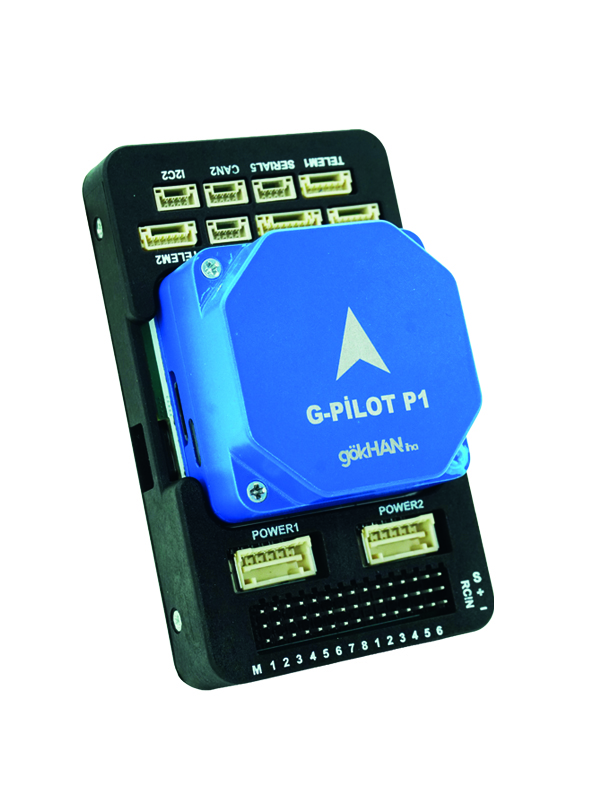
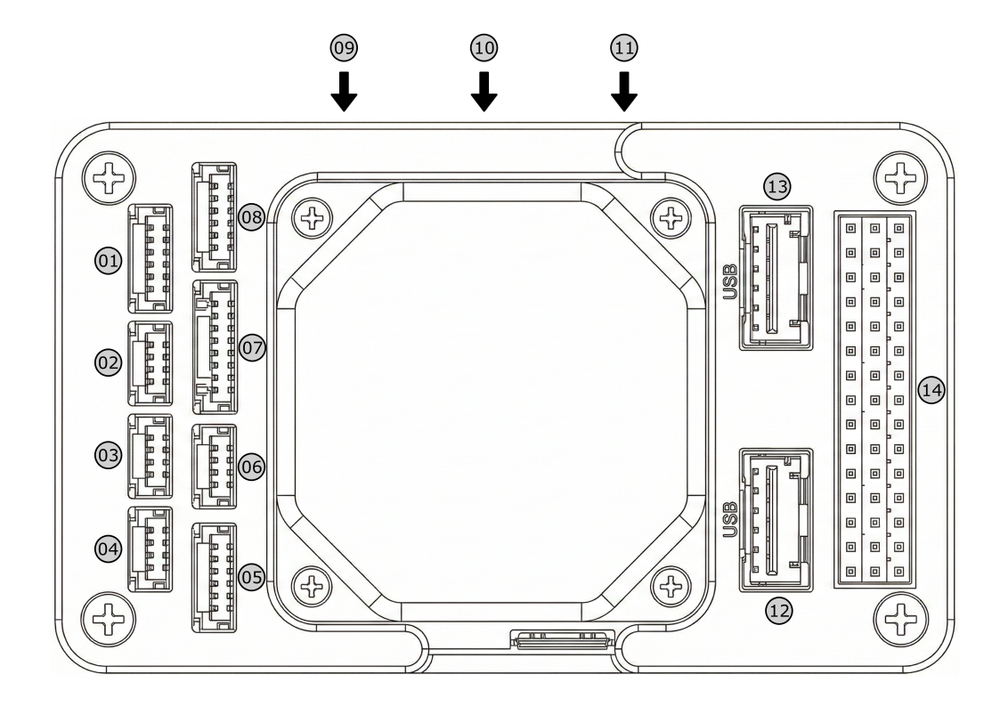

# G-Pilot P1 Flight Controller

*G-Pilot P1 acts as a highly reliable brain for aircraft, thanks to its dual-processor architecture that provides high processing power. While its main processor rapidly solves complex flight algorithms, the accompanying coprocessor takes control in the event of any system failure, ensuring a safe landing. The triple-redundant sensor group located in its chassis helps the vehicle remain stable, unaffected by in-flight vibrations or magnetic interference. Connecting all sensors via a high-speed data bus allows the vehicle to react to instantaneous changes within milliseconds.*

## Features

*   **Processor:** *32bit ARM® STM32H753 Cortex®-M7 (400 MHz / 1 MB RAM / 2 MB FLASH)*
*   **Coprocessor:** *32-bit STM32F100 failsafe co-processor*
*   **Sensors:**
    *   *IMU: 2x ICM-20649 and 1x ICM-20602 (Triple-redundant, 2 sets supported by mechanical shock-absorbing foam, maintained at a constant operating temperature via built-in heaters)*
    *   *Barometer: 2x MS-5611*
    *   *Compass: 1x RM-3100*
*   **BlackBox:** *microSD card slot*
*   **Mechanical:** *Dimensions: 57mm x 95.8mm x 37.3mm | Weight: ~130g | Operating Temperature: -40°C ~ +85°C*

## Connector and Pin Mappings

Connectors are JST GH 1.25mm pitch, except "Molex ClikMate" POWER1&2 connector.

### UART Mapping
*   *SERIAL0(OTG1) : USB (console - MAVlink2)*
*   *SERIAL1(UART2) : Telem1*
*   *SERIAL2(UART3) : Telem2*
*   *SERIAL3(UART4) : GPS*
*   *SERIAL4(UART8) : GPS*
*   *SERIAL5(UART7) : USER*
*   *SERIAL6(OTG2) : SLCAN*

The Telem1 and Telem2 ports have RTS/CTS pins, the other UARTs do not
have RTS/CTS.

### PWM Output
*The G-Pilot P1 provides a total of 14 PWM output channels for motors, servos, and other actuators. The outputs are structurally divided to maximize flight reliability:*

*   ***Main Outputs (1-8):** Controlled by the dedicated 32-bit STM32F100 failsafe coprocessor (IO). These channels ensure that critical control surfaces or primary motors remain manageable and can execute failsafe procedures even if the main processor encounters an issue.*
*   ***Auxiliary Outputs (9-14):** Directly driven by the primary STM32H753 processor (FMU). These channels offer high-speed updates and are ideal for secondary control surfaces, camera gimbals, or additional peripherals.*

### RC Input
- SBUS: A dedicated 3-pin 2.54mm pitch header is provided specifically for standard SBUS receivers.
- CRSF / ELRS: For bidirectional protocols like TBS Crossfire, a full UART connection is required. Users can conveniently connect their receivers to the Telem1, Telem2, or Serial5 ports. To enable this, the corresponding SERIALx_PROTOCOL parameter must be configured to 23 (RCIN) via the ground station software.

### Interfaces

*   14x PWM Servo Outputs (8x Co-processor, 6x Processor)
*   S.Bus Output
*   S.Bus Receiver Input
*   Spektrum/DSM Input

*   5x Serial Ports (2x Full Flow Control)
*   2x I2C Ports
*   2x DroneCAN Ports
*   1x SPI Port

*   1x Analog Input
*   Safety Button and LED
*   High Power Buzzer and Processor Status LED
*   SWD Port for Firmware Update

### Power Interfaces & Battery Monitor

*The G-Pilot P1 features a dedicated power port designed to integrate seamlessly with the included GBRICK LV power module. This setup provides stable power to the system while delivering precise analog voltage and current monitoring.*

*   Main Power Input (POWER 1)
    *   4.7V ~ 5.3V DC power input
    *   Analog voltage and current sensing
    *   Maximum 3.3V for analog sensing pins

*   Backup Power Input (POWER 2)
    *   4.7V ~ 5.3V DC power input
    *   Analog1 voltage and current sensing
    *   Maximum 3.3V for analog sensing pins

- BATT_VOLT_PIN 14
- BATT_CURR_PIN 15
- BATT_VOLT_MULT 10.1
- BATT_AMP_PERVLT 17.0

*The firmware is pre-configured with the correct battery monitoring multipliers for the GBRICK LV, ensuring accurate battery telemetry out of the box.*

### Compass
The GPILOT P1 has a RM-3100 built-in compass.

## Loading Firmware
The board comes pre-installed with an ArduPilot compatible bootloader, allowing the loading of xxxxxx.apj firmware files with any ArduPilot compatible ground station

## Package Contents
*   *1 x G - Pilot P1*
*   *1 x GBRICK LV*
*   *1 x Buzzer & LED Module*
*   *1 x CAN/I2C Expander*
*   *Vibration Dampening Foams (3x Thick, 2x Large Thin, 4x Small Thin)*
*   *Cables: 2x I2C/Buzzer (4-pin), 1x CAN (4-pin, Twisted Pair), 1x GPS1 (8-pin), 1x GPS2 (6-pin, Open-ended), 1x Brick Power, 1x Telemetry (6-pin), 1x USB Type-C*