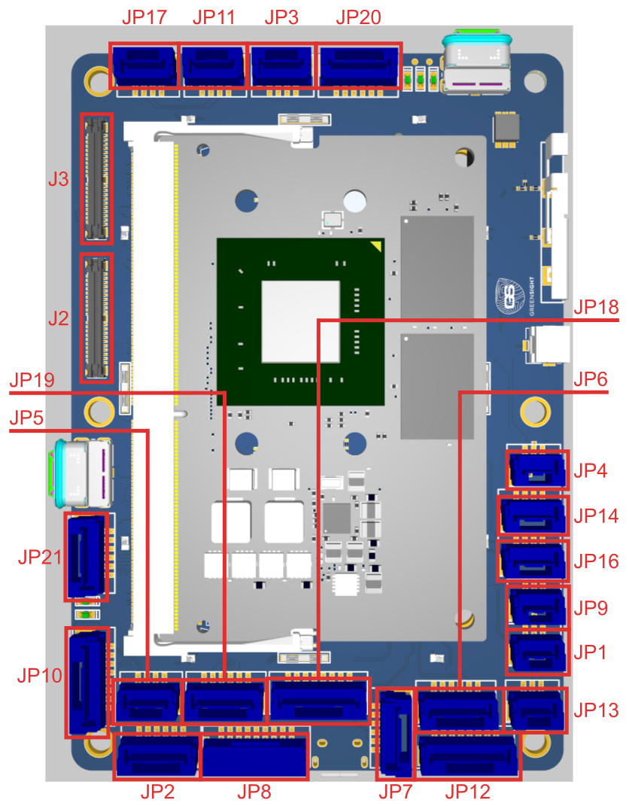
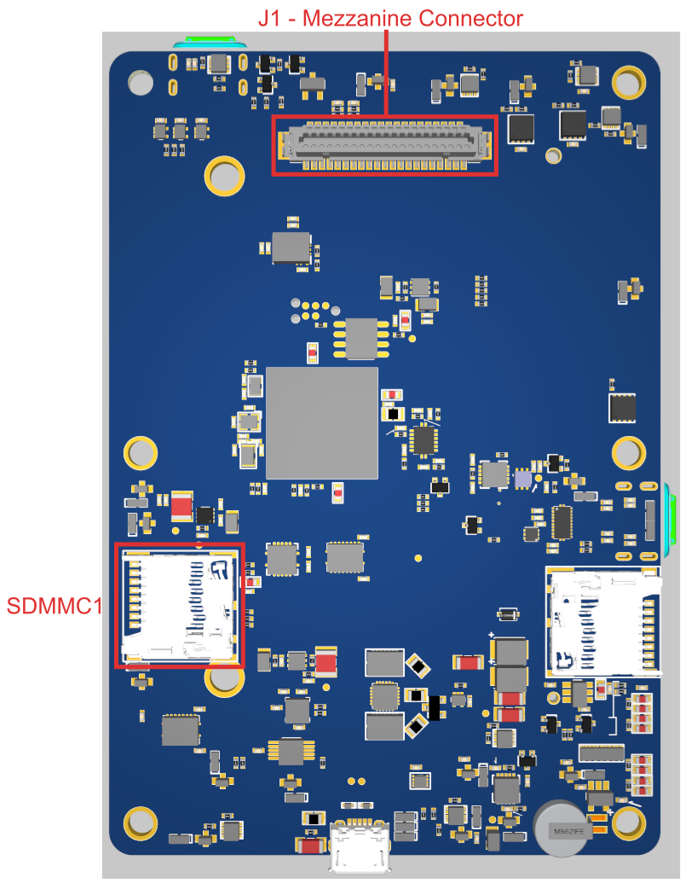
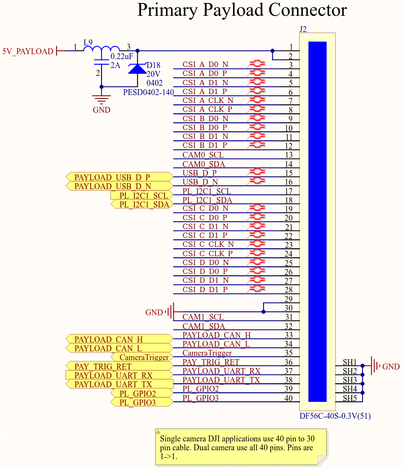
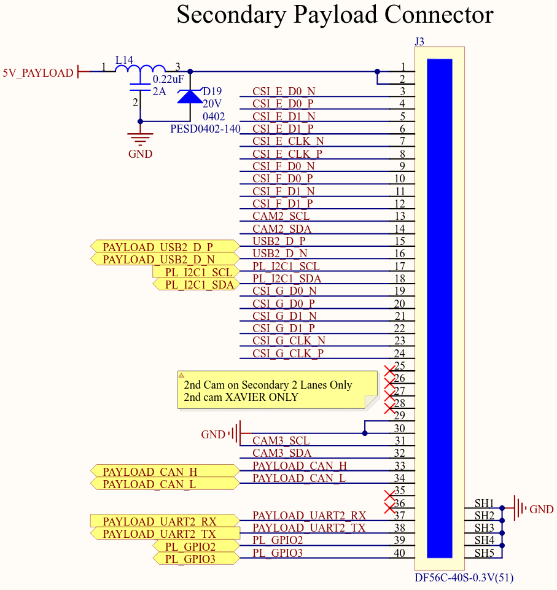

# GreenSight UltraBlue Flight Controller

The UltraBlue flight controller is sold by [GreenSight](https://greensightag.com).

## Features

 - STM32H743 microcontroller
 - Incorporates an NVIDIA Jetson SOM
 - Three IMUs: two BMI088 units and one ICM20649
 - Internal heater for IMU temperature control
 - DPS310 SPI barometer
 - microSD card slot
 - DF9-41S-1V(32) Hirose Mezzanine Connector

## Connector Overview

## UART Mapping

 - SERIAL0 -> USB (console)
 - SERIAL1 -> USART2 (Jetson telem, no DMA)
 - SERIAL2 -> USART6 (telem2)
 - SERIAL3 -> USART1 (primary GPS)
 - SERIAL4 -> UART4 (GPS2, no DMA)
 - SERIAL5 -> UART8 (USER/[RCin: DSM/PPM/SBus])
 - SERIAL6 -> USART3 (ESC telemetry)
 - SERIAL7 -> UART7 (USER/[debug tx/rx], no DMA)
 - SERIAL8 -> USB2

## Connectors

All connectors are JST GH type unless otherwise specified.

### JP1 - PPM/SBUS In (Autopilot RC input)

   <table border="1" class="docutils">
   <tbody>
   <tr>
   <th>Pin</th>
   <th>Signal</th>
   <th>Volt</th>
   </tr>
   <tr>
   <td>1</td>
   <td>PPM/SBUS</td>
   <td>+3.3V</td>
   </tr>
   <tr>
   <td>2</td>
   <td>VCC</td>
   <td>+5V</td>
   </tr>
   <tr>
   <td>3</td>
   <td>GND</td>
   <td>GND</td>
   </tr>
   </tbody>
   </table>

### JP9 - Analog (Autopilot ADC input)

   <table border="1" class="docutils">
   <tbody>
   <tr>
   <th>Pin</th>
   <th>Signal</th>
   <th>Volt</th>
   </tr>
   <tr>
   <td>1</td>
   <td>VCC</td>
   <td>+5V</td>
   </tr>
   <tr>
   <td>2</td>
   <td>Autopilot Analog Input</td>
   <td>Analog 0 to +6.6V</td>
   </tr>
   <tr>
   <td>3</td>
   <td>GND</td>
   <td>GND</td>
   </tr>
   </tbody>
   </table>

### JP16 - API2C4 (Autopilot I2C)

   <table border="1" class="docutils">
   <tbody>
   <tr>
   <th>Pin</th>
   <th>Signal</th>
   <th>Volt</th>
   </tr>
   <tr>
   <td>1</td>
   <td>VCC</td>
   <td>+5V</td>
   </tr>
   <tr>
   <td>2</td>
   <td>Autopilot I2C Bus 4 Clock</td>
   <td>+3.3V</td>
   </tr>
   <tr>
   <td>3</td>
   <td>Autopilot I2C Bus 4 Data</td>
   <td>+3.3V</td>
   </tr>
   <tr>
   <td>4</td>
   <td>GND</td>
   <td>GND</td>
   </tr>
   </tbody>
   </table>

### JP14 - AP Debug (Autopilot debug UART)

   <table border="1" class="docutils">
   <tbody>
   <tr>
   <th>Pin</th>
   <th>Signal</th>
   <th>Volt</th>
   </tr>
   <tr>
   <td>1</td>
   <td>VCC</td>
   <td>+5V</td>
   </tr>
   <tr>
   <td>2</td>
   <td>Autopilot Debug UART Transmit</td>
   <td>+3.3V</td>
   </tr>
   <tr>
   <td>3</td>
   <td>Autopilot Debug UART Receive</td>
   <td>+3.3V</td>
   </tr>
   <tr>
   <td>4</td>
   <td>GND</td>
   <td>GND</td>
   </tr>
   </tbody>
   </table>

### JP4 - Spektrum/DSM (Autopilot RC input)

   <table border="1" class="docutils">
   <tbody>
   <tr>
   <th>Pin</th>
   <th>Signal</th>
   <th>Volt</th>
   </tr>
   <tr>
   <td>1</td>
   <td>VCC</td>
   <td>+3.3V</td>
   </tr>
   <tr>
   <td>2</td>
   <td>GND</td>
   <td>GND</td>
   </tr>
   <tr>
   <td>3</td>
   <td>Spektrum/DSM</td>
   <td>+3.3V</td>
   </tr>
   </tbody>
   </table>

### JP18 - Autopilot SPI

   <table border="1" class="docutils">
   <tbody>
   <tr>
   <th>Pin</th>
   <th>Signal</th>
   <th>Volt</th>
   </tr>
   <tr>
   <td>1</td>
   <td>VCC</td>
   <td>+5V</td>
   </tr>
   <tr>
   <td>2</td>
   <td>SPI5 Clock</td>
   <td>+3.3V</td>
   </tr>
   <tr>
   <td>3</td>
   <td>SPI5 Master In Slave Out</td>
   <td>+3.3V</td>
   </tr>
   <tr>
   <td>4</td>
   <td>SPI5 Master Out Slave In</td>
   <td>+3.3V</td>
   </tr>
   <tr>
   <td>5</td>
   <td>SPI5 External Chip</td>
   <td>+3.3V</td>
   </tr>
   <tr>
   <td>6</td>
   <td>SPI5 External Chip Select 2</td>
   <td>+3.3V</td>
   </tr>
   <tr>
   <td>7</td>
   <td>SPI5 External Chip Select 3</td>
   <td>+3.3V</td>
   </tr>
   <tr>
   <td>8</td>
   <td>GND</td>
   <td>GND</td>
   </tr>
   </tbody>
   </table>

### JP17 - Jetson Cooling Fan (Companion Computer)

   <table border="1" class="docutils">
   <tbody>
   <tr>
   <th>Pin</th>
   <th>Signal</th>
   <th>Volt</th>
   </tr>
   <tr>
   <td>1</td>
   <td>GND</td>
   <td>GND</td>
   </tr>
   <tr>
   <td>2</td>
   <td>VCC</td>
   <td>+5V</td>
   </tr>
   <tr>
   <td>3</td>
   <td>Jetson PWM Tach Input</td>
   <td>+3.3V</td>
   </tr>
   <tr>
   <td>4</td>
   <td>Jetson PWM Fan Output</td>
   <td>+3.3V</td>
   </tr>
   </tbody>
   </table>

### JP3 - CAN 1 (Autopilot and Jetson Companion Computer)

NOTE: CAN 1 is connected to Jetson, Payloads and AP.

   <table border="1" class="docutils">
   <tbody>
   <tr>
   <th>Pin</th>
   <th>Signal</th>
   <th>Volt</th>
   </tr>
   <tr>
   <td>1</td>
   <td>VCC</td>
   <td>+5V</td>
   </tr>
   <tr>
   <td>2</td>
   <td>Autopilot and Jetson CAN High</td>
   <td>+3.3V</td>
   </tr>
   <tr>
   <td>3</td>
   <td>Autopilot and Jetson CAN Low</td>
   <td>+3.3V</td>
   </tr>
   <tr>
   <td>4</td>
   <td>GND</td>
   <td>GND</td>
   </tr>
   </tbody>
   </table>

### JP11 - CAN 2 (Autopilot)

   <table border="1" class="docutils">
   <tbody>
   <tr>
   <th>Pin</th>
   <th>Signal</th>
   <th>Volt</th>
   </tr>
   <tr>
   <td>1</td>
   <td>VCC</td>
   <td>+5V</td>
   </tr>
   <tr>
   <td>2</td>
   <td>Autopilot only CAN High</td>
   <td>+3.3V</td>
   </tr>
   <tr>
   <td>3</td>
   <td>Autopilot only CAN Low</td>
   <td>+3.3V</td>
   </tr>
   <tr>
   <td>4</td>
   <td>GND</td>
   <td>GND</td>
   </tr>
   </tbody>
   </table>

### JP10 - Ethernet (Companion Computer)

NOTE: JP10 is a capacitively coupled ethernet port due to space constraints. It officially supports 10/100 communication over 4x of the pins, MDI pairs 0 and 1, which would correspond to pins 1, 2, 3, and 6 on a standard RJ-45 end (Orange and Green ethernet cable/RJ-45 pairs). Even though these pairs are capacitively coupled, full Gigabit capability has been tested and verified in the lab with all 8x pins in use; the caveat is that this test was done with a cable ~1m long. Speeds above 10/100 may be unstable with longer cable lengths and are not guaranteed. Dual 10/100 connections may also be possible, though this is entirely dependent on the capabilities of the Jetson module itself.

   <table border="1" class="docutils">
   <tbody>
   <tr>
   <th>Pin</th>
   <th>Signal</th>
   <th>Volt</th>
   </tr>
   <tr>
   <td>1</td>
   <td>Jetson Ethernet (Cap Coupled)</td>
   <td>+3.3V</td>
   </tr>
   <tr>
   <td>2</td>
   <td>Jetson Ethernet (Cap Coupled)</td>
   <td>+3.3V</td>
   </tr>
   <tr>
   <td>3</td>
   <td>Jetson Ethernet (Cap Coupled)</td>
   <td>+3.3V</td>
   </tr>
   <tr>
   <td>4</td>
   <td>Jetson Ethernet (Cap Coupled)</td>
   <td>+3.3V</td>
   </tr>
   <tr>
   <td>5</td>
   <td>Jetson Ethernet (Cap Coupled) 10/100</td>
   <td>+3.3V</td>
   </tr>
   <tr>
   <td>6</td>
   <td>Jetson Ethernet (Cap Coupled) 10/100</td>
   <td>+3.3V</td>
   </tr>
   <tr>
   <td>7</td>
   <td>Jetson Ethernet (Cap Coupled) 10/100</td>
   <td>+3.3V</td>
   </tr>
   <tr>
   <td>8</td>
   <td>Jetson Ethernet (Cap Coupled) 10/100</td>
   <td>+3.3V</td>
   </tr>
   </tbody>
   </table>

### JP13 - Jetson Debug (Companion Computer UART)

   <table border="1" class="docutils">
   <tbody>
   <tr>
   <th>Pin</th>
   <th>Signal</th>
   <th>Volt</th>
   </tr>
   <tr>
   <td>1</td>
   <td>Jetson UART Debug Transmit</td>
   <td>+3.3V</td>
   </tr>
   <tr>
   <td>2</td>
   <td>Jetson UART Debug Receive</td>
   <td>+3.3V</td>
   </tr>
   <tr>
   <td>3</td>
   <td>GND</td>
   <td>GND</td>
   </tr>
   </tbody>
   </table>

### JP2 - AP Telem 2 (Autopilot UART)

   <table border="1" class="docutils">
   <tbody>
   <tr>
   <th>Pin</th>
   <th>Signal</th>
   <th>Volt</th>
   </tr>
   <tr>
   <td>1</td>
   <td>VCC</td>
   <td>+5V</td>
   </tr>
   <tr>
   <td>2</td>
   <td>Autopilot Telem 2 UART Transmit</td>
   <td>+3.3V</td>
   </tr>
   <tr>
   <td>3</td>
   <td>Autopilot Telem 2 UART Receive</td>
   <td>+3.3V</td>
   </tr>
   <tr>
   <td>4</td>
   <td>Autopilot Telem 2 UART Clear to Send</td>
   <td>+3.3V</td>
   </tr>
   <tr>
   <td>5</td>
   <td>Autopilot Telem 2 UART Request to Send</td>
   <td>+3.3V</td>
   </tr>
   <tr>
   <td>6</td>
   <td>GND</td>
   <td>GND</td>
   </tr>
   </tbody>
   </table>

### JP19 - JET_SER_1 (Companion Computer UART)

   <table border="1" class="docutils">
   <tbody>
   <tr>
   <th>Pin</th>
   <th>Signal</th>
   <th>Volt</th>
   </tr>
   <tr>
   <td>1</td>
   <td>VCC</td>
   <td>+5V</td>
   </tr>
   <tr>
   <td>2</td>
   <td>Jetson UART 1 Transmit</td>
   <td>+3.3V</td>
   </tr>
   <tr>
   <td>3</td>
   <td>Jetson UART 1 Receive</td>
   <td>+3.3V</td>
   </tr>
   <tr>
   <td>4</td>
   <td>Jetson UART 1 Clear to Send</td>
   <td>+3.3V</td>
   </tr>
   <tr>
   <td>5</td>
   <td>Jetson UART 1 Request to Send</td>
   <td>+3.3V</td>
   </tr>
   <tr>
   <td>6</td>
   <td>GND</td>
   <td>GND</td>
   </tr>
   </tbody>
   </table>

### JP8 - RGB LED & Power Button (Autopilot and Companion Computer UI connector)

   <table border="1" class="docutils">
   <tbody>
   <tr>
   <th>Pin</th>
   <th>Signal</th>
   <th>Volt</th>
   </tr>
   <tr>
   <td>1</td>
   <td>VCC</td>
   <td>+5V</td>
   </tr>
   <tr>
   <td>2</td>
   <td>RGB LED Driver Red channel (low side)</td>
   <td>+3.3V</td>
   </tr>
   <tr>
   <td>3</td>
   <td>RGB LED Driver Green channel (low side)</td>
   <td>+3.3V</td>
   </tr>
   <tr>
   <td>4</td>
   <td>RGB LED Driver Blue channel (low side)</td>
   <td>+3.3V</td>
   </tr>
   <tr>
   <td>5</td>
   <td>Power Button pass-thru to power board</td>
   <td>+3.3V</td>
   </tr>
   <tr>
   <td>6</td>
   <td>Dell 1W input to Jetson</td>
   <td>+3.3V</td>
   </tr>
   <tr>
   <td>7</td>
   <td>Safety Indicator LED pulse</td>
   <td>+3.3V</td>
   </tr>
   <tr>
   <td>8</td>
   <td>Safety switch input to Autopilot</td>
   <td>+3.3V</td>
   </tr>
   <tr>
   <td>9</td>
   <td>GND</td>
   <td>GND</td>
   </tr>
   </tbody>
   </table>

### JP7 - GPS 2 (Autopilot UART/I2C)

   <table border="1" class="docutils">
   <tbody>
   <tr>
   <th>Pin</th>
   <th>Signal</th>
   <th>Volt</th>
   </tr>
   <tr>
   <td>1</td>
   <td>VCC</td>
   <td>+5V</td>
   </tr>
   <tr>
   <td>2</td>
   <td>Autopilot GPS2 UART Transmit</td>
   <td>+3.3V</td>
   </tr>
   <tr>
   <td>3</td>
   <td>Autopilot GPS2 UART Receive</td>
   <td>+3.3V</td>
   </tr>
   <tr>
   <td>4</td>
   <td>Autopilot I2C Bus 2 Clock (GPS2 SCL)</td>
   <td>+3.3V</td>
   </tr>
   <tr>
   <td>5</td>
   <td>Autopilot I2C Bus 2 Data (GPS2 SDA)</td>
   <td>+3.3V</td>
   </tr>
   <tr>
   <td>6</td>
   <td>GND</td>
   <td>GND</td>
   </tr>
   </tbody>
   </table>

### JP5 - Jetson I2C (Companion Computer)

   <table border="1" class="docutils">
   <tbody>
   <tr>
   <th>Pin</th>
   <th>Signal</th>
   <th>Volt</th>
   </tr>
   <tr>
   <td>1</td>
   <td>GND</td>
   <td>GND</td>
   </tr>
   <tr>
   <td>2</td>
   <td>Jetson I2C Bus 1 Clock</td>
   <td>3.3V</td>
   </tr>
   <tr>
   <td>3</td>
   <td>Jetson I2C Bus 1 Data</td>
   <td>3.3V</td>
   </tr>
   <tr>
   <td>4</td>
   <td>VCC</td>
   <td>+5V</td>
   </tr>
   </tbody>
   </table>

### JP6 - GPS 1 (Autopilot UART/I2C)

   <table border="1" class="docutils">
   <tbody>
   <tr>
   <th>Pin</th>
   <th>Signal</th>
   <th>Volt</th>
   </tr>
   <tr>
   <td>1</td>
   <td>VCC</td>
   <td>+5V</td>
   </tr>
   <tr>
   <td>2</td>
   <td>Autopilot GPS1 UART Transmit</td>
   <td>+3.3V</td>
   </tr>
   <tr>
   <td>3</td>
   <td>Autopilot GPS1 UART Receive</td>
   <td>+3.3V</td>
   </tr>
   <tr>
   <td>4</td>
   <td>Autopilot I2C Bus 1 Clock (GPS1 SCL)</td>
   <td>+3.3V</td>
   </tr>
   <tr>
   <td>5</td>
   <td>Autopilot I2C Bus 1 Data (GPS1 SDA)</td>
   <td>+3.3V</td>
   </tr>
   <tr>
   <td>6</td>
   <td>GND</td>
   <td>GND</td>
   </tr>
   </tbody>
   </table>

### JP20 - JET_SPI (Companion Computer SPI)

   <table border="1" class="docutils">
   <tbody>
   <tr>
   <th>Pin</th>
   <th>Signal</th>
   <th>Volt</th>
   </tr>
   <tr>
   <td>1</td>
   <td>VCC</td>
   <td>+5V</td>
   </tr>
   <tr>
   <td>2</td>
   <td>Jetson SPI 0 Clock</td>
   <td>+3.3V</td>
   </tr>
   <tr>
   <td>3</td>
   <td>Jetson SPI 0 Master-In / Servant-Out</td>
   <td>+3.3V</td>
   </tr>
   <tr>
   <td>4</td>
   <td>Jetson SPI 0 Master-Out / Servant-In</td>
   <td>+3.3V</td>
   </tr>
   <tr>
   <td>5</td>
   <td>Jetson SPI 0 Chip Select 0</td>
   <td>+3.3V</td>
   </tr>
   <tr>
   <td>6</td>
   <td>Ground</td>
   <td>GND</td>
   </tr>
   </tbody>
   </table>

### JP12 - AP GPIO (Autopilot GPIOs)
   <table border="1" class="docutils">
   <tbody>
   <tr>
   <th>Pin</th>
   <th>Signal</th>
   <th>Volt</th>
   </tr>
   <tr>
   <td>1</td>
   <td>VCC</td>
   <td>+5V</td>
   </tr>
   <tr>
   <td>2</td>
   <td>WS2812B LED</td>
   <td>+3.3V</td>
   </tr>
   <tr>
   <td>3</td>
   <td>GPIO 59</td>
   <td>+3.3V</td>
   </tr>
   <tr>
   <td>4</td>
   <td>GPIO 60</td>
   <td>+3.3V</td>
   </tr>
   <tr>
   <td>5</td>
   </td>
   <td>GPIO 61</td>
   <td>+3.3V</td>
   </tr>
   <tr>
   <td>6</td>
   <td>GPIO 62</td>
   <td>+3.3V</td>
   </tr>
   <tr>
   <td>7</td>
   <td>GPIO 63</td>
   <td>+3.3V</td>
   </tr>
   <tr>
   <td>8</td>
   <td>GND</td>
   <td>GND</td>
   </tr>
   </tbody>
   </table>

### JP21 - I2S1 (I2C Slave/Connection)

   <table border="1" class="docutils">
   <tbody>
   <tr>
   <th>Pin</th>
   <th>Signal</th>
   <th>Volt</th>
   </tr>
   <tr>
   <td>1</td>
   <td>VCC</td>
   <td>+5V</td>
   </tr>
   <tr>
   <td>2</td>
   <td>I2S1 Clock</td>
   <td>+3.3V</td>
   </tr>
   <tr>
   <td>3</td>
   <td>I2S1 Data In</td>
   <td>+3.3V</td>
   </tr>
   <tr>
   <td>4</td>
   <td>I2S1 Data Out</td>
   <td>+3.3V</td>
   </tr>
   <tr>
   <td>5</td>
   <td>I2S1 Frame Select</td>
   <td>+3.3V</td>
   </tr>
   <tr>
   <td>6</td>
   <td>GND</td>
   <td>GND</td>
   </tr>
   </tbody>
   </table>

### J2 - Jetson Payload 1

   

### J3 - Jetson Payload 2

   

### J1 - Mezzanine Connector

NOTE: Odd pins from 1-19 are VDD_5V_IN. Odd pins from 21 to 41 are GND.

External Pin Information:
   <table border="1" class="docutils">
   <tbody>
   <tr>
   <th>Pin</th>
   <th>Purpose</th>
   </tr>
   <tr>
   <td>2</td>
   <td>ESC/Servo 1 Output, 3.3V, Protected</td>
   </tr>
   <tr>
   <td>4</td>
   <td>ESC/Servo 2 Output, 3.3V, Protected</td>
   </tr>
   <tr>
   <td>6</td>
   <td>ESC/Servo 3 Output, 3.3V, Protected</td>
   </tr>
   <tr>
   <td>8</td>
   <td>ESC/Servo 4 Output, 3.3V, Protected</td>
   </tr>
   <tr>
   <td>10</td>
   <td>ESC/Servo 5 Output, 3.3V, Protected</td>
   </tr>
   <tr>
   <td>12</td>
   <td>ESC/Servo 6 Output, 3.3V, Protected</td>
   </tr>
   <tr>
   <td>14</td>
   <td>ESC/Servo 7 Output, 3.3V, Protected</td>
   </tr>
   <tr>
   <td>16</td>
   <td>ESC/Servo 8 Output, 3.3V, Protected</td>
   </tr>
   <tr>
   <td>18</td>
   <td>ESC Telemetry Serial Port Input</td>
   </tr>
   <tr>
   <td>20</td>
   <td>Power Button Signal GPIO, Passed through to button panel JP8</td>
   </tr>
   <tr>
   <td>22</td>
   <td>Jetson Shutdown Request Signal (GPIO19), 3.3v PU, 3.3v Logic</td>
   </tr>
   <tr>
   <td>24</td>
   <td>N/C</td>
   </tr>
   <tr>
   <td>26</td>
   <td>BMS I2C SDA, Switchable between Jetson and AP, 3.3v logic</td>
   </tr>
   <tr>
   <td>28</td>
   <td>BMS I2C SCL, Switchable between Jetson and AP, 3.3v logic</td>
   </tr>
   <tr>
   <td>30</td>
   <td>Batt Voltage Input - Autopilot ADC 0-3.3v, 1k series no divider</td>
   </tr>
   <tr>
   <td>32</td>
   <td>Batt Current Input - Autopilot ADC 0-3.3v, 1k series no divider</td>
   </tr>
   <tr>
   <td>34</td>
   <td>Jetson GPIO Output (Enable Aux Bus 1), (3.3v), Active High to Enable Power</td>
   </tr>
   <tr>
   <td>36</td>
   <td>Jetson GPIO Output (Enable Aux Bus 2), (3.3v)</td>
   </tr>
   <tr>
   <td>38</td>
   <td>Serial LED Controller Output, AP FMU CAP1 Port (3.3v)</td>
   </tr>
   <tr>
   <td>40</td>
   <td>One Wire Bus to Jetson (3.3v PU)</td>
   </tr>
   </tbody>
   </table>

## RC Input

The RCIN pin, which is physically mapped to UART8 and configured by default as SERIAL5, can be used for most ArduPilot supported unidirectional receiver protocols. For this reason SERIAL5_PROTOCOL defaults to “23” (RCIN).

* PPM: Connect to the JP1 connector. PPM input is only supported on JP1 as it requires a special interrupt.  
* SBUS: Connect to the JP1 connector.  
* Spektrum/DSM radios: Connect to the JP4 connector.  

Bi-directional protocols such as CRSF/ELRS and SRXL2 require a full UART connection. FPort, when connected to RCIN, will only provide RC without telemetry.

To allow CRSF and embedded telemetry available in Fport, CRSF, and SRXL2 receivers, a full UART, such as SERIAL2 (telem2) or SERIAL4 (GPS2) would need to be used for receiver connections. Below are setups using Serial2.
* SERIAL2_PROTOCOL should be set to “23”.
* FPort would require SERIAL2_OPTIONS be set to “15” 
* CRSF would require SERIAL2_OPTIONS be set to “0”
* SRXL2 would require SERIAL2_OPTIONS be set to “4” and connects only the TX pin.

## PWM Output

The UltraBlue flight controller supports up to 16 PWM outputs.

The 16 PWM outputs are in 5 groups:
* PWM 1 - 4 are in group1 (TIM5)
* PWM 5 - 8 are in group2 (TIM4)
* PWM 9 - 12 are in group3 (TIM1)
* PWM 13 and 14 are in group4 (TIM12) (no DMA, no DShot)
* PWM 15 and 16 are in group5 (TIM8)

Channels within the same group need to use the same output rate and protocol. Outputs 1 - 8 support bi-directional DShot.

## GPIOs

All PWM outputs can be used as GPIO (relays, buttons, RPM, etc.). To use them you need to set the output's SERVOx_FUNCTION to -1. See GPIOs page for more information.

The numbering of the GPIOs for PIN parameters in ArduPilot is:
* PWM1 50
* PWM2 51
* PWM3 52
* PWM4 53
* PWM5 54
* PWM6 55
* PWM7 56
* PWM8 57
* PWM9 58
* PWM10 59
* PWM11 60
* PWM12 61
* PWM13 62
* PWM14 63

## Firmware

The board comes pre-installed with an ArduPilot compatible bootloader, allowing the loading of *.apj firmware files with any ArduPilot compatible ground station.

## Battery Monitoring

The J1 - Mezzanine Connector has inputs for battery voltage and current. It also has an I2C bus connection, Bus 1 (I2C3), intended for use with SMBus batteries and BMSs. The BATT_I2C_BUS parameter should be set to 1.

## Camera Control

GPIO 64 (camera trigger) is controlled by RELAY1 (default).  
GPIO 65 (camera trigger return) is controlled by RELAY2 (default).
Both of these pins are routed to the J2 connector - Jetson Payload 1.

## Acknowledgements

Thanks to [GreenSight](https://greensightag.com) for images.
