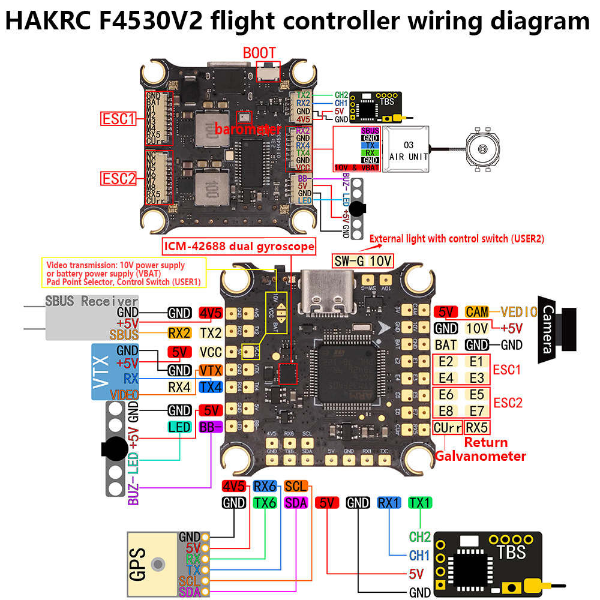

# HAKRC F405v2 Flight Controller

https://www.hakrc.com/HAKRC-4530V2-FC.html

The HAKRC F405v2 is a flight controller produced by [HAKRC](https://www.hakrc.com).

## Features

- MCU：STM32F405RET6
- IMU：ICM42688
- Baro：DPS310/SPL06/BMP280
- OSD: AT7456E
- Blackbox：16MB
- PWM output：9CH
- UART：4
- Power Supply：2-6S Lipo
- BEC Output：5V/3A, 10V/2.5A
- USB Connector: Type-C
- Weight：8.5g
- Size：36mm x 36mm
- Mounting Hole：30.5mm x 30.5mm

## Pinout

## UART Mapping

The UARTs are marked Rn and Tn in the above pinouts. The Rn pin is the
receive pin for UARTn. The Tn pin is the transmit pin for UARTn.
|Name|Pin|Function|
|:-|:-|:-|
|SERIAL0|COMPUTER|USB|
|SERIAL1|TX1/RX1|UART1 (RC Input)|
|SERIAL2|TX2/RX2 (SBUS)|UART2|
|SERIAL4|TX4/RX4|UART4|
|SERIAL6|TX6/RX6|UART6 (GPS)|

## RC Input

RC input is configured on SERIAL1 (USART1), which is available on the RX1, TX1.

*Note* It is recommend to use CRSF/ELRS. 

The RX2 pad provides an inverted input for S.BUS receivers.

## OSD Support

The HAKRC F405v2 supports OSD using OSD_TYPE 1 (MAX7456 driver).

## PWM Output

The HAKRC F405v2 supports up to 9 PWM outputs.

- The pads for motor output E1 to E8 on the two motor connectors.
- LED for one servo

The PWM is in 4 groups:

 - PWM 1, 4  in group1
 - PWM 2, 3, 5  in group2
 - PWM 6, 7, 8  in group3
 - PWM 9  in group4

Channels within the same group need to use the same output rate. If any channel in a group uses DShot then all channels in the group need to use DShot.

Protocol support: 
- PWM
- Oneshot125
- Oneshot42
- Multispot
- Dshot150
- Dshot300
- Dshot600

## Pin IO

- RELAY1 (GPIO 81): SW-G off\on control (HIGH:on; LOW:off)
- RELAY2 (GPIO 82): VTX Power control (HIGH:on; LOW:off)

## Battery Monitoring

The board has a builting voltage sensor. The voltage sensor can handle up to 6S
LiPo batteries.

The correct battery setting parameters are:

 - BATT_MONITOR 3
 - BATT_VOLT_PIN 11
 - BATT_VOLT_MULT around 10.93
 - BATT_CURR_PIN 13
 - BATT_CURR_MULT around 4.85 with the included ESC

 ## Compass

The HAKRC F405v2 does not have a builting compass, but you can attach an external compass using I2C on the SDA and SCL pads.

## Loading Firmware

Initial firmware load can be done with DFU by plugging in USB with the
bootloader button pressed. Then you should load the "with_bl.hex"
firmware, using your favourite DFU loading tool.

Once the initial firmware is loaded you can update the firmware using
any ArduPilot ground station software. Updates should be done with the
*.apj firmware files.