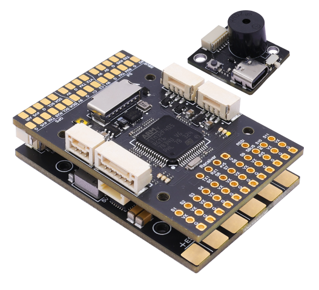
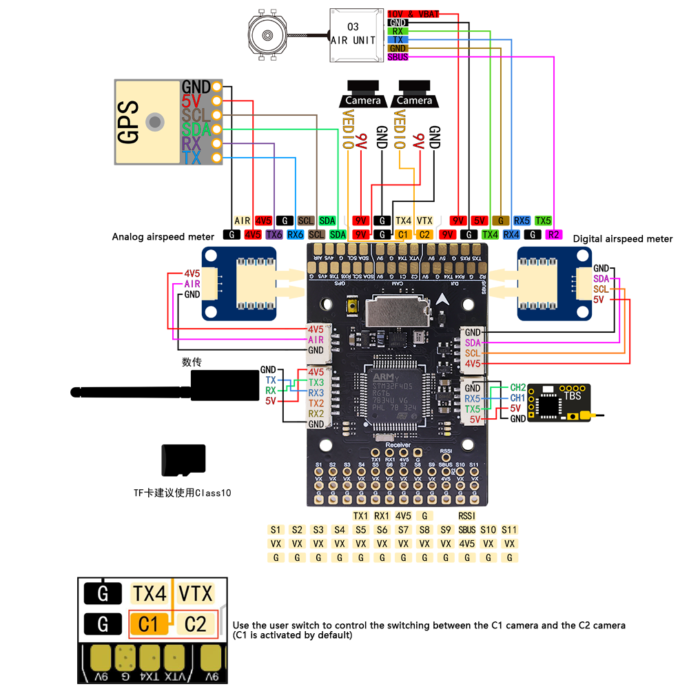
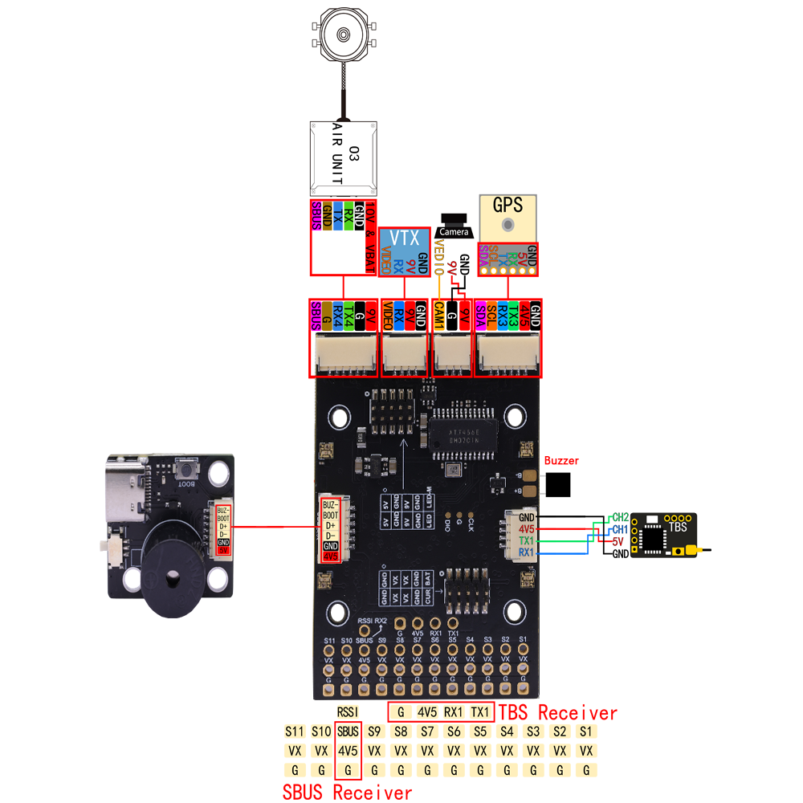
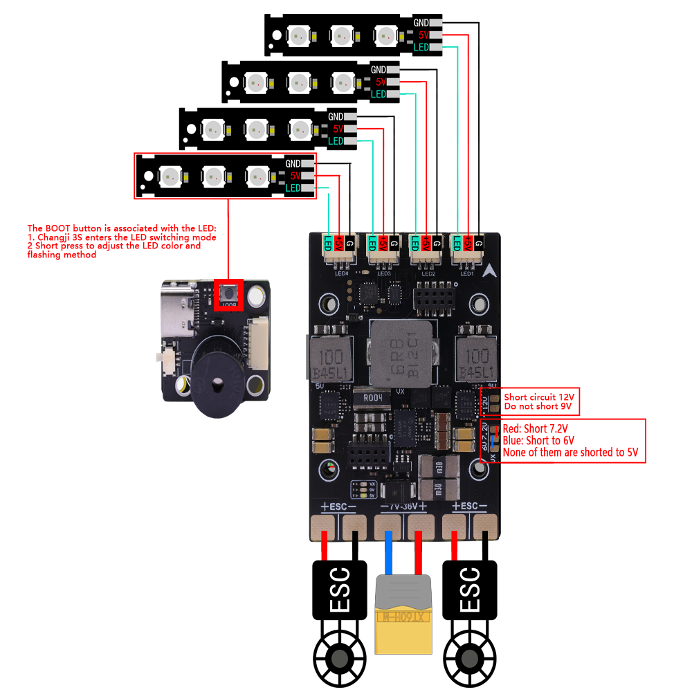

# HAKRCF405Wing Flight Controller

The HAKRC F405 Wing v1.0 is a flight controller produced by [HAKRC](https://www.hakrc.com/).

## Features

 - MCU: STM32F405RGT6, 168MHz
 - Gyro: ICM42688-P
 - 16Mb Onboard Flash
 - BEC output: 5V, 2A@4V
 - Barometer: SPL06
 - OSD: AT7456E
 - 5 UARTS: (UART1, UART3, UART4, UART5, UART6)
 - 5 PWM outputs (4 motor outputs used internally for integrated 4-in-1 ESC and 1 integrated LED)

## Pinout

Flight controller board

Power board

## UART Mapping

The UARTs are marked Rn and Tn in the above pinouts. The Rn pin is the
receive pin for UARTn. The Tn pin is the transmit pin for UARTn.
|Name|Pin|Function|
|:-|:-|:-|
|SERIAL0|COMPUTER|USB|
|SERIAL1|RX1/TX1|UART1 (ELRS)|
|SERIAL2|RX2/TX2|UART2 (Serial / RX2 Shared with SBUS) |
|SERIAL3|TX3/RX3|UART3 (Telemetry)
|SERIAL4|TX4/RX4|UART4 (DJI)|
|SERIAL5|TX5/RX5|UART5 |
|SERIAL6|TX6/RX6|UART6 |

## RC Input

RC input is configured on the on-board ELRS on UART1 or through (UART1_RX/UART1_TX) pins. It supports all serial RC protocols.

## OSD Support

The HAKRCF405Wing supports OSD using OSD_TYPE 1 (MAX7456 driver).

## PWM Output

The HAKRCF405Wing has 8 motor outputs and 3 servo outputs

## Battery Monitoring

The board has a builtin voltage sensor and a current sensor input tied main battery input, external ESCs connects on the power board. 
The voltage sensor can handle up to 36 Volt DC. LiPo batteries.

The correct battery setting parameters are:

 - BATT_MONITOR 4
 - BATT_VOLT_PIN 11
 - BATT_VOLT_MULT 550
 - BATT_CURR_PIN 13
 - BATT_CURR_MULT 100

These are set by default in the firmware and shouldn't need to be adjusted

## Airspeed

The HAKRCF405Wing has both analog (JST-GH 3 pin) and I2C port (JST-GH 4pin) exposed for the external airspeed sensor. 
Analog airspeed settings:
 - AIRSPEED_PIN 15

## Compass

The HAKRCF405Wing does not have onboard compass. Compass can be connected on I2C port (JST-GH 4pin)

## NeoPixel LED

The board includes a NeoPixel LED on the underside which is pre-configured to output ArduPilot sequences. 
This is the twelwth (12) PWM output.

## Loading Firmware

Initial firmware load can be done with DFU by plugging in USB with the
bootloader button pressed. Then you should load the "with_bl.hex"
firmware, using your favourite DFU loading tool.

Once the initial firmware is loaded you can update the firmware using
any ArduPilot ground station software. Updates should be done with the
*.apj firmware files.
