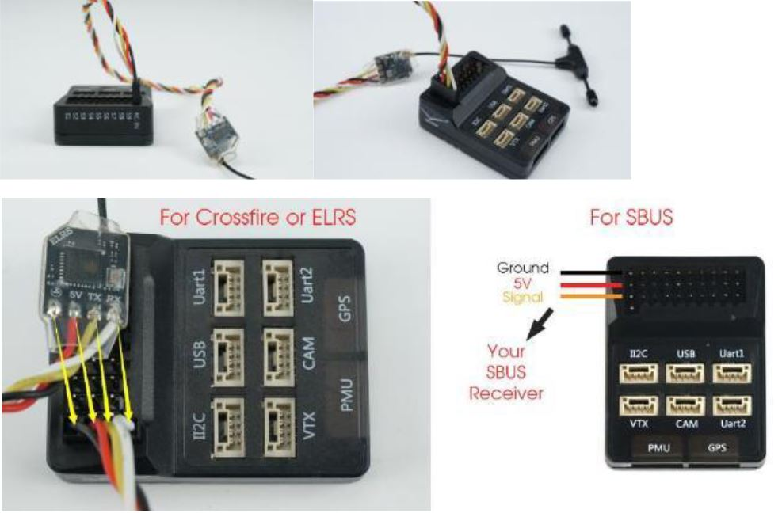

# HEEWING F405 Flight Controller

https://www.heewing.com/pages/t1-ranger-vtol-pnp-manual

The HEEWING F405 is a flight controller produced by [HEEWING](https://www.heewing.com/pages/t1-ranger-vtol-pnp-manual) that is incorporated into their Ranger-T1 VTOL RTF airframe.

## Features

 - STM32F405 microcontroller
 - ICM42688 IMU
 - SLP06 barometer
 - 16Mb dataflash
 - MAX7456 OSD
 - 4 UARTs
 - 9 PWM outputs

### HEEWING F405 Pinout

## UART Mapping

The UARTs are marked Rn and Tn in the above pinouts. The Rn pin is the
receive pin for UARTn. The Tn pin is the transmit pin for UARTn.

 - SERIAL0 -> USB
 - SERIAL1 -> UART3 (UART1 on casing, DMA-enabled)
 - SERIAL2 -> UART1 (UART2 on casing, DMA-enabled)
 - SERIAL5 -> UART5 (GPS)
 - SERIAL6 -> UART2 (RCIN RX-only or RX/TX with BRD_ALT_CONFIG=1, DMA-enabled)

## RC Input
 
RC input is configured on the RCIN connector (UART2_RX) pin. It supports all serial RC protocols. It can be configured for two-way protocols (e.g. CRSF) by setting BRD_ALT_CONFIG=1
 
## FrSky Telemetry
 
FrSky Telemetry can be supported using the transmit pin on a spare serial ports SERIAL1 and SERIAL2.
  
## OSD Support

The HEEWING F405 supports OSD using OSD_TYPE 1 (MAX7456 driver).

## PWM Output

The HEEWING F405 supports up to 9 PWM outputs. M1-M2, M5-M6 and M9 support bi-directional dshot. All outputs support dshot although M3-4 are not recommended for this purpose as they share resources with I2C.

The PWM is in 4 groups:

 - PWM 1 and 2 in group1
 - PWM 3 and 4 in group2
 - PWM 5 and 6 in group3
 - PWM 7-9 in group4

Channels within the same group need to use the same output rate. If
any channel in a group uses DShot then all channels in the group need
to use DShot.

## Battery Monitoring

The board has a built-in voltage and current sensor. The current
sensor can read up to 130 Amps. The voltage sensor can handle up to 6S
LiPo batteries.

The correct battery setting parameters are:

 - BATT_MONITOR 4
 - BATT_VOLT_PIN 10
 - BATT_CURR_PIN 11
 - BATT_VOLT_MULT 7.71
 - BATT_AMP_PERVLT 26.67

## Compass

The HEEWING F405 does not have a builtin compass, but you can attach an external compass using the GPS port. The RTF kit comes pre-supplied with a GPS and compass.

## Loading Firmware

Initial firmware load can be done with DFU by plugging in USB with the
bootloader button pressed. Then you should load the "with_bl.hex"
firmware, using your favourite DFU loading tool.

Note that this hardware has problems going into DFU mode if a GPS is connected and powered - please disconnect your GPS when flashing for the first time.

Once the initial firmware is loaded you can update the firmware using
any ArduPilot ground station software. Updates should be done with the
*.apj firmware files.

