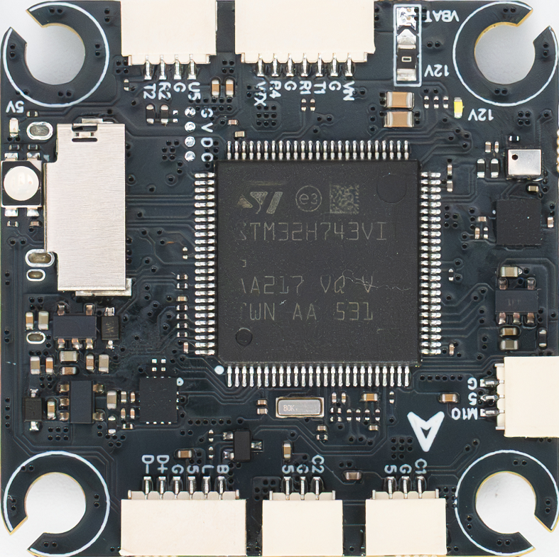
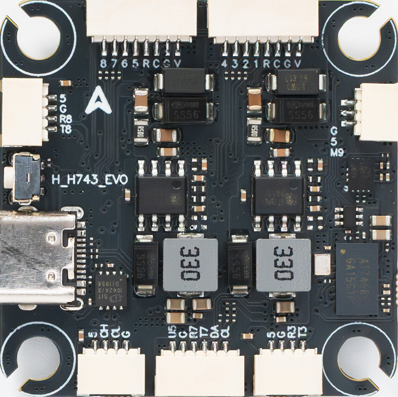

# HGLRC H743 EVO Flight Controller

The HGLRC H743 EVO is an STM32H743-based flight controller for FPV
multirotors. It has dual IMUs, an analog OSD, a microSD slot, an on-board
barometer and compass, CAN, and ten PWM outputs. It is produced by
[HGLRC](https://www.hglrc.com/).

## Where to Buy

Available from the [HGLRC flight controller store](https://www.hglrc.com/collections/fc).

## Board Images

### Top

### Bottom

## Features

- STM32H743VIT6 microcontroller (480 MHz, 2 MiB flash)
- ICM-42688-P (SPI1) and BMI270 (SPI4) IMUs
- DPS368 barometer (I2C2, supported by the DPS310 driver)
- IST8310 compass (I2C2)
- AT7456E analog OSD (SPI2)
- microSD card slot (SDMMC, 4-bit)
- One CAN port (FDCAN1)
- Eight motor outputs, two auxiliary PWM outputs, and one serial LED output
- Analog battery voltage and current sensing
- Switchable 12 V VTX power output
- Two-input camera switch
- USB Type-C

## UART Mapping

| ArduPilot port | Connector/function | Default use |
|---|---|---|
| SERIAL0 | USB | MAVLink2 |
| SERIAL1 | UART1 | MSP DisplayPort |
| SERIAL2 | UART2 | RC input |
| SERIAL3 | UART3 | None |
| SERIAL4 | UART4 (only R4 pinned out on VTX connector) | None |
| SERIAL5 | UART5 (R5 only pinned out, marked R on ESC connectors) | ESC Telemetry |
| SERIAL6 | Not connected | -- |
| SERIAL7 | UART7 | GPS |
| SERIAL8 | UART8 | None |

UART TX and RX pins are marked as `Rx`/`Tx` except as noted. Pins marked `5` are 5V. UART protocols may be changed by the user.

## RC Input

SERIAL2 is configured by default for serial RC input and supports protocols such as CRSF and ELRS. Set `SERIAL2_OPTIONS` to `0` for CRSF/ELRS.

SERIAL4 RX is pinned out on the VTX connector for an optional DJI SBUS connection. To use it, set `SERIAL4_PROTOCOL` to `23` and set `SERIAL2_PROTOCOL` to a value other than `23`. PPM input is not supported.

See [Radio Control Systems](https://ardupilot.org/copter/docs/common-rc-systems.html) for other protocols and `SERIALx_OPTIONS` values.

## Motor and Servo Outputs

| Output | Board label | Timer channel | DShot | Bidirectional DShot |
|---|---|---|---|---|
| 1 | M1 | TIM1_CH1 | Yes | Yes |
| 2 | M2 | TIM1_CH2 | Yes | Yes |
| 3 | M3 | TIM1_CH3 | Yes | Yes |
| 4 | M4 | TIM1_CH4 | Yes | Yes |
| 5 | M5 | TIM4_CH1 | Yes | Yes |
| 6 | M6 | TIM4_CH2 | Yes | Yes |
| 7 | M7 | TIM8_CH1 | Yes | Yes |
| 8 | M8 | TIM8_CH2 | Yes | Yes |
| 9 | M9 | TIM2_CH3 | No | No |
| 10 | M10 | TIM2_CH4 | No | No |

Outputs on the same timer must use the same protocol and update rate. The
serial LED output is on PWM11.

## CAN

Connect CAN peripherals to the board's CAN connector, including CAN_H, CAN_L, power, and ground. Terminate
each end of the CAN bus with 120 ohms. CAN1 is enabled on CAN driver 1 using
the DroneCAN protocol by default (`CAN_P1_DRIVER=1`, `CAN_D1_PROTOCOL=1`).

## Battery Monitoring

The default battery parameters are:

- `BATT_MONITOR=4`
- `BATT_VOLT_PIN=10`
- `BATT_CURR_PIN=11`
- `BATT_VOLT_MULT=21.0`
- `BATT_AMP_PERVLT=40.0` (calibrate against a reference meter for your specific power module)

## I2C, Compass, and Barometer

The on-board IST8310 compass is provided on I2C2, but due to potential interference it is usually disabled in favor of an external compass, typically as part of a GPS/Compass combination connected to I2C1. The DPS368 barometer is also connected to I2C2.

## OSD Support

The AT7456E analog OSD is enabled by default with `OSD_TYPE=1`. SERIAL1 defaults to MSP DisplayPort protocol, and `OSD_TYPE2` is set to `5` by default to enable simultaneous DisplayPort OSD for an HD VTX.

## VTX Power Control

The VTX connector is powered by the switchable 12 V BEC through Relay 2 and is enabled by default. Assign an RC channel the `Relay2 Control` auxiliary function to switch VTX power in flight.

## Camera Control

Relay 3 selects between the CAM1 and CAM2 video inputs. Assign an RC channel the `Relay3 Control` auxiliary function to select the camera.

## Firmware

Firmware for the HGLRC H743 EVO can be found at [firmware.ardupilot.org](https://firmware.ardupilot.org) under the `HGLRC_H743_EVO` folder.

## Loading Firmware

To load ArduPilot firmware, hold the boot button or pad low while powering up the board. Then use STM32CubeProgrammer or another DFU utility to load the `HGLRC_H743_EVO_bl.bin` file. Subsequently, a ground control station can update firmware using the `*.apj` files.
