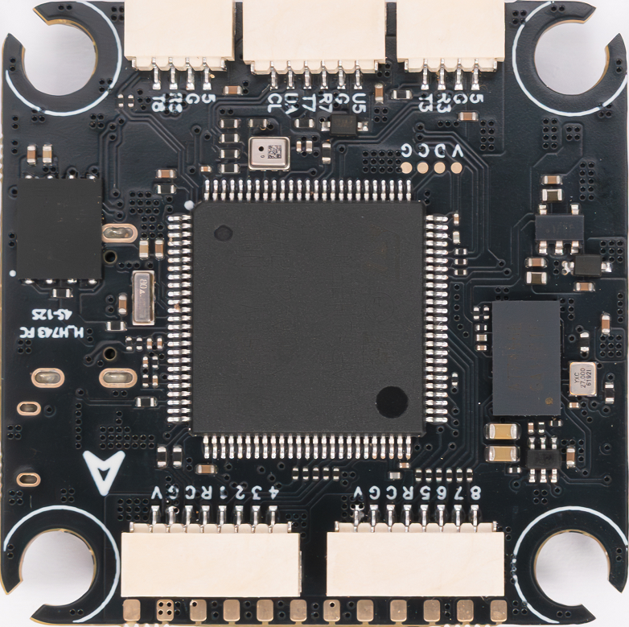
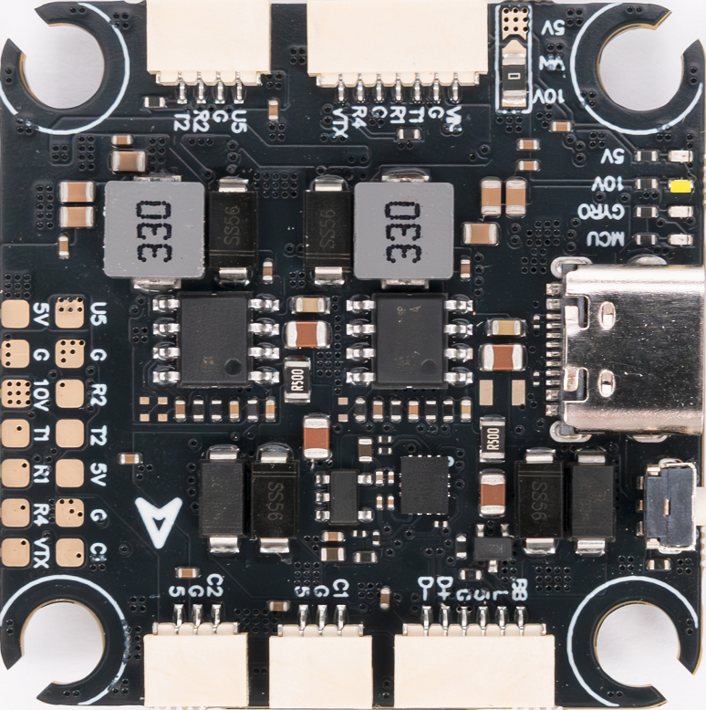

# HGLRC H743 PRO Flight Controller

The HGLRC H743 PRO is a flight controller produced by [HGLRC](https://www.hglrc.com/).

## Where to Buy

Available from the [HGLRC flight controller store](https://www.hglrc.com/collections/fc).

## Features

- STM32H743VI microcontroller
- ICM42688-P IMU
- SPA06-003 barometer
- AT7456E analog OSD
- 16 MiB onboard flash for data logging
- 8 motor outputs
- 7 UARTs, with UART5 exposed as RX-only
- I2C connector for external peripherals
- Addressable LED output
- Dual camera inputs with an analog camera switch
- Switchable 10V VTX power output
- USB Type-C connector
- 5V 2A and 10V 2A BECs
- Up to 12S battery input

## Board Images

## UART Mapping

The UART pins are marked `Rn` and `Tn` on the board. `Rn` is the receive pin and `Tn` is the transmit pin for UARTn.

| ArduPilot port | Hardware port | Default use | TX DMA | RX DMA |
|----------------|---------------|-------------|--------|--------|
| SERIAL0 | USB | MAVLink | Yes | Yes |
| SERIAL1 | USART1 | VTX (MSP DisplayPort) | Yes | Yes |
| SERIAL2 | USART2 | RC input (CRSF/ELRS) | Yes | Yes |
| SERIAL3 | USART3 | GPS or general-purpose serial | Yes | Yes |
| SERIAL4 | UART4 (RX only) | General-purpose serial | ---| Yes |
| SERIAL5 | UART5 RX | ESC telemetry (RX-only) | -- | Yes |
| SERIAL6 | -- | Reserved | -- | -- |
| SERIAL7 | UART7 | GPS | Yes | Yes |
| SERIAL8 | UART8 | General-purpose serial | Yes | Yes |

## RC Input

UART2 is configured by default for serial RC input and supports all ArduPilot RC protocols but not PPM. Connect the receiver to the `T2` and `R2` pads and set `SERIAL2_OPTIONS` appropriately.

See [Radio Control Systems](https://ardupilot.org/copter/docs/common-rc-systems.html) for other protocols and `SERIALx_OPTIONS` values.

## OSD Support

The HGLRC H743 PRO has an onboard AT7456E analog OSD, enabled by default with `OSD_TYPE=1`. SERIAL1 defaults to MSP DisplayPort protocol, and `OSD_TYPE2` is set to `5` by default to enable simultaneous DisplayPort OSD for an HD VTX. Connect an analog camera to `C1` or `C2` and the analog video transmitter to `VTX`.

## PWM Outputs

The HGLRC H743 PRO provides 8 motor outputs, available through the two ESC connectors:

- PWM 1 to 4 use TIM1 and support DShot and bidirectional DShot with RPM telemetry
- PWM 5 to 8 use TIM4 and support DShot and bidirectional DShot with RPM telemetry

Channels in the same timer group must use the same output rate. If any channel in a group uses DShot, all channels in that group must use DShot.

The addressable LED pad uses a separate timer output and is assigned as PWM 9 internally. It is not an additional motor or servo output.

## GPIOs

| GPIO | Function |
|------|----------|
| GPIO(50) | PWM 1 |
| GPIO(51) | PWM 2 |
| GPIO(52) | PWM 3 |
| GPIO(53) | PWM 4 |
| GPIO(54) | PWM 5 |
| GPIO(55) | PWM 6 |
| GPIO(56) | PWM 7 |
| GPIO(57) | PWM 8 |
| GPIO(58) | PWM 9 / addressable LED |
| GPIO(80) | Buzzer |
| GPIO(81) | VTX power control |
| GPIO(82) | Camera switch |

## Battery Monitoring

The board has an onboard battery voltage sensor and an ESC current-sensor input. The default firmware settings are:

- `BATT_MONITOR=4`
- `BATT_VOLT_PIN=10`
- `BATT_CURR_PIN=11`
- `BATT_VOLT_MULT=21.0`
- `BATT_AMP_PERVLT=120`

Current monitoring should be calibrated for the connected ESC.

## Compass

The HGLRC H743 PRO does not have a built-in compass. An external compass can be connected to the `SCL` and `SDA` pads on the I2C connector.

## VTX Power Control

The 10V VTX supply is controlled by GPIO 81 and is assigned to Relay 1 by default. It is enabled at startup. Assign an RC channel the `Relay1 Control` auxiliary function to switch VTX power in flight.

## Camera Switch

The analog video input can be switched between `C1` and `C2` using GPIO 82, which is assigned to Relay 2 by default. Assign an RC channel the `Relay2 Control` auxiliary function to select the camera.

## Firmware

Firmware for the HGLRC H743 PRO can be found [here](https://firmware.ardupilot.org) in sub-folders labeled `HGLRC_H743_PRO`.

## Loading Firmware

To load ArduPilot firmware, hold the `PWR BUT` button (next to the USB-C connector) low while powering up the board. Then use STM32CubeProgrammer or another DFU utility to load the `HGLRC_H743_PRO_bl.bin` file. Subsequently, a ground control station can update firmware using the `*.apj` files.
