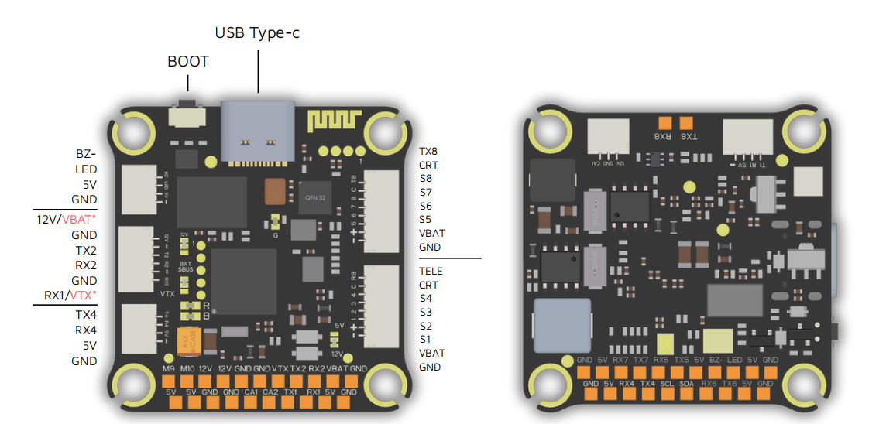

# HWH7 Flight Controller (RTF-H7-FC-8S)

The **HWH7** is a flight controller designed and produced by HW.

## Features

- MCU: STM32H743, 480 MHz, 2 MB Flash.
- IMUs: Dual SPI IMU support (two sensor positions). Default/probed: ICM-42688P .Alternative/probed: BMI270.
- Barometer: I2C barometer (SPL06 or DPS310 at 0x76).
- OSD: AT7456E (SPI) + optional MSP DisplayPort (for DJI/HD systems).
- Logging: microSD (SDMMC1 4-bit).
- PWM Outputs: 12 total. Outputs 1–8 support bidirectional DShot.
- ESC connectivity: up to two ESCs via 8‑pin ribbon connectors (board wiring).
- Power (board hardware): 4S–8S LiPo input (12–35.6 V), on-board 5V/3A and 12V/3A BECs.
- Other hardware (board option): 512Mb blackbox flash.

## Pinout / Connectors

## Serial Ports (UARTs)

Serial ordering (ArduPilot): `SERIAL0..SERIAL8` = `OTG1, USART1, USART2, USART3, UART4, UART5, USART6, UART7, UART8`

| Typical Label | ArduPilot Port | HW Port | TX Pin | RX Pin | Default Use |
| --- | --- | --- | --- | --- | --- |
| USB Type‑C | SERIAL0 | OTG1 | PA11(DM) | PA12(DP) | MAVLink over USB |
| UART1 (TX1/RX1) | SERIAL1 | USART1 | PA9 | PA10 | RC Input (SBUS/DSM/CRSF via serial RCIN) |
| UART2 (TX2/RX2) | SERIAL2 | USART2 | PA2 | PA3 | DisplayPort |
| UART3 | SERIAL3 | USART3 | PD8 | PD9 |  (connected to internal BT module, not currently usable by ArduPilot) |
| UART4 (TX4/RX4) | SERIAL4 | UART4 | PD1 | PD0 | GPS |
| UART5 | SERIAL5 | UART5 | PB6 | PB5 | User |
| UART6 | SERIAL6 | USART6 | PC6 | PC7 | User |
| UART7 | SERIAL7 | UART7 | PE8 | PE7 | User |
| UART8 | SERIAL8 | UART8 | PE1 | PE0 | ESC Telemetry |

## PWM Outputs

The HWH7 supports up to 12 PWM or DShot outputs. These outputs are organized into 5 groups based on the MCU timers:

| Output | MCU Pin | Timer | Notes |
|---:|---|---|---|
| 1 | PE14 | TIM1_CH4 | bidirectional DShot capable |
| 2 | PE13 | TIM1_CH3 | bidirectional DShot capable |
| 3 | PE11 | TIM1_CH2 | bidirectional DShot capable |
| 4 | PE9  | TIM1_CH1 | bidirectional DShot capable |
| 5 | PD12 | TIM4_CH1 | bidirectional DShot capable |
| 6 | PD13 | TIM4_CH2 | bidirectional DShot capable |
| 7 | PD14 | TIM4_CH3 | bidirectional DShot capable |
| 8 | PD15 | TIM4_CH4 | bidirectional DShot capable |
| 9 | PE5  | TIM15_CH1 | standard PWM |
| 10 | PE6 | TIM15_CH2 | standard PWM |
| 11 | PA0 | TIM2_CH1 | “LED pad” (can be used as an output) |
| 12 | PA1 | TIM5_CH2 | buzzer output (HAL_BUZZER_PIN) |

- **Group 1:** PWM 1, 2, 3, 4 (TIM1)
- **Group 2:** PWM 5, 6, 7, 8 (TIM4)
- **Group 3:** PWM 9, 10 (TIM15)
- **Group 4:** PWM 11 (TIM2)
- **Group 5:** PWM 12 (TIM5)

- **Rate and Protocol Consistency:** All channels within the same group **must** use the same output rate and protocol. If any channel in a group is configured for DShot, all other channels in that group must also be configured for DShot.
- **Bi-directional DShot:** Support is available for **PWM 1 through 8** (Groups 1 and 2).
- **Timer Grouping Warning:** Be cautious when mixing different types of servos, ESCs, or other timer-based outputs. For example, if PWM 9 is used for a standard servo and PWM 10 is used for a NeoPixel LED, they will conflict because they share **Group 3 (TIM15)**. In typical setups, PE5 and PE6 are used together as servo outputs by default.

## Battery Monitor (ADC)

The board has a built-in voltage sensor and external current sensor input.

- **BATT_MONITOR** = 4 (Analog Voltage and Current)
- **BATT_VOLT_PIN** = 10 (PC0)
- **BATT_CURR_PIN** = 11 (PC1)
- **BATT_VOLT_MULT** = 11.0
- **BATT_AMP_PERVLT** = 5.882 (or specify your sensor sensitivity like 170mV/A)

## User GPIOs

- GPIO 62 (PD10): Status LED.
- GPIO 80 (PE2) controls the camera output to the connectors marked "CAM1" and "CAM2". Setting this GPIO high switches the video output from CAM1 to CAM2. By default, RELAY1 is configured to control this pin and sets the GPIO high (CAM1).
- GPIO 81 (PE4): controls the VTX power output to the connectors marked "12V".Setting this GPIO low switches the video power off.By default, RELAY2 is configured to control this pin and sets the GPIO high (Power ON).
- GPIO 82 (PD10): This pin is active-low. The Bluetooth function is disabled by default when the pin is low. This feature is currently not supported in ArduPilot.

## Compass

The HWH7 does not have a builtin compass, but you can attach an external compass using I2C on the SDA and SCL pads.

## ESC Telemetry

The HWH7 board features two 8-pin ESC connectors. Telemetry from these connectors is routed to **UART8**.

Note that due to hardware routing:

- **ESC Connector 1** telemetry is connected to **UART8_RX (PE0)**.
- **ESC Connector 2** telemetry is connected to **UART8_TX (PE1)**.

Because both signals share the same UART port on different pins, **simultaneous telemetry from both ESCs is not supported.** You must choose which ESC to receive telemetry from by configuring the `SERIAL8_OPTIONS` parameter:

- **To use telemetry from ESC 1:** Set `SERIAL8_OPTIONS` to `0` (default).
- **To use telemetry from ESC 2:** Set `SERIAL8_OPTIONS` to `8` (SwapTXRX), which allows the flight controller to listen for telemetry on the TX8 pin.

## OSD

The HWH7 includes an integrated AT7456E analog OSD chip, accessible via the CAM1/2 and VTX pins. MSP DisplayPort OSD is also supported and enabled by default for use with digital video systems.

## microSD Logging

The board uses **SDMMC1** (4-bit) for microSD logging.

The bootloader hwdef enables flashing firmware from microSD (`AP_BOOTLOADER_FLASH_FROM_SD_ENABLED`).

## Board ID

`AP_HW_HWH7`

## Loading Firmware

Initial firmware load can be done with DFU by plugging in USB with the bootloader button pressed.

Firmware can be found on the [firmware server](https://firmware.ardupilot.org) in folders marked "HWH7"

Then load the `*_with_bl.hex` firmware using a DFU tool.

Once the initial firmware is loaded you can update the firmware using any ArduPilot ground station software.

Updates should be done with the `*.apj` firmware files.
