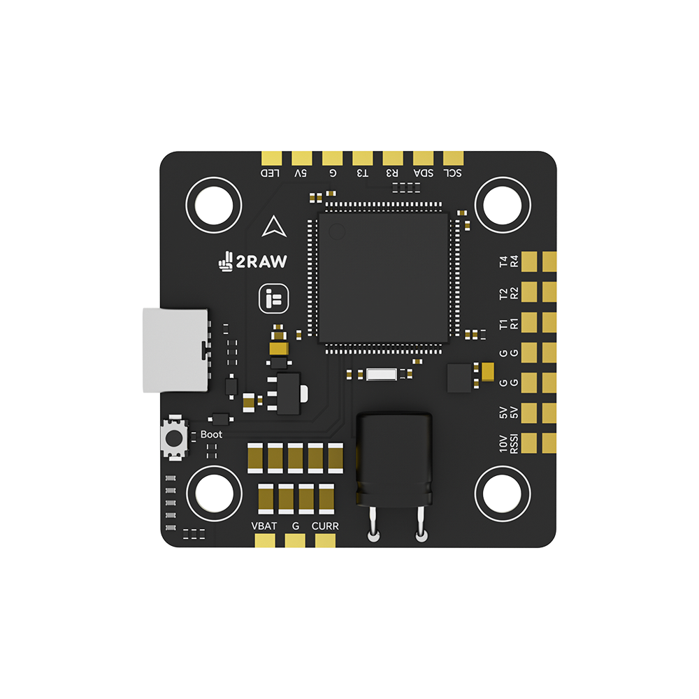
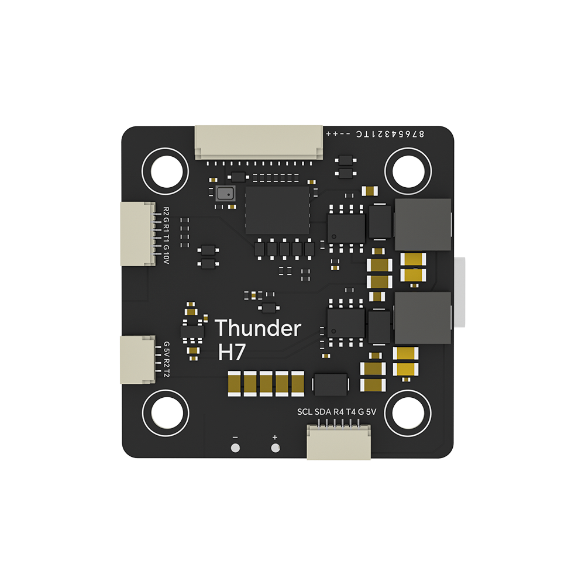

# iFlight 2RAW H743 Flight Controller

The iFlight 2RAW H743 is a flight controller produced by [iFlight](https://shop.iflight.com/Thunder-H7-Flight-Controller-Pro2200).

## Features

 - MCU - STM32H743 32-bit processor running at 480 MHz
 - IMU - ICM42688P
 - Barometer - SPL06-001
 - Onboard Flash: 1GBit exposed as microSD card
 - 6x UARTs
 - 9x PWM Outputs (8 Motor Output, 1 LED)
 - Battery input voltage: 2S-6S
 - BEC 5V 1.5A
 - BEC 10V 1.5A

## Pinout

## UART Mapping

The UARTs are marked Rn and Tn in the above pinouts. The Rn pin is the
receive pin for UARTn. The Tn pin is the transmit pin for UARTn.

 - SERIAL0 -> USB
 - SERIAL1 -> UART1 (VTX HD, DMA-enabled)
 - SERIAL2 -> UART2 (RX, DMA-enabled)
 - SERIAL3 -> UART3 (GPS, DMA-enabled)
 - SERIAL4 -> UART4 (GPS, DMA-enabled)
 - SERIAL6 -> UART6 (ESC Telemetry)

## RC Input

RC input is configured on the R2 (UART2_RX) pin. It supports all serial RC
protocols. For protocols requiring half-duplex serial to transmit
telemetry (such as FPort) you should setup SERIAL3 as an RC input serial port,
with half-duplex, pin-swap and inversion enabled.
 
## FrSky Telemetry
 
FrSky Telemetry is supported using the T3 pin (UART3 transmit). You need to set the following parameters to enable support for FrSky S.PORT
 
  - SERIAL3_PROTOCOL 10
  - SERIAL3_OPTIONS 7
  
## OSD Support

The iFlight 2RAW H743 supports MSP DisplayPort OSD using OSD_TYPE 5

## PWM Output

The iFlight 2RAW H743 supports up to 9 PWM outputs. The pads for motor output
M1 to M8 are provided in the motor connector, plus M9 on a separate pad for LED strip
or another PWM output.

The PWM is in 5 groups:

 - PWM 1-2   in group1
 - PWM 3-6   in group2
 - PWM 7-8   in group3
 - PWM 9     in group4

Channels within the same group need to use the same output rate. If
any channel in a group uses DShot then all channels in the group need
to use DShot. Channels 1-8 support bi-directional dshot.

## Battery Monitoring

The board has a built-in voltage and current sensor. The current
sensor can read up to 130 Amps. The voltage sensor can handle up to 6S
LiPo batteries.

The correct battery setting parameters are:

 - BATT_MONITOR 4
 - BATT_VOLT_PIN 11
 - BATT_CURR_PIN 13
 - BATT_VOLT_MULT 11.1
 - BATT_AMP_PERVLT 64

## Compass

The iFlight 2RAW H743 does not have a builtin compass, but you can attach an external compass using I2C on the SDA and SCL pads.

## VTX power control
GPIO 81 controls the VTX BEC output to pins marked "10V". Setting this GPIO low removes voltage supply to pins.
By default RELAY2 is configured to control this pin and sets the GPIO high.

## Logging

Logging is via a 1GBit flash chip exposed via a microSD interface. In order to be used you must format the card using mission planner
after the first time you have loaded the firmware

## Loading Firmware

Initial firmware load can be done with DFU by plugging in USB with the
bootloader button pressed. Then you should load the "with_bl.hex"
firmware, using your favourite DFU loading tool.

Once the initial firmware is loaded you can update the firmware using
any ArduPilot ground station software. Updates should be done with the
*.apj firmware files.

