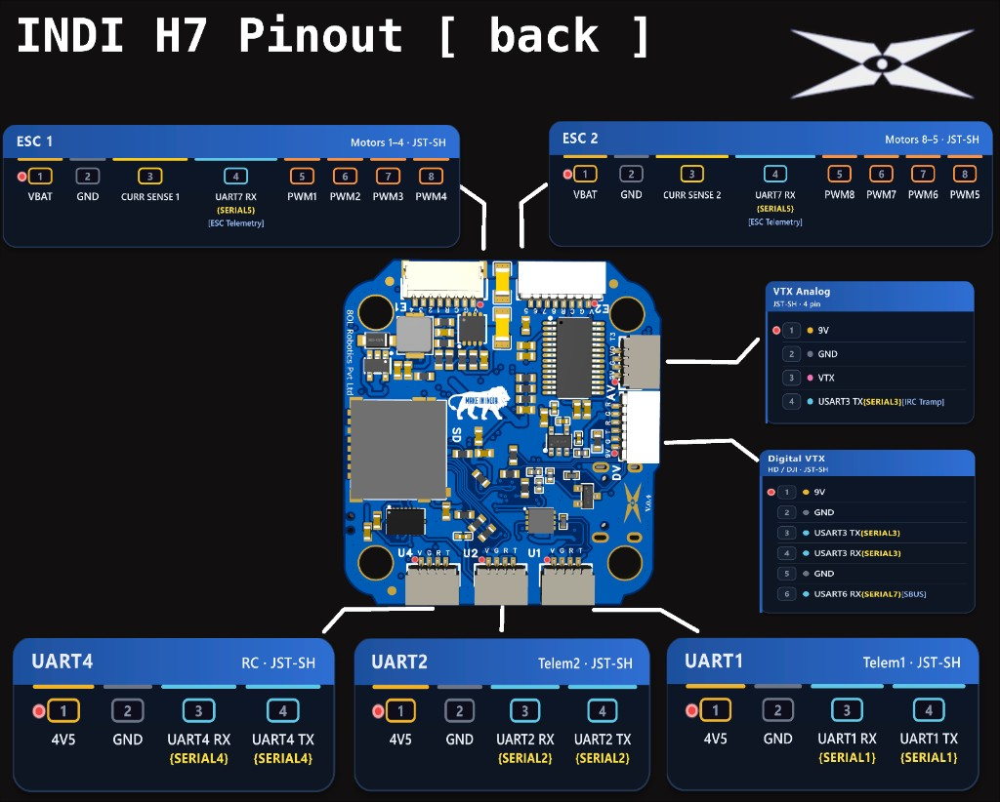

# IndiH743 Flight Controller

The IndiH743 is an STM32H743 flight controller produced by [8OL Robotics](https://www.8olrobotics.com).

## Where to Buy

- [Biji Pathfinders](https://bijipathfinders.com/product/indi-h7-flight-controller/)
- [8OL Robotics](https://www.8olrobotics.com)

## Features

- STM32H743 microcontroller, 480 MHz, 2 MB Flash
- BMI088 and ICM-42688-P / ICM-45686 IMUs
- DPS310 barometer
- AT7456E OSD
- microSD card slot
- 7 UARTs, CAN, external I2C
- 10 PWM/DShot outputs (bi-directional DShot on 1-8) plus RGB LED pad
- Analog and digital / HD VTX connectors
- 2S-6S input; 9V and 4V5 BECs
- 42.4 x 39.5 x 9 mm, 30.5 x 30.5 mm M3 mounting

## Pinout

`{SERIALn}` is the ArduPilot serial port. `[...]` is a protocol / role note.

### CAN - JST-GH

| Pin | Signal |
|-----|--------|
| 1   | 4V5    |
| 2   | CAN H  |
| 3   | CAN L  |
| 4   | GND    |

### UART1 (Telem1) - JST-SH

| Pin | Signal             |
|-----|--------------------|
| 1   | 4V5                |
| 2   | GND                |
| 3   | UART1 RX {SERIAL1} |
| 4   | UART1 TX {SERIAL1} |

### UART2 (Telem2) - JST-SH

| Pin | Signal             |
|-----|--------------------|
| 1   | 4V5                |
| 2   | GND                |
| 3   | UART2 RX {SERIAL2} |
| 4   | UART2 TX {SERIAL2} |

### UART4 (RC) - JST-SH

| Pin | Signal             |
|-----|--------------------|
| 1   | 4V5                |
| 2   | GND                |
| 3   | UART4 RX {SERIAL4} |
| 4   | UART4 TX {SERIAL4} |

### CAM - JST-SH

| Pin | Signal   |
|-----|----------|
| 1   | 9V       |
| 2   | GND      |
| 3   | Video in |

### VTX (Analog) - JST-SH

| Pin | Signal                          |
|-----|---------------------------------|
| 1   | 9V                              |
| 2   | GND                             |
| 3   | VTX                             |
| 4   | USART3 TX {SERIAL3} [IRC Tramp] |

### I2C1 - JST-SH

| Pin | Signal   |
|-----|----------|
| 1   | 4V5      |
| 2   | GND      |
| 3   | I2C1 SDA |
| 4   | I2C1 SCL |

### GPS - JST-SH

| Pin | Signal             |
|-----|--------------------|
| 1   | 4V5                |
| 2   | GND                |
| 3   | UART8 RX {SERIAL6} |
| 4   | UART8 TX {SERIAL6} |
| 5   | I2C2 SDA           |
| 6   | I2C2 SCL           |

### Digital VTX - JST-SH

| Pin | Signal                     |
|-----|----------------------------|
| 1   | 9V                         |
| 2   | GND                        |
| 3   | USART3 TX {SERIAL3} [MSP]  |
| 4   | USART3 RX {SERIAL3} [MSP]  |
| 5   | GND                        |
| 6   | USART6 RX {SERIAL7} [SBUS] |

Analog VTX and Digital VTX share USART3 TX, so IRC Tramp and MSP DisplayPort are mutually exclusive on SERIAL3.

- **Default (analog VTX control):** `SERIAL3_PROTOCOL` = 44 (IRC Tramp) with `SERIAL3_OPTIONS` = 4 (half-duplex). Also set `VTX_ENABLE` = 1 and reboot; Tramp does nothing while `VTX_ENABLE` is 0.
- **HD / Digital VTX (MSP DisplayPort):** set `SERIAL3_PROTOCOL` = 42, `SERIAL3_OPTIONS` = 0, and `OSD_TYPE2` = 5, then reboot. This runs HD OSD alongside the onboard analog OSD (`OSD_TYPE` = 1) and disables Tramp on the Analog VTX connector.
- **HD air-unit SBUS (pin 6):** set `SERIAL7_PROTOCOL` = 23 and `SERIAL4_PROTOCOL` = -1, then reboot (only one RCIN source is allowed).

### ESC 1 - JST-SH

| Pin | Signal                             |
|-----|------------------------------------|
| 1   | VBAT                               |
| 2   | GND                                |
| 3   | CURRENT SENSE 1                    |
| 4   | UART7 RX {SERIAL5} [ESC Telemetry] |
| 5   | PWM1                               |
| 6   | PWM2                               |
| 7   | PWM3                               |
| 8   | PWM4                               |

### ESC 2 - JST-SH

| Pin | Signal                             |
|-----|------------------------------------|
| 1   | VBAT                               |
| 2   | GND                                |
| 3   | CURRENT SENSE 2                    |
| 4   | UART7 RX {SERIAL5} [ESC Telemetry] |
| 5   | PWM8                               |
| 6   | PWM7                               |
| 7   | PWM6                               |
| 8   | PWM5                               |

### Pads (left to right)

SPI3 pads are wired for a PixArt SPI optical flow sensor (`SPIDEV pixartflow` in hwdef).

#### Row 1

| Pad | Signal                  |
|-----|-------------------------|
| 1   | SPI3 CLK                |
| 2   | SPI3 MISO               |
| 3   | SPI3 MOSI               |
| 4   | SPI3 CHIP SELECT        |
| 5   | PWM 9 [Servo]           |
| 6   | PWM 10 [Servo]          |
| 7   | RGB [NeoPixel LED]      |
| 8   | BZ+ [Active Buzzer +ve] |

#### Row 2

| Pad | Signal                  |
|-----|-------------------------|
| 1   | 4V5                     |
| 2   | 4V5                     |
| 3   | 9V                      |
| 4   | GND                     |
| 5   | GND                     |
| 6   | GND                     |
| 7   | GND                     |
| 8   | BZ- [Active Buzzer -ve] |

## UART Mapping

| Port | UART   | Protocol      | TX DMA | RX DMA |
|------|--------|---------------|--------|--------|
| 0    | USB    | MAVLink2      | ✘      | ✘      |
| 1    | USART1 | MAVLink2      | ✔      | ✔      |
| 2    | USART2 | MAVLink2      | ✔      | ✔      |
| 3    | USART3 | IRC Tramp     | ✔      | ✔      |
| 4    | UART4  | RCIN          | ✔      | ✔      |
| 5    | UART7  | ESC Telemetry | ✔      | ✔      |
| 6    | UART8  | GPS           | ✔      | ✔      |
| 7    | USART6 | None          | ✘      | ✘      |
| 8    | USB    | MAVLink2      | ✘      | ✘      |

UART7 is RX only (RX7) on pin 4 of both ESC connectors. USART6 is RX only (RX6) on Digital VTX pin 6 (optional HD SBUS). USART3 TX is shared with the Analog VTX connector; see Digital VTX above for MSP DisplayPort setup.

SERIAL8 is a second USB CDC endpoint on the same physical USB connector, not a separate port. It defaults to MAVLink2 (same as SERIAL0), so a second GCS or MAVLink tool can connect at the same time.

## RC Input

RC input is on UART4 by default. It supports all serial RC protocols except PPM. See [RC systems](https://ardupilot.org/copter/docs/common-rc-systems.html).

- SBUS/DSM/SRXL: UART4 RX (protocol detection handles SBUS inversion)
- FPort: connect to TX4; `SERIAL4_OPTIONS` = 7 (or RX4 with `SERIAL4_OPTIONS` = 15)
- CRSF/ELRS: TX and RX; `SERIAL4_OPTIONS` = 0
- DJI / HD air-unit SBUS: Digital VTX pin 6 (SERIAL7); see Digital VTX above

## OSD Support

Onboard analog OSD uses `OSD_TYPE` = 1 (AT7456E). Connect camera to CAM and analog VTX to the Analog VTX connector. For digital / HD VTX MSP DisplayPort, see Digital VTX above.

## PWM Output

- PWM 1-4 on ESC 1
- PWM 5-8 on ESC 2
- PWM 9-10 on side pads
- RGB on PWM11 (`SERVO11_FUNCTION` = 120 by default)

PWM groups:

- PWM 1-2 group1
- PWM 3-6 group2
- PWM 7-10 group3
- PWM 11 group4

Channels in a group must share the same output rate. If any channel in a group uses DShot, all must use DShot. Outputs 1-8 support bi-directional DShot.

## GPIOs

| Pin     | GPIO Number |
|---------|-------------|
| PWM(1)  | 50          |
| PWM(2)  | 51          |
| PWM(3)  | 52          |
| PWM(4)  | 53          |
| PWM(5)  | 54          |
| PWM(6)  | 55          |
| PWM(7)  | 56          |
| PWM(8)  | 57          |
| PWM(9)  | 58          |
| PWM(10) | 59          |
| PWM(11) | 62          |

## Battery Monitoring

Supports 2S-6S input. Internal voltage sense is shared by BATT and BATT2. ESC1 / ESC2 current sense inputs are BATT / BATT2 current (analog current sense on the ESC connectors). The default `BATT_AMP_PERVLT` / `BATT2_AMP_PERVLT` values are tuned for the ESC (Indi ESC 50A) sold with this board as a stack. If you use a different ESC, you must recalibrate or set `BATT_AMP_PERVLT` and/or `BATT2_AMP_PERVLT` to match that ESC. BATT2 is only meaningful when a second ESC is connected to ESC 2; otherwise set `BATT2_MONITOR` = 0 (BATT2 reports the same voltage as BATT).

- BATT_MONITOR = 4 / BATT2_MONITOR = 4
- BATT_VOLT_PIN = 10 / BATT2_VOLT_PIN = 10
- BATT_CURR_PIN = 11 / BATT2_CURR_PIN = 7
- BATT_VOLT_MULT = 10.969 / BATT2_VOLT_MULT = 10.969
- BATT_AMP_PERVLT = 80.0 / BATT2_AMP_PERVLT = 80.0

## Compass

No builtin compass. Use an external compass on I2C1 or the GPS connector (I2C2).

## Loading Firmware

Firmware for the IndiH743 is available from the [ArduPilot Firmware Server](https://firmware.ardupilot.org) under the `IndiH743` target.

The board ships with ArduPilot firmware and an ArduPilot-compatible bootloader. Update firmware with `*.apj` files from any ArduPilot-compatible ground station (Mission Planner, QGroundControl, etc.).

The board is expected to support Betaflight and PX4. After loading another firmware, restore ArduPilot via DFU:

1. Hold the DFU button (shown on the front pinout) while powering up / connecting USB.
2. Use [STM32CubeProgrammer](https://www.st.com/en/development-tools/stm32cubeprog.html) to load the `*_with_bl.hex` file (bootloader + firmware).
3. After that, update again with `*.apj` files from a GCS.
