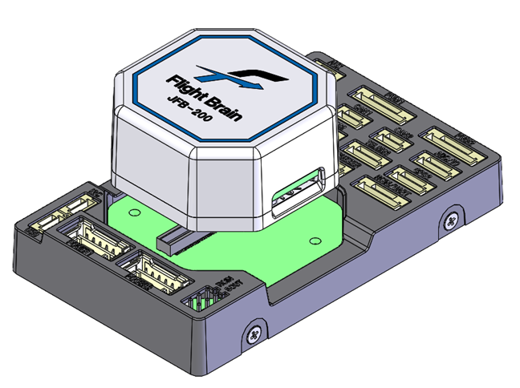
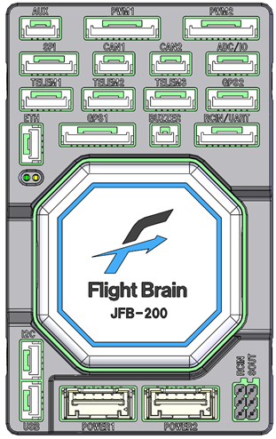

# JFB-200 Flight Controller

JFB-200 flight controller of [JAE](https://www.jae.com/Motion_Sensor_Control/eVTOL/FlightController/)  
The JFB-200 consists of an octa module with a CPU and sensors—and an I/O board.  
Some of the sensors mounted on the octa module are vibration-isolated and feature built-in heaters.  

## Features

- Processor

  - STM32H755 microcontroller

- Sensors

  - Three IMUs: ICM45686, ASM330 and IIM42653 SPI IMU
  - Two BAROs: two BMP390 SPI barometer
  - Two Mags: builtin I2C BMM350 and IST8310 magnetometer

- Interfaces

  - microSD card slot
  - 7 UARTs plus USB (including GPS1, GPS2, RCIN and S.OUT)
  - 16 PWM outputs (16 PWM shares GPIO)
  - Three I2C and two CAN ports
  - Two external Buzzer (Open/Drain and 24V Out)
  - external safety Switch
  - voltage monitoring for servo rail and Vcc
  - Ethernet port

- Power

  - two dedicated power input ports for external power bricks
  - two analog battery voltage and current sensing port

## Pinout

## UART Mapping

- SERIAL0 -> USB    (MAVLink2)
- SERIAL1 -> UART7  (TELEM1, MAVLink2, DMA-enabled)
- SERIAL2 -> UART5  (TELEM2, MAVLink2, DMA-enabled)
- SERIAL3 -> USART3 (TELEM3, MAVLink2, DMA-enabled)
- SERIAL4 -> USART1 (GPS1, DMA-enabled)
- SERIAL5 -> USART2 (GPS2, DMA-enabled)
- SERIAL6 -> UART8  (RCIN, DMA-enabled)
- SERIAL7 -> USART6 (SBUSOUT, DMA-enabled)
- SERIAL8 -> USB    (MAVLink2)

The TELEM1, TELEM2 and TELEM3 ports have RTS/CTS pins, the other UARTs do not have RTS/CTS.

## RC Input

RC input is configured on the port marked RCIN/UART.  
This connector supports all RC unidirectional RC protocols. Two cables are available for this port.  
To use software binding of Spektrum satellite receivers you need to use the Spektrum satellite cable.
To use bi-directional protocols such as CRSF/ELRS, a full UART must be used instead. UART8 is pre-configured for these RC inputs. See [RC systems](https://ardupilot.org/copter/docs/common-rc-systems.html) for more details.

## PWM Output

The JFB-200 supports up to 16 PWM/DShot outputs.

The 16 PWM outputs are in 4 groups:  

- PWM  1,  2,  3 and  4 in group1 (TIM1)
- PWM  5,  6,  7 and  8 in group2 (TIM3)
- PWM  9, 10, 11 and 12 in group3 (TIM4)
- PWM 13, 14, 15 and 16 in group4 (TIM8)

Channels within the same group need to use the same output rate.  
If any channel in a group uses DShot then all channels in the group need to use DShot.  
PWM output voltage can be changed setting BRD_PWM_VOLT_SEL parameter.  

## Battery Monitoring

The board has two dedicated power monitor ports on 8 pin connectors.  
The correct battery setting parameters are dependent on the type of power brick which is connected.  
Recomended input voltage is 4.9 to 5.5 volt.

First battery monitor is enabled by default:

- BATT_MONITOR    4 (Analog Voltage and Current)
- BATT_VOLT_PIN   16
- BATT_CURR_PIN   18
- BATT_VOLT_MULT  1 (must need adjustment depending on the connected power monitor)
- BATT_AMP_PERVLT 1 (must need adjustment depending on the connected power monitor)

The second battery monitor is not enabled by default, but its parameter defaults have been set:

- BATT2_VOLT_PIN   4
- BATT2_CURR_PIN   6
- BATT2_VOLT_MULT  1 (must need adjustment depending on the connected power monitor)
- BATT2_AMP_PERVLT 1 (must need adjustment depending on the connected power monitor)

## Compass

The JFB-200 has two builtin compasses BMM350 and IST8310.  
Due to potential interference the board is usually used with an external I2C compass as part of a GPS/Compass combination.

## GPIOs

PWM 1-8 can be used as GPIO outputs only for relays,etc.  
PMW 9-16 can be used as GPIOs for relays, buttons, RPM etc.  

The numbering of the GPIOs for PIN variables in ArduPilot is:  

- PWM(1)  50
- PWM(2)  51
- PWM(3)  52
- PWM(4)  53
- PWM(5)  54
- PWM(6)  55
- PWM(7)  56
- PWM(8)  57
- PWM(9)  58
- PWM(10) 59
- PWM(11) 60
- PWM(12) 61
- PWM(13) 62
- PWM(14) 63
- PWM(15) 64
- PWM(16) 65
- CAP1 66
- CAP2 67

## Analog inputs

The JFB-200 has 10 analog inputs

- ADC Pin2  -> +3.3V Sense
- ADC Pin4  -> Battery Voltage 2
- ADC Pin6  -> Battery Current Sensor 2
- ADC Pin8  -> ADC IN 1 (6.6V)
- ADC Pin10 -> RSSI voltage monitoring
- ADC Pin13 -> ADC IN 2 (3.3V)
- ADC Pin14 -> SERVORAIL sense
- ADC Pin15 -> 5V sense
- ADC Pin16 -> Battery Voltage
- ADC Pin18 -> Battery Current Sensor

## I2C Buses

The JFB-200 has 4 I2C interfaces.
I2C 3 is for internal only.

- the internal I2C port  is bus 3 in ArduPilot (I2C3 in hardware)
- the port labelled GPS1 is bus 1 in ArduPilot (I2C1 in hardware)
- the port labelled GPS2 is bus 2 in ArduPilot (I2C2 in hardware)
- the port labelled I2C  is bus 4 in ArduPilot (I2C4 in hardware)

## CAN

The JFB-200 has two independent CAN buses with terminating resistors.

## Dedicated Signal input/output

The JFB-200 has the following dedicated discrete signals on the AUX port

- ARMED status signal output
- Hardware WDT Fail signal output
- HW reset signal input

## Connectors

Unless noted otherwise all connectors are JST GH 1.25mm pitch

### AUX port

| Pin | Signal | Volt | Remarks |
| --- | --- | --- | --- |
| 1 | ARMEDn | +3.3V | |
| 2 | WDT_FAILn | +3.3V  | |
| 3 | EXT_RESETn | +3.3V  | |
| 4 | SHEILD | GND | |

### PWM1 ports

| Pin | Signal | Volt | Remarks |
| --- | --- | --- | --- |
| 1 | VCChigh | +5V |
| 2 | PWM(1) | +3.3V or +5V | GPIO 50 (Output only) |
| 3 | PWM(2) | +3.3V or +5V | GPIO 51 (Output only) |
| 4 | PWM(3) | +3.3V or +5V | GPIO 52 (Output only) |
| 5 | PWM(4) | +3.3V or +5V | GPIO 53 (Output only) |
| 6 | PWM(5) | +3.3V or +5V | GPIO 54 (Output only) |
| 7 | PWM(6) | +3.3V or +5V | GPIO 55 (Output only) |
| 8 | PWM(7) | +3.3V or +5V | GPIO 56 (Output only) |
| 9 | PWM(8) | +3.3V or +5V | GPIO 57 (Output only) |
| 10 | GND | |

### PWM2 ports

| Pin | Signal | Volt | Remarks |
| --- | --- | --- | --- |
| 1 | VCChigh | +5V |
| 2 | PWM(9) | +3.3V or +5V | GPIO 58 |
| 3 | PWM(10) | +3.3V or +5V | GPIO 59 |
| 4 | PWM(11) | +3.3V or +5V | GPIO 60 |
| 5 | PWM(12) | +3.3V or +5V | GPIO 61 |
| 6 | PWM(13) | +3.3V or +5V | GPIO 62 |
| 7 | PWM(14) | +3.3V or +5V | GPIO 63 |
| 8 | PWM(15) | +3.3V or +5V | GPIO 64 |
| 9 | PWM(16) | +3.3V or +5V | GPIO 65 |
| 10 | GND | |

### SPI port

| Pin | Signal | Volt | Remarks |
| --- | --- | --- | --- |
| 1 | VCC | +5V |
| 2 | SPI5_SCK | +3.3V |
| 3 | SPI5_MISO | +3.3V |
| 4 | SPI5_MOSI | +3.3V |
| 5 | SPI5_CSn | +3.3V |
| 6 | N.C. | |
| 7 | GND | |

### CAN1, CAN2 ports

| Pin | Signal | Volt | Remarks |
| --- | --- | --- | --- |
| 1 | VCC | +5V |
| 2 | CAN_H | |
| 3 | CAN_L | |
| 4 | GND | |

### ADC/IO port

| Pin | Signal | Volt | Remarks |
| --- | --- | --- | --- |
| 1 | VCC3high | +3.3V |
| 2 | CAP1 | +3.3V | GPIO 66 |
| 3 | CAP2 | +3.3V | GPIO 67 |
| 4 | AIN3 | +3.3V |
| 5 | AIN6 | +6.6V |
| 6 | GND | |

### TELEM1 ports

| Pin | Signal | Volt | Remarks |
| --- | --- | --- | --- |
| 1 | VCC | +5V |
| 2 | UART7_TX (OUT) | +3.3V |
| 3 | UART7_RX (IN) | +3.3V |
| 4 | UART7_CTS | +3.3V |
| 5 | UART7_RTS | +3.3V |
| 6 | GND ||

### TELEM2 ports

| Pin | Signal | Volt | Remarks |
| --- | --- | --- | --- |
| 1 | VCC | +5V |
| 2 | UART5_TX (OUT) | +3.3V |
| 3 | UART5_RX (IN) | +3.3V |
| 4 | UART5_CTS | +3.3V |
| 5 | UART5_RTS | +3.3V |
| 6 | GND ||

### TELEM3 ports

| Pin | Signal | Volt | Remarks |
| --- | --- | --- | --- |
| 1 | VCC | +5V |
| 2 | USART3_TX (OUT) | +3.3V |
| 3 | USART3_RX (IN) | +3.3V |
| 4 | USART3_CTS | +3.3V |
| 5 | USART3_RTS | +3.3V |
| 6 | GND ||

### GPS2 port

| Pin | Signal | Volt | Remarks |
| --- | --- | --- | --- |
| 1 | VCC | +5V |
| 2 | USART2_TX (OUT) | +3.3V |
| 3 | USART2_RX (IN) | +3.3V |
| 4 | I2C2 SCL | +3.3V |
| 5 | I2C2 SDA | +3.3V |
| 6 | GND | |

### ETH port

| Pin | Signal | Volt | Remarks |
| --- | --- | --- | --- |
| 1 | RXN | |
| 2 | RXP | |
| 3 | TXN | |
| 4 | TXP | |

### GPS1 port

| Pin | Signal | Volt | Remarks |
| --- | --- | --- | --- |
| 1 | VCC | +5V |
| 2 | USART1_TX (OUT) | +3.3V |
| 3 | USART1_RX (IN) | +3.3V |
| 4 | I2C1 SCL | +3.3V(pullup) |
| 5 | I2C1 SDA| +3.3V(pullup) |
| 6 | Safety Button | +3.3V |
| 7 | Safety LED | +3.3V |
| 8 | VCC3 | +3.3V |
| 9 | BUZZER | OPEN/DRAIN |
| 10 | GND |  |

### BUZZER port (See Note¹)

| Pin | Signal | Volt | Remarks |
| --- | --- | --- | --- |
| 1 | BUZZER VCC | +24V/GND |
| 2 | GND | |

- **¹**: **[CAUTION]** To prevent malfunction caused by overvoltage, do not connect any buzzer other than 24V.

### RCIN/UART port

| Pin | Signal | Volt | Remarks |
| --- | --- | --- | --- |
| 1 | VCChigh | +5V |
| 2 | USART6_TX (OUT) | +3.3V | SBUSOUT |
| 3 | USART6_RX (IN) | +3.3V | SBUSOUT |
| 4 | RSSI | +3.3V |
| 5 | PPM | +3.3V | Low Reso |
| 6 | USART8_TX (OUT) | +3.3V | RCIN |
| 7 | USART8_RX (IN) | +3.3V | RCIN |
| 8 | GND | |

### I2C port

| Pin | Signal | Volt | Remarks |
| --- | --- | --- | --- |
| 1 | VCC | +5V |
| 2 | I2C4 SCL | +3.3V |
| 3 | I2C4 SDA | +3.3V |
| 4 | GND | |

### USB port

| Pin | Signal | Volt | Remarks |
| --- | --- | --- | --- |
| 1 | VCC | +5V | Power IN |
| 2 | D_Minus |  |
| 3 | D_Plus | |
| 4 | GND | |

### RCIN port

2.54mm pitch pin header

| Pin | Signal | Volt | Remarks |
| --- | --- | --- | --- |
| 1 | RCIN | +3.3V |
| 2 | VCChigh | +5V |
| 3 | GND | |

### SOUT port

2.54mm pitch pin header

| Pin | Signal | Volt | Remarks |
| --- | --- | --- | --- |
| 1 | SOUT | +3.3V |
| 2 | VCChigh | +5V |
| 3 | GND | |

### POWER1, POWER2 ports

Molex picoblade 5024430670

| Pin | Signal | Volt | Remarks |
| --- | --- | --- | --- |
| 1 | VCC IN | +4.9V ～ +5V | Power IN |
| 2 | VCC IN | +4.9V ～ +5V | Power IN |
| 3 | CURRENT | +3.3V |
| 4 | VOLTAGE | +3.3V |
| 5 | GND | |
| 6 | GND | |

## Loading Firmware

Firmware for these boards can be found at the [ArduPilot firmware server](https://firmware.ardupilot.org) in sub-folders labeled "JFB200".  

The board comes pre-installed with an ArduPilot compatible bootloader, allowing the loading of *.apj firmware files with any ArduPilot compatible ground station.  
The JFB-200 can be booted into DFU mode using a dedicated adapter.
