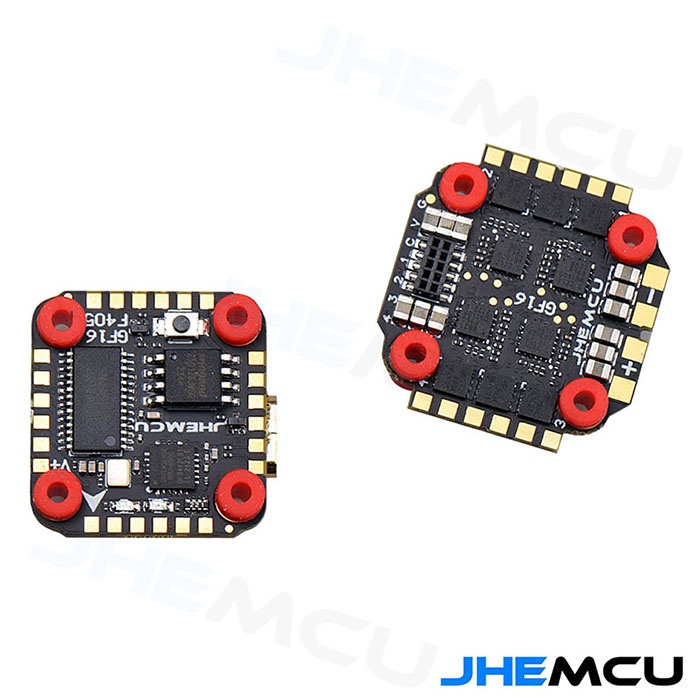
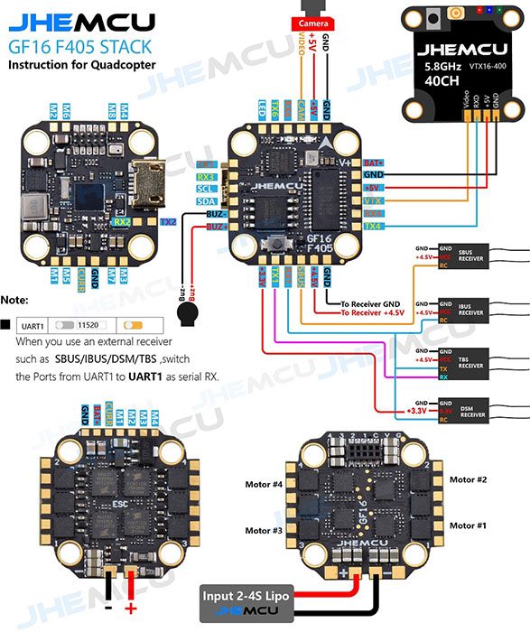

# JHEMCU GF16-405 Flight Controller (Stack)

JHEMCU GF16  2-4S 16*16 F405 Flight Controller 13A 4IN1 ESC Stack

The JHEMCU GF16  is a 2-4S F4 Stack
There are 5 serial ports (UART1, UART2, UART3, UART4, UART6), 8 motor ports, one I2C port, one SBUS interface (the serial port used by SBUS is RX1),
and the WS2812 interface is reserved. Built-in black box 16MB and barometer, buzzer interface, camera interface.

### Specs:
 
**Flight control parameters:**
* CPU: STM32F405
* Gyroscope/Accelerometer: MPU6000
* OSD: AT7456E
* Barometer: BMP280
* Black box: 16MB
* IIC: Support
* BEC: 5V/3A
* Number of motor channels: 8 M1-M8
* UART: UART1 (RC), UART2, UART3, UART4, UART6
* USB: micro usb
* Size: 16*16MM M3
* Receiver: ELRS (CRSF), TBS (CRSF), SBUS, IBUS, DSM2, DSMX
* Support programmable LED such as WS2812
* Support buzzer
* Built-in voltage and current sensors
 
**ESC parameters:**
* 1. Input voltage: 2-4S LiPo/2-4S HV LiPo
* 2. BEC output: none
* 3. Continuous working current of single ESC: 13A*4
* 4. External ESC size: 24*25mm (including the maximum size of pads and protruding points)
* 5. Screw hole pitch 16*16MM, aperture 3MM
* 6. Firmware: BLHELI_S G_H_30_16_7.HEX
* 7. Support Dshot600, Dshot300, Dshot150, Oneshot125, Multishot, PWM control signals
 
Weight: flight control + ESC = 5.8 grams

## Pinout

## UART Mapping
TODO
The UARTs are marked Rn and Tn in the above pinouts. The Rn pin is the
receive pin for UARTn. The Tn pin is the transmit pin for UARTn.
|Name|Pin|Function|
|:-|:-|:-|
|SERIAL0|COMPUTER|USB|
|SERIAL1|RX1/TX1|USART1 (DMA) - Used by the on-board ELRS receiver, but TX1/RX1 pads are also available |
|SERIAL2|TX2/RX2|USART2 |
|SERIAL3|TX3/RX3|USART3 (DMA) - GPS, located near I2C pads|
|SERIAL4|TX4/RX4|UART4|
|SERIAL6|TX6/RX6|USART6 (DMA) - Telemetry|

## RC Input
TODO 
RC input is configured on SERIAL1 (USART1) connected to the ELRS receiver, configured for CRSF with `SERIAL1_PROTOCOL 23`. 
*Note* A different target is available to should you want to run an external receiver on USART2 (RX2/TX2/SBUS). Note that PPM receivers are not supported as there is no timer resource available for this input. 
  
## OSD Support
TODO
The GSF405A supports OSD using OSD_TYPE 1 (MAX7456 driver).

## Motor Output
TODO
The built-in ESC is mapped to motor outputs 1-4. Bidirectional DShot is supported (requires flashing the ESC to a BLHeli_S version that supports bdshot, such as Bluejay [esc-configurator.com]).

## Battery Monitoring
TODO
The board has a built-in voltage and current sensors. 

The correct battery setting parameters are:

 - BATT_MONITOR 4
 - BATT_VOLT_PIN 11
 - BATT_VOLT_SCALE 11
 - BATT_CURR_PIN 13
 - BATT_CURR_SCALE 17

These are set by default in the firmware and shouldn't need to be adjusted

## Compass

The GF16 does not have a builtin compass, but you can attach an external compass to the I2C pins.

## LED
TODO
The board includes a LED_STRIP output, which is assigned a timer and DMA. This is the fifth PWM output.

## Loading Firmware

Initial firmware load can be done with DFU by plugging in USB with the
bootloader button pressed. Then you should load the "with_bl.hex"
firmware, using your favourite DFU loading tool.

Once the initial firmware is loaded you can update the firmware using
any ArduPilot ground station software. Updates should be done with the
*.apj firmware files.
