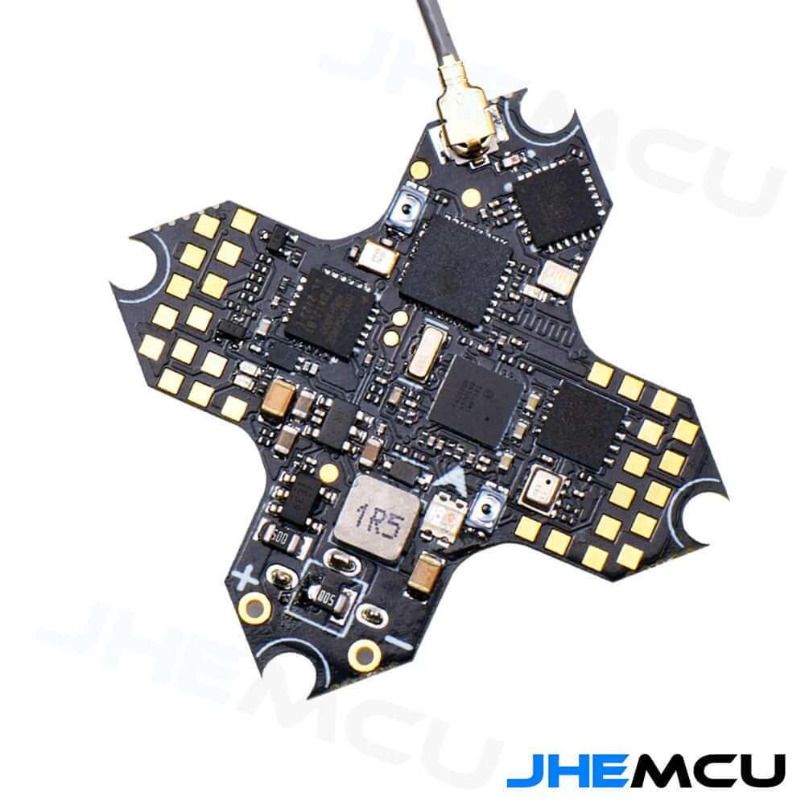
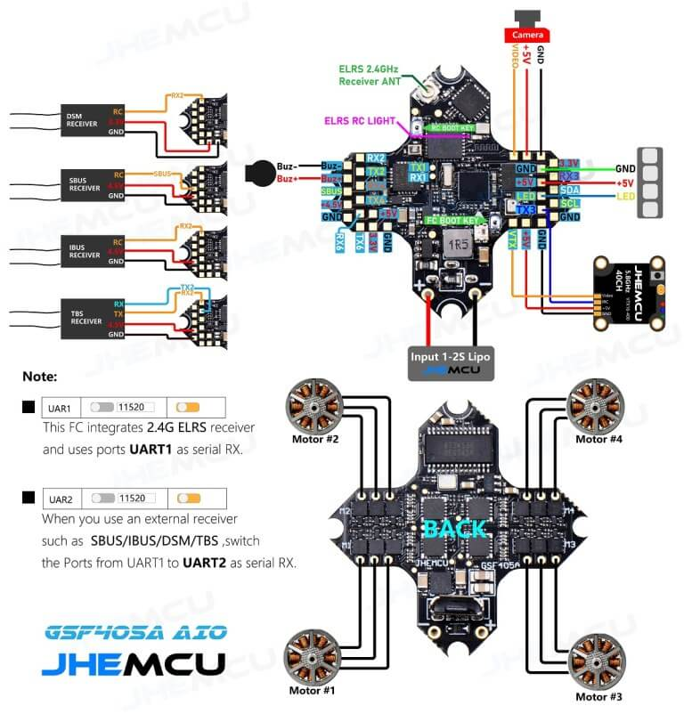

# JHEMCU GSF405A AIO Flight Controller

The JHEMCU GSF405A is a 1-2S Whoop-style (25.5mm x 25.5mm) flight controller featuring the STM32F405OG6 MCU, 4in1 5A ESCs, BMP280 barometer, 8MB flash, and an on-board ExpressLRS 2.4GHz receiver. The board weighs 3.3g, making it suitable for small or lightweight ArduPilot builds.

https://pyrodrone.com/collections/new-products/products/jhemcu-gsf405a-1s-2s-aio-f4-flight-control-w-5a-esc-elrs-2-4g-rx-25-5-25-5mm
https://www.racedayquads.com/collections/new-products/products/jhemcu-gsf405a-1-2s-toothpick-whoop-aio-flight-controller-w-8bit-5a-esc-and-elrs-2-4ghz-rx

### Specs:
**Flight control parameters**
* MCU: STM32F405OG6
* Gyroscope/Accelerometer: MPU6000
* OSD: AT7456E
* Barometer: BMP280
* Black box: 8MB
* I2C: Support
* BEC: 5V
* UART: UART1 (ELRS), UART2 (external RC), UART3, UART4, UART6
* USB: micro usb
* Size: 25.5*25.5MM M2
* Receiver: ELRS (CRSF), TBS (CRSF), SBUS, IBUS, DSM2, DSMX
* Support programmable LED such as WS2812
* Support buzzer
* Built-in voltage and current sensors
* Weight: 3.3 grams

**ESC parameters**
* Support PWM, Oneshot125, Oneshot42, Multishot, Dshot150, Dshot300, Dshot600
* Input voltage: 1S-2S Lipo
* Continuous current: 5A
* Firmware: BLHELI_S S_H_50_REV16_7.HEX
* *Note* Bidirectional DShot requires [flashing](https://esc-configurator.com/) a compatible ESC firmware (eg [Bluejay](https://github.com/mathiasvr/bluejay))). 

## Pinout

## UART Mapping

The UARTs are marked Rn and Tn in the above pinouts. The Rn pin is the
receive pin for UARTn. The Tn pin is the transmit pin for UARTn.
|Name|Pin|Function|
|:-|:-|:-|
|SERIAL0|COMPUTER|USB|
|SERIAL1|RX1/TX1|USART1 (DMA) - Used by the on-board ELRS receiver, but TX1/RX1 pads are also available |
|SERIAL2|TX2/RX2|USART2 |
|SERIAL3|TX3/RX3|USART3 (DMA) - GPS, located near I2C pads|
|SERIAL4|TX4/RX4|UART4|
|SERIAL6|TX6/RX6|USART6 (DMA) - Telemetry|

## RC Input
 
RC input is configured on SERIAL1 (USART1) connected to the ELRS receiver, configured for CRSF with `SERIAL1_PROTOCOL 23`. 
*Note* A different target is available to should you want to run an external receiver on USART2 (RX2/TX2/SBUS). Note that PPM receivers are not supported as there is no timer resource available for this input. 
  
## OSD Support

The GSF405A supports OSD using OSD_TYPE 1 (MAX7456 driver).

## Motor Output

The built-in ESC is mapped to motor outputs 1-4. Bidirectional DShot is supported (requires flashing the ESC to a BLHeli_S version that supports bdshot, such as Bluejay [esc-configurator.com]).

## Battery Monitoring

The board has a built-in voltage and current sensors. 

The correct battery setting parameters are:

 - BATT_MONITOR 4
 - BATT_VOLT_PIN 11
 - BATT_VOLT_SCALE 11
 - BATT_CURR_PIN 13
 - BATT_CURR_SCALE 17

These are set by default in the firmware and shouldn't need to be adjusted

## Compass

The GSF405A does not have a builtin compass, but you can attach an external compass to the I2C pins.

## LED

The board includes a LED_STRIP output, which is assigned a timer and DMA. This is the fifth PWM output.

## Loading Firmware

Initial firmware load can be done with DFU by plugging in USB with the
bootloader button pressed. Then you should load the "with_bl.hex"
firmware, using your favourite DFU loading tool.

Once the initial firmware is loaded you can update the firmware using
any ArduPilot ground station software. Updates should be done with the
*.apj firmware files.
