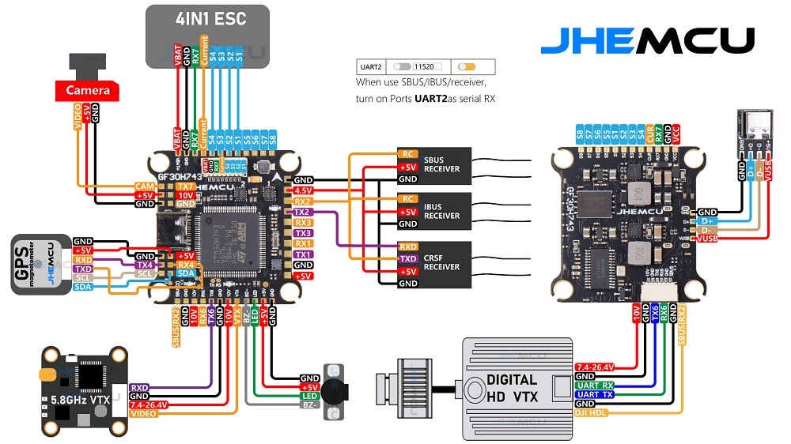

# JHEMCU H743 HD Flight Controller

The JHEMCU H743 HD is a flight controller produced by [JHEMCU](https://jhemcu.com/).

## Features

 - MCU - STM32H743 32-bit processor running at 480 MHz
 - IMU - dual ICM42688P
 - Barometer - DPS310
 - Voltage & current sensor
 - OSD - AT7456E
 - Onboard Flash: 1 Gbits (W25N01G)
 - 7x UARTs (1,2,3,4,5,6,7)
 - 9x PWM Outputs (8 Motor Output, 1 LED)
 - Battery input voltage: 3S-6S
 - BEC 5V/2.5A, 10V/2.0A

## Pinout

## UART Mapping

The UARTs are marked RXn and TXn in the above pinouts. The RXn pin is the
receive pin for UARTn. The TXn pin is the transmit pin for UARTn.

In addition to pinouts, the board also has SH6P 1mm connector for DJI FPV and SH8P 1mm connector for 4 in 1 ESC.

 - SERIAL0 -> USB
 - SERIAL1 -> USART1 (DMA-enabled)
 - SERIAL2 -> USART2 (RX/SBUS, DMA-enabled)
 - SERIAL3 -> USART3 (DMA-enabled)
 - SERIAL4 -> UART4 (GPS, DMA-enabled)
 - SERIAL5 -> UART5 (Pins labeled R5 T5)
 - SERIAL6 -> USART6 (DisplayPort, DMA-enabled)
 - SERIAL7 -> UART7 (ESC Telemetry)
 - SERIAL8 -> UART8 (Unused, not tested, no pinout, need to solder direct on precessor pins to utilize if you need just one more UART)

## RC Input

RC input is configured on the RX2/TX2 (USART2_RX/USART2_TX) pins. It supports ELRS(CSRF), TBS(CSRF), SBUS, IBUS, DSM2, and DSMX.

## OSD Support

JHEMCU H743 supports OSD using OSD_TYPE 1 (MAX7456 driver).

## PWM Output

JHEMCU H743 supports up to 9 PWM outputs. 8 motors and 1 LED strip or another PWM output.

The PWM is in 4 groups:

 - PWM 1 - 4 in group1
 - PWM 5, 6  in group2
 - PWM 7, 8  in group3
 - PWM 9     in group4

Channels within the same group need to use the same output rate. If any channel in a group uses DShot then all channels in the group need to use DShot. Channels 1-8 support bi-directional dshot.

## Battery Monitoring

The board has a built-in voltage and current sensor. The current
sensor's max Amps is not specified. The voltage sensor can handle up to 6S
LiPo batteries.

## Compass

JHEMCU H743 does not have a builtin compass, but you can attach an external compass using I2C on the SDA and SCL pads.

## Loading Firmware

Initial firmware load can be done with DFU by plugging in USB with the
bootloader button pressed. Then you should load the "with_bl.hex"
firmware, using your favourite DFU loading tool.

Once the initial firmware is loaded you can update the firmware using
any ArduPilot ground station software. Updates should be done with the
*.apj firmware files.

