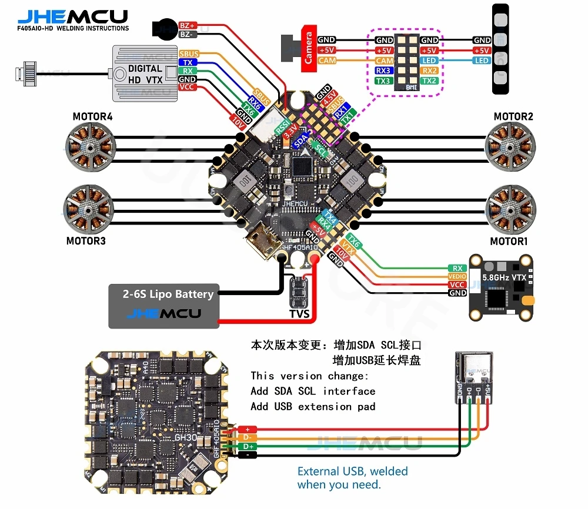

# JHEMCUF405PRO (aka GHF405AIO-HD) Flight Controller

The JHEMCUF405PRO is an AIO flight controller produced by [JHEMCU](https://jhemcu.com/).

There's a different version of the board that doesn't have I2C pads exposed. IT's not that one.

## Features

 - MCU - STM32F405 32-bit processor running at 168 MHz
 - IMU - ICM42605
 - Barometer - DPS310
 - Voltage & current sensor
 - OSD - AT7456E
 - Onboard Flash: 8MB
 - 5x UARTs (1,2,3,4,6)
 - 5x PWM Outputs (4 Motor Output, 1 LED)
 - Battery input voltage: 2S-6S
 - BEC 5V/2.5A, 10V/2.0A
 - I2C: exposed pins
 - ESCs: BlheliS 40A (advertised)
 - LED strip: Supported
 - Buzzer: supported

## Pinout

## UART Mapping

The UARTs are marked RXn and TXn in the above pinouts. The RXn pin is the
receive pin for UARTn. The TXn pin is the transmit pin for UARTn.

In addition to pinouts, the board also has SH6P 1mm connector for digital FPV systems.
Please note that the board will not enter DFU mode if the receiver (eg. CRSF/ELRS is connected to either USART1/USART3/USART4). If you have it soldered there due to DMA requirement you need to temporarily desolder the wire on the FC's RX pad and solder it back after flashing

 - SERIAL0 -> USB
 - SERIAL1 -> USART1 (RCin,DMA-enabled)
 - SERIAL2 -> USART2 (MAVLink2)
 - SERIAL3 -> USART3 (GPS1, DMA-enabled)
 - SERIAL4 -> UART4  (GPS2)
 - SERIAL6 -> USART6 (MSP DisplayPort, DMA-enabled)

These statements are based on the current implementation of the dma_resolver.py script at the time of writing.

## RC Input
RC input is best configured on the RX1/TX1 (USART1_RX/USART1_TX) pins due to having full DMA capability and being mostly easy to access for desoldering to enable DFU mode.
* PPM is not supported.
* FPort requires connection to T1 and :ref:`SERIAL1_OPTIONS<SERIAL1_OPTIONS>` be set to “7”.
* CRSF also requires a T1 connection, in addition to R1, and automatically provides telemetry. Set :ref:`SERIAL1_OPTIONS<SERIAL1_OPTIONS>` to “0”.
* SRXL2 requires a connection to T1 and automatically provides telemetry. Set :ref:`SERIAL1_OPTIONS<SERIAL1_OPTIONS>` to “4”.
Any UART can be used for RC system connections in ArduPilot also, and is compatible with all protocols except PPM. See :ref:`Radio Control Systems <common-rc-systems>` for details.

## OSD Support
JHEMCUF405PRO supports OSD using OSD_TYPE 1 (MAX7456 driver).
* Use of internal MAX7456 for analog OSD/VTX is enabled by default.
* Simultaneous HD VTX OSD support is pre-configured on UART6

## PWM Output
JHEMCUF405PRO supports up to 5 motor/servo outputs. 4 motors and 1 LED strip or another PWM output. Outputs are grouped and each group must use the same protocol. All outputs support PWM and DShot. 
* Output 1-2 Group 1
* Output 3-4 Group 2
* Output 5/LED Group 3

## Battery Monitoring
The default battery configuration is:
* :ref:`BATT_MONITOR<BATT_MONITOR>` = 4
* :ref:`BATT_VOLT_PIN<BATT_VOLT_PIN__AP_BattMonitor_Analog>` = 13
* :ref:`BATT_CURR_PIN<BATT_CURR_PIN__AP_BattMonitor_Analog>` = 12 
* :ref:`BATT_VOLT_MULT<BATT_VOLT_MULT__AP_BattMonitor_Analog>` = 11
* :ref:`BATT_AMP_PERVLT<BATT_AMP_PERVLT__AP_BattMonitor_Analog>` = 95.84

## Compass
JHEMCUF405PRO does not have a builtin compass, but you can attach an external compass using I2C on the SDA and SCL pads.

The SCL/SDA pads are exposed as two tiny circles.

## Loading Firmware
Firmware for this board can be found `here <https://firmware.ardupilot.org>`__  in sub-folders labeled “JHEMCUF405PRO”.

Initial firmware load can be done with DFU by plugging in USB with the
bootloader button pressed. Then you should load the "with_bl.hex"
firmware, using your favourite DFU loading tool.

Once the initial firmware is loaded you can update the firmware using any ArduPilot ground station software. Updates should be done with the \*.apj firmware files.

If you're having trouble entering DFU mode then try desoldering the wire coming from the receiver to the board's Rx pad.