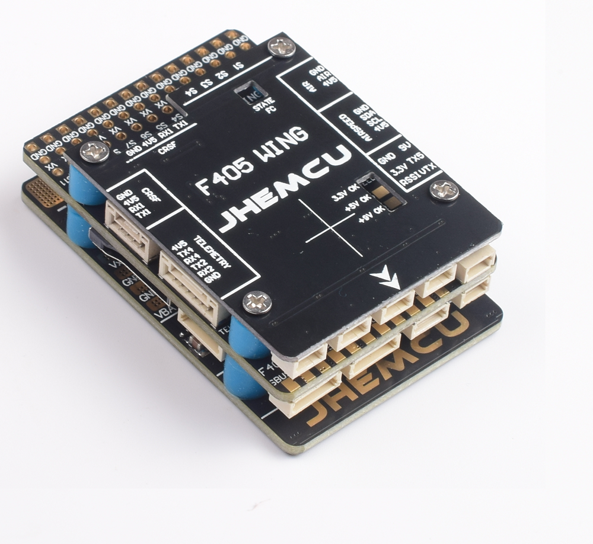
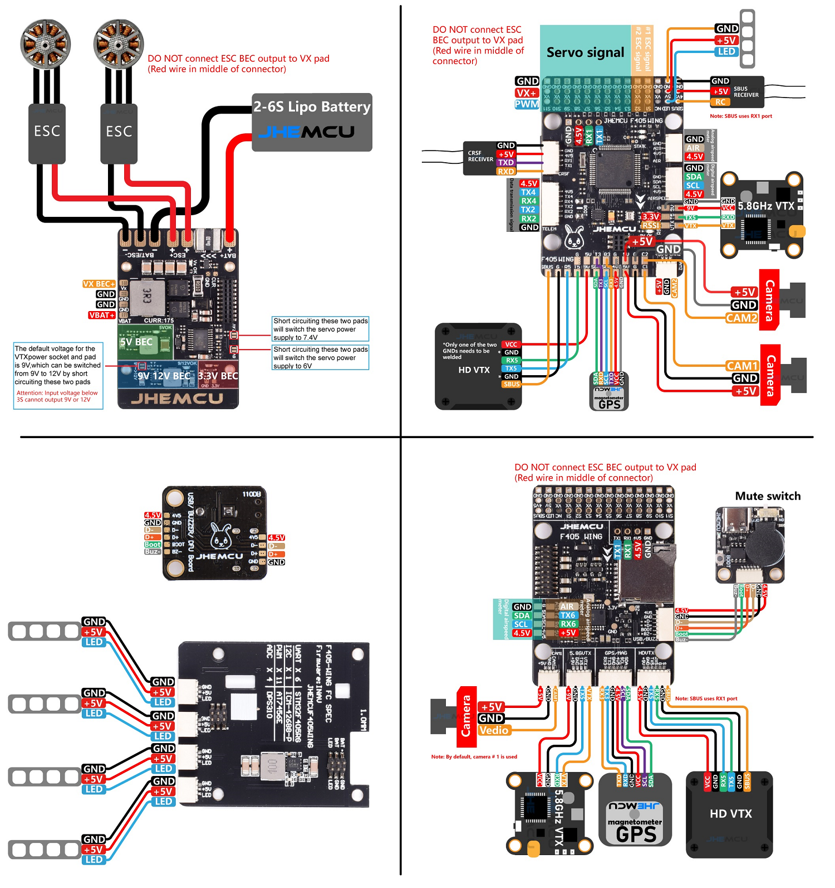

# JHEMCUF405WING Flight Controller

The JHEMCUF405WING is a flight controller produced by [JHEMCU](http://www.JHEMCU.com/).

Specifications
==============

-  **Processor**

   -  STM32F405RGT6 ARM (168MHz)
   -  AT7456E OSD

-  **Sensors**

   -  ICM-42688P IMU (accel, gyro)
   -  SPL-06 barometer
   -  Voltage & 120A current sensor

-  **Power**

   -  2S - 6S Lipo input voltage with voltage monitoring
   -  90A Cont., 215A peak current monitor
   -  9V/12/5V, 1.8A BEC for powering Video Transmitter controlled by GPIO(early bd revs do not have this feature)
   -  4.9V/6V/7.2V, 4.5A BEC for servos
   -  5V, 2.4A BEC for internal and peripherals

-  **Interfaces**

   -  12x PWM outputs DShot capable (Serail LED output is PWM12)
   -  1x RC input
   -  5x UARTs/serial for GPS and other peripherals, 6th UART internally tied to Wireless board)
   -  I2C port for external compass, airspeed, etc.
   -  microSDCard for logging, etc.
   -  USB-C port
 

## Pinout

## Wiring Diagram

## UART Mapping

The UARTs are marked Rn and Tn in the above pinouts. The Rn pin is the
receive pin for UARTn. The Tn pin is the transmit pin for UARTn.

 - SERIAL0 -> USB
 - SERIAL1 -> USART1 (Serial RC input) (DMA capable)
 - SERIAL2 -> USART2 (RX tied to inverted SBUS RC input, but can be used as normal UART if :ref:`BRD_ALT_CONFIG<BRD_ALT_CONFIG>` =1) 
 - SERIAL3 -> UART3 (GPS) (TX DMA capable)
 - SERIAL4 -> UART4 (MAVLink2) (TX DMA capable)
 - SERIAL5 -> UART5 (DisplayPort, available on HD VTX connector) (TX DMA capable)
 - SERIAL6 -> UART6 (tied to internal wireless module , MAVLink2 telem) 

## RC Input

The SBUS pin, is passed by an inverter to RX2 (UART2 RX), which by default is mapped to a timer input instead of the UART, and can be used for all ArduPilot supported receiver protocols, except CRSF/ELRS and SRXL2 which require a true UART connection. However, FPort, when connected in this manner, can provide RC without telemetry. 

To allow CRSF and embedded telemetry available in Fport, CRSF, and SRXL2 receivers, the UART1 should be used. With this option, :ref:`SERIAL11_PROTOCOL<SERIAL1_PROTOCOL>` must be set to "23" (already set by default), and:

- PPM is not supported.

- DSM/SRXL connects to the RX1  pin, but SBUS would still be connected to SBUS.

- FPort requires connection to TX1 and RX1 via a bi-directional inverter. See :ref:`common-FPort-receivers`.

- CRSF also requires a TX1 connection, in addition to RX1 and automatically provides telemetry. ELRS is connected in the same way, but bit 13 of :ref:`RC_OPTIONS<RC_OPTIONS>` should be set.

- SRXL2 requires a connection to TX1 and automatically provides telemetry.  Set :ref:`SERIAL1_OPTIONS<SERIAL1_OPTIONS>` to "4".

.. note:: UART1 is configured by default for serial receivers. You can also have more than one receiver in the system at a time (usually used for long range hand-offs to a remote TX). See :ref:`common-multiple-rx` for details.

Any UART can be used for RC system connections in ArduPilot also, and is compatible with all protocols except PPM (SBUS requires external inversion on other UARTs). See :ref:`common-rc-systems` for details.

## OSD Support

The JHEMCUF405Wing supports using its internal OSD using its MAX7456. Simultaneous external HD VTX OSD support such as DJI or DisplayPort is supported using UART5 and is configured by default. See :ref:`common-msp-osd-overview-4.2` for more info.

## PWM Output

The JHEMCUF405Wing supports up to 12 PWM outputs (PWM12 is the serial LED output, by default). All outputs support DShot.

The PWM is in 5 groups:

 - PWM 1,2 in group1
 - PWM 2,4 in group2
 - PWM 5-7 in group3
 - PWM 8-10 in group4
 - PWM 11,12 in group5  Note: PWM12 is setup for LED use by default, if PWM11 is used, you must re-assign PMW12 to a normal PWM output or nothing

Channels within the same group need to use the same output rate. If
any channel in a group uses DShot then all channels in that group would need
to use DShot.

## Battery Monitoring

The board has a builting voltage and current sensor. The current
sensor can read up to 90A continuosly, 215 Amps peak. The voltage sensor can handle up to 6S
LiPo batteries.

The correct battery setting parameters are set by default and are:

:ref:`BATT_MONITOR<BATT_MONITOR>` = 4

:ref:`BATT_VOLT_PIN<BATT_VOLT_PIN__AP_BattMonitor_Analog>` 10

:ref:`BATT_CURR_PIN<BATT_CURR_PIN__AP_BattMonitor_Analog>` 11

:ref:`BATT_VOLT_MULT<BATT_VOLT_MULT__AP_BattMonitor_Analog>` 11.05

:ref:`BATT_AMP_PERVLT<BATT_AMP_PERVLT__AP_BattMonitor_Analog>` 50

## Compass

The JHEMCUF405Wing does not have a built-in compass, but you can attach an external compass using I2C on the SDA and SCL pads.

## VTX power control

GPIO 81 controls the VTX BEC output to pins marked "9V". Setting this GPIO high removes voltage supply to pins. ``Relay2`` controls this GPIO by default.

## Camera Control

GPIO 82 switches the C1 and C2 camera inputs. ``Relay 3`` controls this GPIO by default.

## Loading Firmware
Firmware for these boards can be found at https://firmware.ardupilot.org in sub-folders labeled “JHEMCUF405Wing”.

Initial firmware load can be done with DFU by plugging in USB with the
boot button pressed. Then you should load the "JHEMCUF405Wing_bl.hex"
firmware, using your favourite DFU loading tool.

Subsequently, you can update firmware with Mission Planner.

