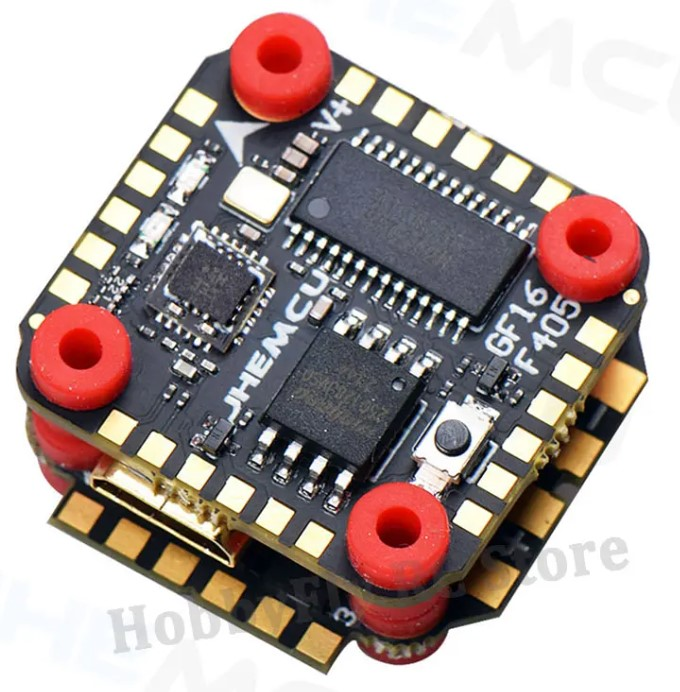
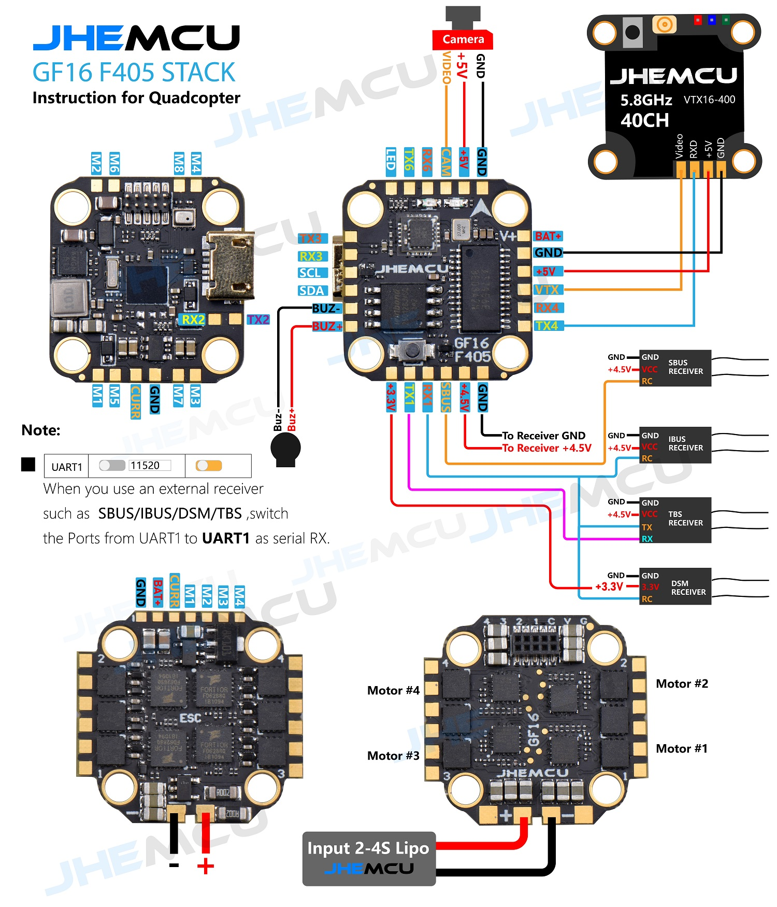
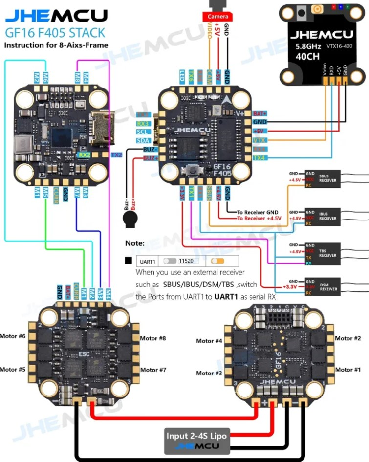

# JHEMCU GF16-BMI stack F405 (JHEM_JHEF405) Flight Controller with 13A ESC

JHEMCU GF16-BMI stack F405 Flight control 13A ESC
produced by  [JHEMCU](https://www.jhemcu.com/)
 
There are 5 serial ports (UART1, UART2, UART3, UART4, UART6), 8 motor ports, 1 I2C port, and 1 SBUS interface (the serial port used by SBUS is RX1), with WS2812 interface reserved. Built in black box 16MB and barometer, with buzzer interface and camera interface.

### Specs:
**Flight control parameters:**
* MCU: STM32F405
* Gyroscope/Accelerometer: BMI270
* OSD: AT7456E
* Barometer: BMP280
* Black box: 16MB
* I2C: Support
* BEC: 5V/3A
* UART: UART1 (RC), UART2, UART3, UART4, UART6
* USB: micro USB
* Size: 16 * 16MM M3
* Receiver: ELRS (CRSF), TBS (CRSF), SBUS, IBUS, DSM2, DSMX
* Support programmable LED such as WS2812
* Support buzzer
* Built-in voltage and current sensors

**Electrical adjustment parameters:**
 
* Input voltage: 2-4S LiPo/2-4S HV LiPo
* BEC output: None
* Continuous working current of single electric regulator: 13A * 4
* External electrical adjustment size: 24 * 25mm (including the maximum size of solder pads and protruding points)
* Screw hole pitch 16 * 16MM, hole diameter 3MM
* Firmware: BLHELI_ S G_ H_ 30_ 16_ 7. HEX
* Supports Dshot600, Dshot300, Dshot150, Oneshot125, Multispot, PWM control signals
 
Weight: flight control+electric adjustment=5.8g

## Pinout

## UART Mapping

The UARTs are marked Rn and Tn in the above pinouts. The Rn pin is the
receive pin for UARTn. The Tn pin is the transmit pin for UARTn.
|Name|Pin|Function|
|:-|:-|:-|
|SERIAL0|COMPUTER|USB|
|SERIAL1|RX1/TX1|USART1 (DMA) - RC Input/Output |
|SERIAL2|TX2/RX2|USART2 (DMA RX only) - MAVLink2 |
|SERIAL3|TX3/RX3|USART3 (DMA TX only) - GPS1 |
|SERIAL4|TX4/RX4|UART4 (DMA TX only) - VTX |
|SERIAL6|TX6/RX6|USART6 -  User |

## RC Input
 
SBUS input must be on SBUS pin, all others can use RX1, CRSF/ELRS/SRXL2 must also use TX pin
  
## OSD Support

The GSF405A supports OSD using OSD_TYPE 1 (MAX7456 driver).

## PWM Output

The JHEM_JHEF405 supports up to 9 PWM outputs (PWM9 is the serial LED output, by default). All outputs support DShot.

The PWM is in 5 groups:

* PWM 1,2,5 in group1
* PWM 3,4 in group2
* PWM 6 in group3
* PWM 7,8 in group4
* PWM 9 in group5

Channels within the same group need to use the same output rate. If any channel in a group uses DShot then all channels in that group would need to use DShot.

## Battery Monitoring

The board has a built-in voltage and current sensors. 

The correct battery setting parameters are:

 - BATT_MONITOR 4
 - BATT_VOLT_PIN 13
 - BATT_VOLT_SCALE 11.0
 - BATT_CURR_PIN 12
 - BATT_CURR_SCALE 58.8

These are set by default in the firmware and shouldn't need to be adjusted

## Compass

The JHEM_JHEF405 does not have a builtin compass, but you can attach an external compass to the I2C pins.

## LED

The board includes a LED_STRIP output, which is assigned a timer and DMA. This is the PWM 9 output.

## Loading Firmware

Initial firmware load can be done with DFU by plugging in USB with the
bootloader button pressed. Then you should load the "with_bl.hex"
firmware, using your favourite DFU loading tool.

Once the initial firmware is loaded you can update the firmware using
any ArduPilot ground station software. Updates should be done with the
*.apj firmware files.
