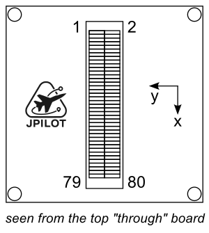

# JPilot-C

Autopilot board for small UAV.

Developed and distributed by [Flyfocus](https://flyfocus.pl/avionics/)

## Features

- Based on STM32H7 system-on-chip
- Micro SD Card for Logging/LUA Scripting.
- Onboard sensors: 2x IMU, 2x barometer
- Interfaces: USB, GPIO, SPI, I2C, USART, PWM, CAN, analog
- Dimensions: 32x32x8mm
- Mass: 5g
- Power: <1W
- Overcurrent and ESD protection

## Pinout

JPilot-C is a family of firmware-compatible modules, the mezzanine connector uses the following pins:

| Pin Number | Pin Name | Pin Function |
| --- | --- | --- |
| 1 | PA13 | SWDIO |
| 2 | *not conn.* | *reserved* |
| 3 | PA14 | SWCLK |
| 4 | PB11 | I2C 2 SDA |
| 5 | PB7 | EXTERN CS |
| 6 | PB10 | I2C 2 SCL |
| 7 | NRST | RESET |
| 8 | *not conn.* | *reserved* |
| 9 |  | SERVO PWR RAIL |
| 10 | *not conn.* | *reserved* |
| 11 | PB4 | EXTERN DRDY |
| 12 | PE0 | SERIAL 5 RX |
| 13 |  | GND |
| 14 | PE1 | SERIAL 5 TX |
| 15 |  | GND |
| 16 | PD9 | SERIAL 4 RX |
| 17 | *not conn.* | *reserved* |
| 18 | PD8 | SERIAL 4 TX |
| 19 | *not conn.* | *reserved* |
| 20 | PD6 | SERIAL 3 RX |
| 21 | PC4 | 5V ANALOG IN (pressure sens) |
| 22 | PD5 | SERIAL 3 TX |
| 23 | PA4 | AUX BATT VOLTAGE SENS |
| 24 | PA15 | ALARM |
| 25 | PA7 | AUX BATT CURRENT SENS |
| 26 | *not conn.* | *reserved* |
| 27 | *not conn.* | *reserved* |
| 28 | *not conn.* | *reserved* |
| 29 | *not conn.* | *reserved* |
| 30 | *not conn.* | *reserved* |
| 31 | PA12 | USB DP1 |
| 32 | *not conn.* | *reserved* |
| 33 | PA11 | USB DM1 |
| 34 | PA10 | SERIAL 2 RX |
| 35 | *not conn.* | *reserved* |
| 36 | PA9 | SERIAL 2 TX |
| 37 | *not conn.* | *reserved* |
| 38 | PE7 | SERIAL 1 RX |
| 39 | PB6/PB5/PD4 | CAN L 2 |
| 40 | PE8 | SERIAL 2 TX |
| 41 | PB6/PB5/PD4 | CAN H 2 |
| 42 | *not conn.* | *reserved* |
| 43 | *not conn.* | *reserved* |
| 44 | *not conn.* | *reserved* |
| 45 | *not conn.* | *reserved* |
| 46 | PD1 | SERIAL 6 TX |
| 47 | PC0 | BATT VOLTAGE SENS |
| 48 | PD0 | SERIAL 6 RX|
| 49 | PC1 | BATT CURRENT SENS |
| 50 | PD14 | PWM9 |
| 51 | PE14 | SPI EXT MOSI |
| 52 | PD15 | PWM10 |
| 53 |  | SERVO PWR RAIL |
| 54 | PE5 | PWM11 |
| 55 | *not conn.* | *reserved* |
| 56 | PE6 | PWM12 |
| 57 | *not conn.* | *reserved* |
| 58 | PA8 | PWM13 |
| 59 | *not conn.* | *reserved* |
| 60 | PE11 | PWM14 |
| 61 |  | 5V IN |
| 62 | *not conn.* | *reserved* |
| 63 |  | 5V IN |
| 64 | *not conn.* | *reserved* |
| 65 | *not conn.* | *reserved* |
| 66 | PD13 | PWM8 |
| 67 | PE13 | SPI EXT MISO |
| 68 | PD12 | PWM7 |
| 69 | *not conn.* | *reserved* |
| 70 | PA3 | PWM6 |
| 71 | *not conn.* | *reserved* |
| 72 | PA2 | PWM5 |
| 73 | PE12 | SPI EXT SCK |
| 74 | PA1 | PWM4 |
| 75 | *not conn.* | *reserved* |
| 76 | PA0 | PWM3 |
| 77 | PB9/PB8/PD3 | CAN L 1 |
| 78 | PB1 | PWM2 |
| 79 | PB9/PB8/PD3  | CAN H 1 |
| 80 | PB0 | PWM1 |

## UART Mapping

UART Port Mapping:
Port      UART      Protocol        TX DMA  RX DMA
--------- --------- --------------- ------- -------
0         USB       MAVLink2        ✘       ✘
1         UART7     MAVLink2        ✔       ✔
2         USART1    MAVLink2        ✔       ✔
3         USART2    GPS             ✔       ✔
4         USART3    GPS             ✔       ✔
5         UART8     None            ✔       ✔
6         UART4     None            ✔       ✔

## CAN Ports

There are 2 CAN buses available, each with a 120 Ohm termination resistor built-in.

## PWM Output

JPilot-C supports up to 14 PWM outputs with D-Shot.

The PWM outputs are in 5 groups:

- PWM 1 & 2 in group 1
- PWM 3 - 6 in group 2
- PWM 7 - 10 in group 3
- PWM 11 & 12 in group 4
- PWM 13 & 14 in group 5

Channels within the same group need to use the same output rate. If any channel in a group uses D-Shot then all channels in the group need to use D-Shot.

## RC Input

Any of the serial ports can be used for a bidirectional RC connection. Change its ``SERIALx_PROTOCOL`` to "23" and follow the instructions in :ref:`common-rc-systems` to other setup info for the RC system being used.

## Battery Monitor

The board has internal voltage sensors and connection for external current sensors, able to monitor two batteries.
The default battery parameters are:

- BATT_MONITOR 4
- BATT_VOLT_PIN 10
- BATT_CURR_PIN 11
- BATT_VOLT_MULT 11
- BATT_AMP_PERVLT 40
- BATT2_VOLT_PIN 18
- BATT2_CURR_PIN 7
- BATT2_VOLT_MULT 11
- BATT2_AMP_PERVLT 40

## Analog pins

These analog pins are used in addition to battery monitoring:

- Servo rail voltage (up to 10V, ADC1 CH8)
- VDD 5V supply voltage (up to 6V, ADC1 CH19)
- Analog airspeed (up to 6V, pin "4"), note that an I2C module is recommended instead

## Compass

JPilot-C does not have a builtin compass, but you can attach an external compass using the I2C port.

## Firmware

Firmware for JPilot-C can be found [here](https://firmware.ardupilot.org) in sub-folders labeled "JPilot-C".

The board comes pre-installed with an ArduPilot compatible bootloader, allowing the loading of xxxxxx.apj firmware files with any ArduPilot compatible ground station.
