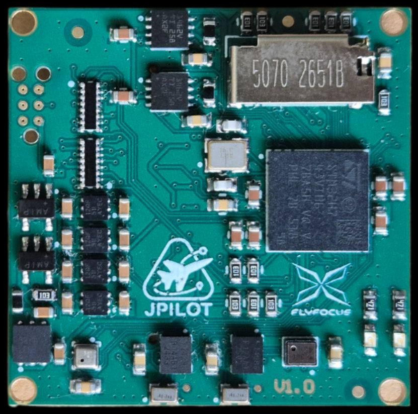

# JPilot-C

Autopilot board for small UAV.

Developed and distributed by [Flyfocus](https://flyfocus.pl/avionics/)

## Features

- dimensions: 32x32x8mm
- mass: 5g
- power: <1W
- interfaces: USB, GPIO, SPI, I2C, USART, PWM, CAN, analog
- onboard sensors: 2x IMU, 2x barometer
- overcurrent and ESD protection

## Pinout

JPilot-C is a family of firmware-compatible modules, pinout for peripheral hardware depends on the specific adapter board used.

## UART Mapping

|Serial#|Port      |
|-------|----------|
|Serial0|USB (OTG1)|
|Serial1|UART7     |
|Serial2|USART1    |
|Serial3|USART2    |
|Serial4|USART3    |
|Serial5|UART8     |
|Serial6|UART4     |

## CAN Ports

There are 2 CAN buses available, each with a 120 Ohm termination resistor built-in.

## PWM Output

JPilot-C supports up to 14 PWM outputs with D-Shot.

The PWM outputs are in 5 groups:

- PWM 1 & 2 in group 1
- PWM 3 - 6 in group 2
- PWM 7 - 10 in group 3
- PWM 11 & 12 in group 4
- PWM 13 & 14 in group 5

Channels within the same group need to use the same output rate. If any channel in a group uses D-Shot then all channels in the group need to use D-Shot.

## RC Input

Any of the serial ports can be used for a bidirectional RC connection.

## Battery Monitor

The board has internal voltage sensors and connection for external current sensors, able to monitor two batteries.
The default battery parameters are:

- BATT_MONITOR 4
- BATT_VOLT_PIN 10
- BATT_CURR_PIN 11
- BATT_VOLT_MULT 11
- BATT_AMP_PERVLT 40
- BATT2_VOLT_PIN 18
- BATT2_CURR_PIN 7
- BATT2_VOLT_MULT 11
- BATT2_AMP_PERVLT 40

## Analog pins

These analog pins are used in addition to battery monitoring:

- Servo rail voltage (up to 10V, pin PC5)
- VDD 5V supply voltage (up to 6V, pin PA5)
- Analog airspeed (up to 6V, pin PC4), note that an I2C module is recommended instead

## Compass

JPilot-C does not have a builtin compass, but you can attach an external compass using the I2C port.

## Firmware

Firmware for JPilot-C can be found [here](https://firmware.ardupilot.org) in sub-folders labeled "JPilot-C".
