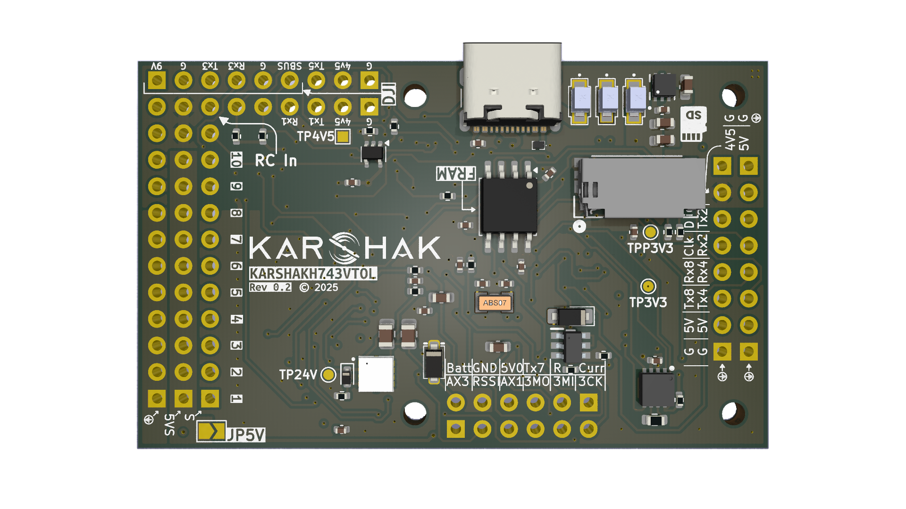

# KARSHAKH743VTOL Flight Controller

The KARSHAKH743VTOL is a hardware product produced by [Karshak](https://www.karshakdrones.com/).

## Features

- Processor
  - STM32H743 microcontroller, 480MHz, 2MB Flash
- Sensors
  - Single BMI088 IMU (+1 External IMU; Optional Addon)(SPI1 & SPI4)
  - SPL06 barometer (I2C1)
- Power
  - 5V 5A BEC; 9V, 12V(selectable) 5A cont. BEC; 5V, 6.3V, 7V(selectable) 5A BEC delivered through PDB
  - FC BEC 5V 5A cont.(for FC and peripherals), BEC 3.3V 1A(for FC)
- Interfaces
  - 10x PWM outputs DShot capable (direct use)
  - 1x RC input
  - 7x UARTs/Serial for GPS and other peripherals plus USB
  - 1x CAN
  - 2x I2C
  - 3x SPI (SPI3 on pin headers, SPI4 on EXT. IMU connector)
  - 3x ADC(Vbat, Current and RSSI)
  - microSD card slot for logging, etc.
  - USB-TypeC port
  - "DJI"-pin header with SBUS
  - Built-in RGB LED
  - External/built-in Buzzer.
- Dimensions
  - 60 x 37mm

## Pinout

## UART Mapping

- SERIAL0 -> USB (MAVLink2)
- SERIAL1 -> UART1 (GPS, DMA-enabled)
- SERIAL2 -> UART2 (MAVLink2, DMA-enabled)
- SERIAL3 -> UART3 (DisplayPort, DMA-enabled)
- SERIAL4 -> UART4 (MAVLink2, DMA-enabled)
- SERIAL5 -> UART5 (RC Input, Rx5 is the SBUS used in the VTX connector, DMA-enabled)
- SERIAL7 -> UART7 (ESC Telemetry, DMA-enabled)
- SERIAL8 -> UART8 (MAVLink2, DMA-enabled)

## RC Input

RC input is configured via the USART5 RX(Rx5 is hardware inverted) input by default, located at one end of the servo rail pin header named `RCIn`. All ArduPilot-supported serial RC protocols can be connected directly to this pin, excluding PPM.
SBUS in `DJI` named VTX-HD pin header is hardware inverted Rx5, so avoid using any signal on UART5 under normal RCIN operation.

- For FPort the receiver must be tied to the USART5 TX5 pin , [RSSI_TYPE](https://ardupilot.org/copter/docs/parameters.html#rssi-type-rssi-type) set to 3, [SERIAL5_OPTIONS](https://ardupilot.org/copter/docs/parameters.html#serial5-options-serial5-options) = "7" (invert TX/RX, half duplex).
- For full duplex CRSF/ELRS use both TX5 and RX5, and [RSSI_TYPE](https://ardupilot.org/copter/docs/parameters.html#rssi-type-rssi-type) set to 3 and provides telemetry.

If the PPM protocol needs to be used, then contact [Karshak](https://www.karshakdrones.com/) with contact message as `Need Help with PPM`.

## VTX Support

The generic 2.54 mm pin header located at the top-right corner provides connectivity for a DJI Air Unit or HD VTX. The default communication protocol is DisplayPort. Note that pin 1 (_the rightmost through-hole pad_) supplies 9 V. Exercise caution to avoid connecting peripherals that require only 5 V or 3.3 V. SBUS in `DJI` named VTX-HD pin header is hardware inverted Rx5.

## PWM Output

The KARSHAKH743VTOL supports up to 10 PWM outputs. All channels support bi-directional DShot.

10 PWM outputs are grouped into 3 groups:

- PWM 1, 2, 3, 4 are in Group 1 (TIM1);
- PWM 5 and 6 are in Group 2 (TIM2);
- PWM 7, 8, 9, 10 are in Group 3 (TIM3);

Channels in the same group must use the same output protocol and/or output rate. If any channel in a group uses DShot, all channels in the group need to use DShot.

## Battery Monitoring

The board has an internal voltage sensor (VBAT pin) and connections (CURR pin) for an external current sensor input.
The voltage sensor can handle up to 6S LiPo batteries.

The default battery parameters are:

- `BATT_MONITOR 4`
- `BATT_VOLT_PIN 4`
- `BATT_CURR_PIN 8`
- `BATT_VOLT_MULT 10.2`
- `BATT_AMP_PERVLT 20.4`

## Compass

The KARSHAKH743VTOL does not have a built-in compass, but you can attach an external compass via the I2C connector using the SDA and SCL pins.

## RSSI

Analog RSSI can be input on the RSSI pin. Set `RSSI_TYPE = 1`, `RSSI_ANA_PIN = 11`.

## GPIOs

The 2 pins labelled AX1 and AX3 are GPIO outputs.

The numbering of the GPIOs for PIN variables in ArduPilot is:

- `AX1 - 81`
- `AX3 - 83`

## CAN

The KARSHAKH743VTOL has ONE independent CAN bus, with the following pinouts.

### CAN1

   | Pin | Signal | Volt |
| --- | --- | --- |
| 1 (red) | VCC | +5V |
| 2 (blk) | CAN_H | +12V |
| 3 (blk) | CAN_L | +12V |
| 4 (blk) | GND | GND |

## Physical

- Mounting: `30.5 x 30.5mm`, `Φ2mm`
- Dimensions: `60 x 37mm`
- Weight: 16.5g (with onboard buzzer, external IMU connector and USB Type-C port)

## Loading Firmware

Firmware for these boards can be found at the [ArduPilot firmware server](https://firmware.ardupilot.org) in sub-folders labelled `"KARSHAKH743VTOL"`.

The board comes pre-installed with an ArduPilot-compatible bootloader, enabling the loading of `*.apj` firmware files through any ArduPilot-compatible ground station.
