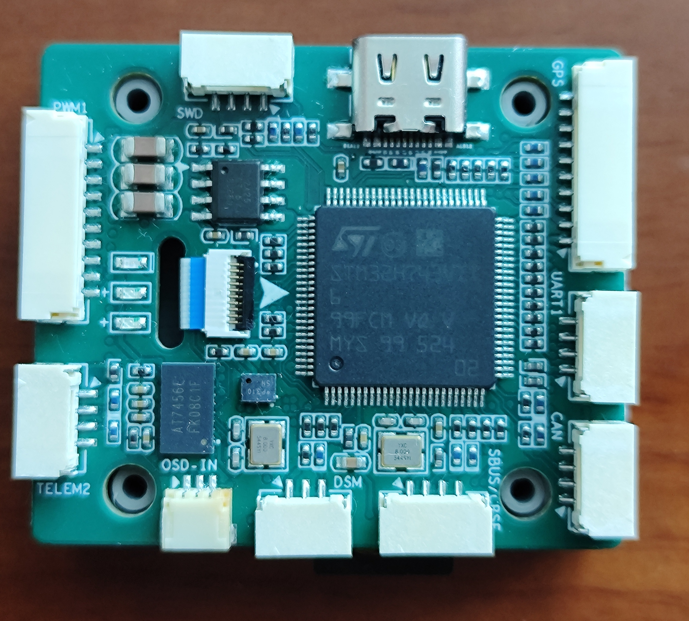
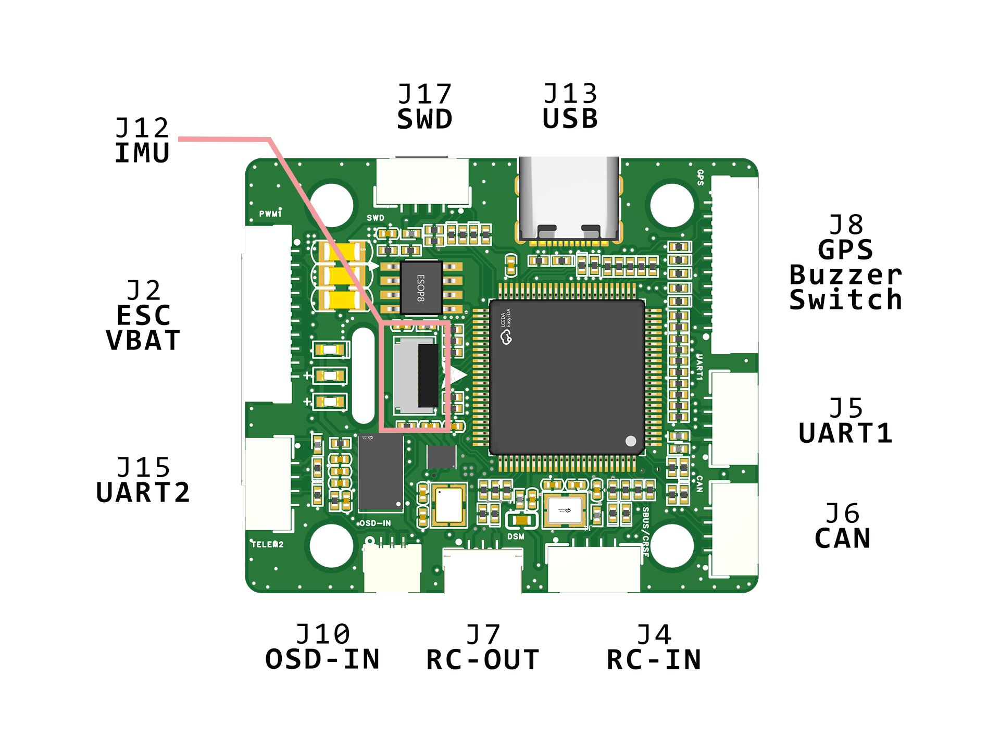
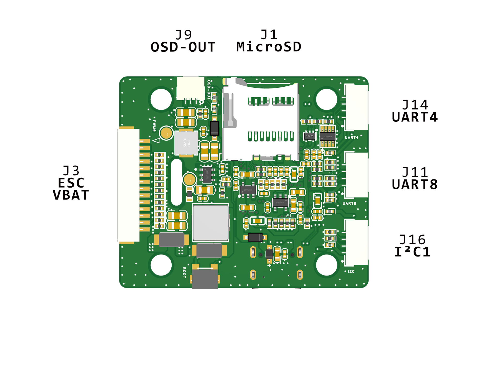

# KT-FMU-F1

The KT-FMU-F1 is a flight controller manufactured by [Coolfly](https://www.cecooleye.cn/).

## Features

- MCU: STM32H743VI with Cortex-M7 CPU
- IMU: BMI088 + BMI270
- Mag: IST8310
- Barometer: DPS310
- OSD: AT7456E
- Interfaces:
  - 7x UARTs (4 for Telem, 1 for RC, 1 for ESC, 1 for GPS)
  - 10x PWM Outputs
  - Battery input voltage: 2S - 8S
  - 2x IIC
  - 1x CAN
  - 1x USB

## UART Mapping and Default Protocols

| Serial | Port  | Protocol    | Notes       |
| ------ | ----- | ----------- | ----------- |
| 0      | USB   | MAVLink2    |             |
| 1      | UART1 | MAVLink2    | DMA-enabled |
| 2      | UART2 | DisplayPort | DMA-enabled |
| 3      | UART3 | GPS         | DMA-enabled |
| 4      | UART4 | MAVLink2    | DMA-enabled |
| 6      | UART6 | RCIN        | DMA-enabled |
| 7      | UART7 | ESC Telem   | RX only     |
| 8      | UART8 | None        |             |

## Pinout

There are a lot of interfaces on the board:

Connectors on the top layer:

Connectors on the bottom layer:

Pin definition:  

### ESC/VBAT - J2

| Pin Number | Function        |
| ---------- | --------------- |
| 1          | Current Sensing |
| 2          | UART7_TX        |
| 3          | PWM6            |
| 4          | PWM5            |
| 5          | PWM4            |
| 6          | PWM3            |
| 7          | PWM2            |
| 8          | PWM1            |
| 9          | VBAT_IN         |
| 10         | GND             |

### ESC/VBAT - J3

| Pin Number | Function        |
| ---------- | --------------- |
| 1          | GND             |
| 2          | VBAT_IN         |
| 3          | PWM1            |
| 4          | PWM2            |
| 5          | PWM3            |
| 6          | PWM4            |
| 7          | PWM5            |
| 8          | PWM6            |
| 9          | PWM7            |
| 10         | PWM8            |
| 11         | PWM9            |
| 12         | PWM10           |
| 13         | UART7_TX        |
| 14         | Current Sensing |

> [!WARNING]
> Only use one of J2 and J3 at a time!

### UART - J5, J11, J14, J15

| Pin Number | Function |
| ---------- | -------- |
| 1          | 5V Out   |
| 2          | TX       |
| 3          | RX       |
| 4          | GND      |

### I2C - J16

| Pin Number | Function |
| ---------- | -------- |
| 1          | 5V Out   |
| 2          | I2C1_SDA |
| 3          | I2C1_SCL |
| 4          | GND      |

### SWD - J17

| Pin Number | Function |
| ---------- | -------- |
| 1          | 3V3      |
| 2          | SWCLK    |
| 3          | SWDIO    |
| 4          | GND      |

### CAN - J6

| Pin Number | Function |
| ---------- | -------- |
| 1          | 5V Out   |
| 2          | CAN_H    |
| 3          | CAN_L    |
| 4          | GND      |

### OSD Out - J9

| Pin Number | Function  |
| ---------- | --------- |
| 1          | GND       |
| 2          | Video Out |
| 3          | 9V Out    |

### OSD In - J10

| Pin Number | Function |
| ---------- | -------- |
| 1          | GND      |
| 2          | Video In |
| 3          | 9V Out   |

### IMU Submodule - J12

| Pin Number | Function   |
| ---------- | ---------- |
| 1          | 5V Out     |
| 2          | CS_BMI270  |
| 3          | SPI2_MISO  |
| 4          | SPI2_MOSI  |
| 5          | SPI2_SCK   |
| 6          | I2C1_SCL   |
| 7          | I2C1_SDA   |
| 8          | CS_BMI088G |
| 9          | CS_BMI088A |
| 10         | GND        |

### RCIN - J4

| Pin Number | Function |
| ---------- | -------- |
| 1          | 5V Out   |
| 2          | UART6_TX |
| 3          | UART6_RX |
| 4          | GND      |

### RCOUT - J7

| Pin Number | Function |
| ---------- | -------- |
| 1          | 3V3      |
| 2          | GND      |
| 3          | RCOUT    |

### GPS, Safety Switch, Buzzer - J8

| Pin Number | Function      |
| ---------- | ------------- |
| 1          | 5V Out        |
| 2          | UART3_TX      |
| 3          | UART3_RX      |
| 4          | I2C1_SCL      |
| 5          | I2C1_SDA      |
| 6          | Safety SW     |
| 7          | Safety SW LED |
| 8          | 3V3           |
| 9          | Buzzer        |
| 10         | GND           |

## PWM Output

KT-FMU-F1 supports up to 10 PWM outputs.
The PWM channels are divided into 3 groups:

| PWM Channel | Group |
| ----------- | ----- |
| 1 - 4       | TIM1  |
| 5 - 6       | TIM3  |
| 7 - 10      | TIM4  |

## RC Input

RC input is configured on the SERIAL6 by default. It supports all serial RC
protocols. For protocols requiring half-duplex serial to transmit
telemetry (such as FPort) you should set SERIAL6_OPTIONS to 4 (HalfDuplex).  

Additionally, there's also a connector `RCOUT` outputing the RC signal from `RCIN`,
allowing another module to receive it.

## OSD Support

Onboard OSD (using MAX7456 driver) is supported by default.
DisplayPort OSD is also simultaneously available on any of the UART connectors (default is UART2).

## Compass

The KT-FMU-F1 has a built-in compass on the IMU submodule. Due to potential interference,  this compass is disabled, and the autopilot is usually used with an external I2C compass as part of a GPS/Compass combination.  

## Battery Monitoring

The KT-FMU-F1 has a internal voltage sensor and connections on the
`ESC` connector for an external current sensor input.
The voltage sensor can handle up to 8S LiPo batteries.

The default battery parameters are:

- BATT_MONITOR: 4 (Analog voltage and current)
- BATT_VOLT_PIN 10
- BATT_CURR_PIN 11
- BATT_VOLT_MULT 21
- BATT_AMP_PERVLT 40.2

## Loading Firmware

Firmware for these boards can be found at the ArduPilot firmware server
in sub-folders labeled `KT-FMU-F1`.

To flah the initial firmware with DFU:

0. Hold the boot button
1. Plug in the USB cable then release the boot button
2. Load the `ardu*_with_bl.hex` firmware with any DFU loading tool.
e.g. `STM32CubeProgrammer` and `dfu-util`.

Subsequently, you can update the `.apj` firmware with Mission Planner and QGC.
