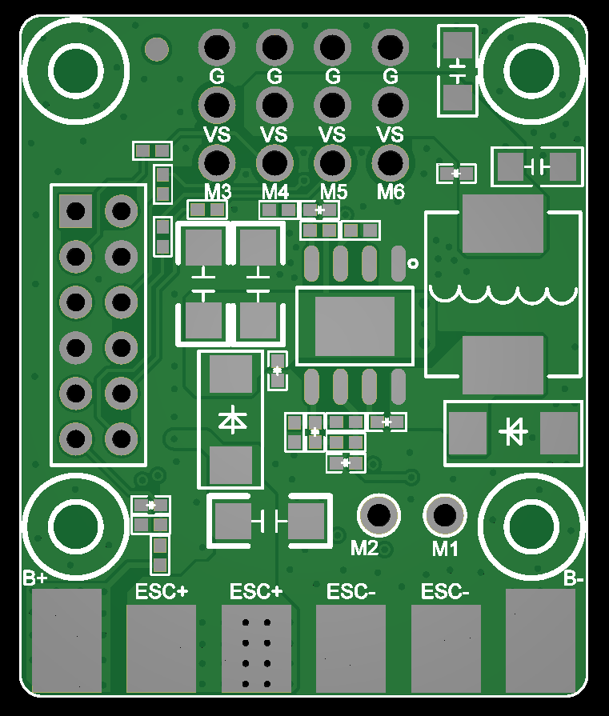
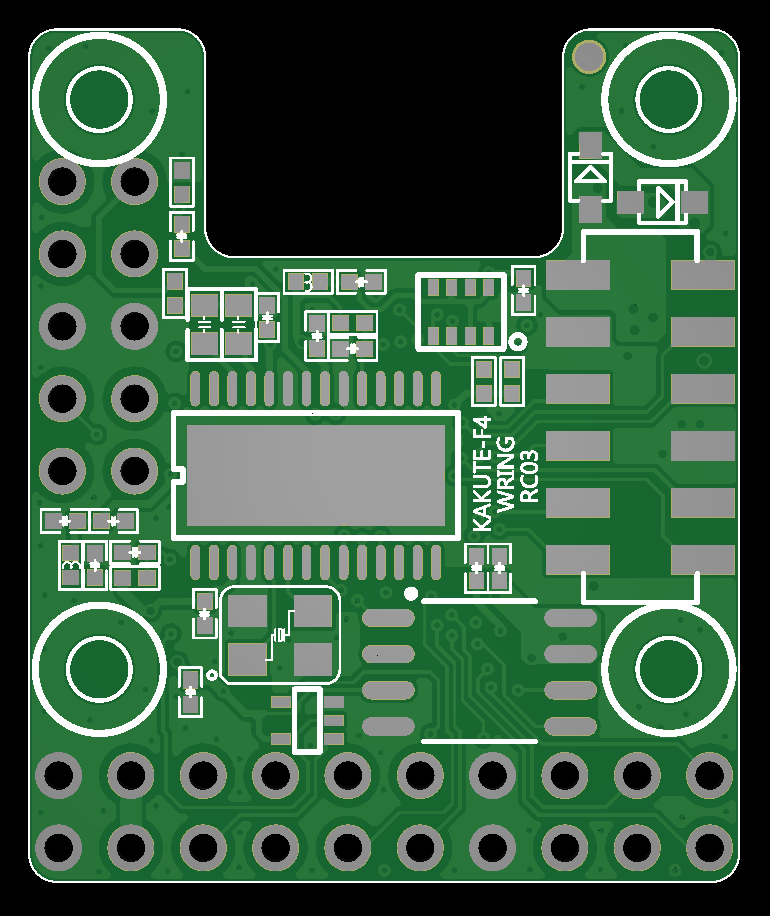
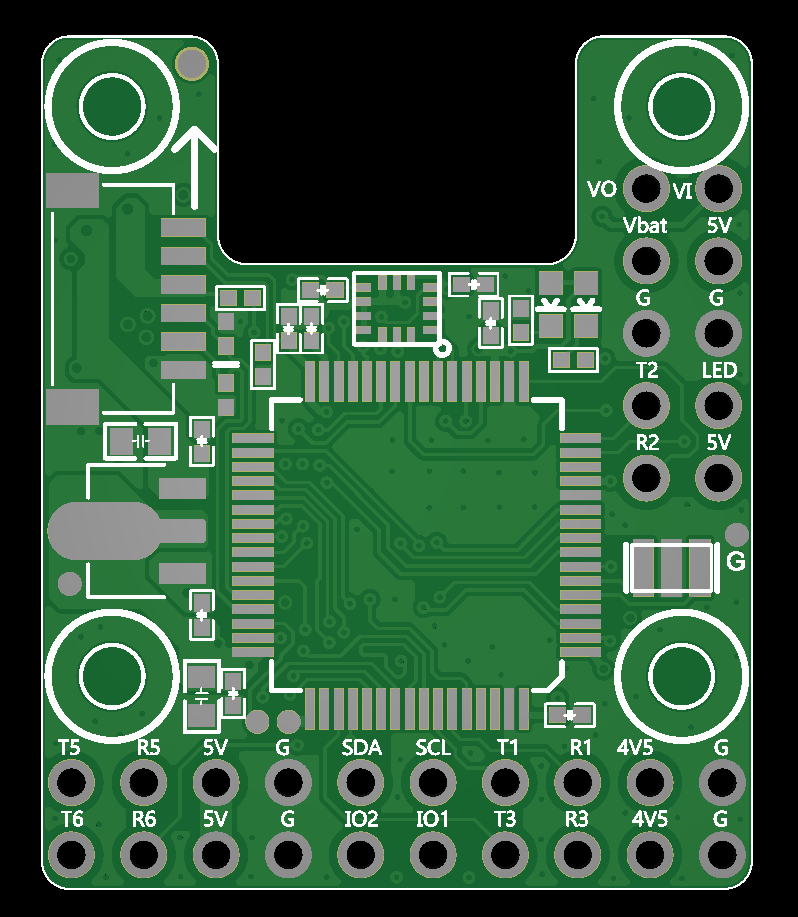

# KakuteF4-Wing Flight Controller

The KakuteF4-Wing is a flight controller produced by [Holybro](http://www.holybro.com/).

## Features
    Processor
        STM32F405 32-bit processor
        AT7456E OSD
    Sensors
        ICM42688 Acc/Gyro
        SLP06 barometer
    Power
        2S - 8S Lipo input voltage with voltage monitoring
        9V/12V, 1.5A BEC for powering Video Transmitter
        6V/7.2V, ?A BEC for servos
        3.3V, 1A BEC
    Interfaces
        7x PWM outputs DShot capable, 4 outputs BiDirDShot capable
        1x RC input
        5x UARTs/serial for GPS and other peripherals
        1x I2C ports for external compass, airspeed, etc.
        USB-C port

## Pinout

## UART Mapping

The UARTs are marked Rn and Tn in the above pinouts. The Rn pin is the
receive pin for UARTn. The Tn pin is the transmit pin for UARTn.

 - SERIAL0 -> USB
 - SERIAL1 -> UART1 (GPS) DMA-Enabled
 - SERIAL2 -> UART2 (Telem1) DMA Enabled
 - SERIAL3 -> UART3 (RX) DMA Enabled
 - SERIAL5 -> UART5 (User)
 - SERIAL6 -> USART6 (User)

## RC Input

RC input is configured on the R3 (UART3_RX) pin. It supports all serial RC
protocols.
   
## OSD Support

The KakuteF4-Wing supports OSD using OSD_TYPE 1 (MAX7456 driver).

## PWM Output

The KakuteF4 supports up to 7 PWM outputs. All outputs support DShot. Outputs 1-4 support BiDirDshot.

The PWM is in 5 groups:

 - PWM 1-2 in group1
 - PWM 3-4 in group2
 - PWM 5-6 in group3
 - PWM 7   in group4

Channels within the same group need to use the same output rate. If
any channel in a group uses DShot then all channels in the group need
to use DShot.

## Battery Monitoring

The board has a built-in voltage and current sensor. The current
sensor can read up to ?? Amps. The voltage sensor can handle up to 6S
LiPo batteries.

The correct battery setting parameters are:

 - BATT_MONITOR 4
 - BATT_VOLT_PIN 10
 - BATT_CURR_PIN 11
 - BATT_VOLT_MULT 11
 - BATT_AMP_PERVLT 40
 
## Compass

The KakuteF4-Wing does not have a built-in compass, but you can attach an external compass using I2C on the SDA and SCL pads.

## Loading Firmware
Firmware for these boards can be found at https://firmware.ardupilot.org in sub-folders labeled “KakuteF4-Wing”.

Initial firmware load can be done with DFU by plugging in USB with the
boot button pressed. Then you should load the "KakuteF4-Wing_bl.hex"
firmware, using your favourite DFU loading tool.

Subsequently, you can update firmware with Mission Planner.

